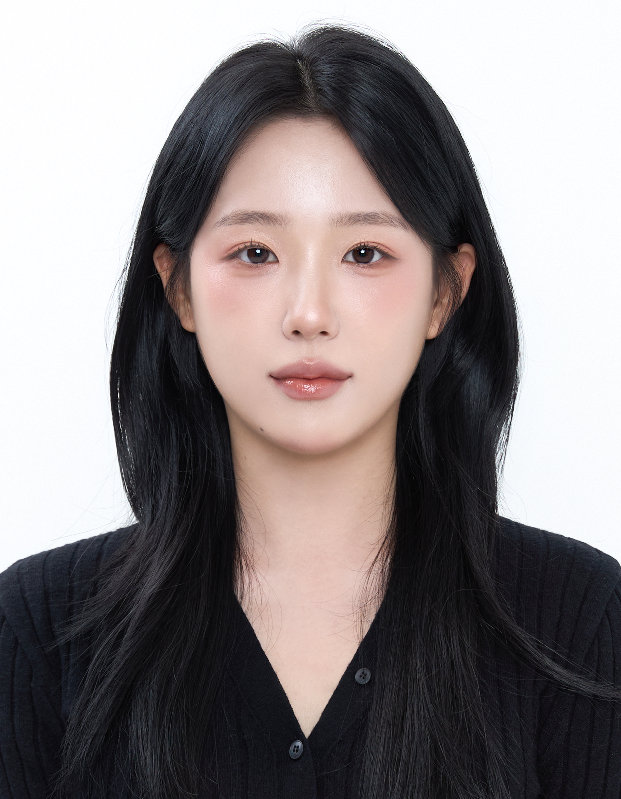

# Profile

{: width="30%" height="auto" align="left"}

 Yeonghyeon Kim
  안드로이드 개발자 -김영현  
“Building the future, one line of code at a time.”     

 
## Personal Data
---
> 2000.05.25 대한민국 

> contact : agilecatch@gmail.com  

## Education
---
> Mar.2019 ~ Feb.2023. 조선대학교
>
> IT융합대학 정보통신공학과 (Department of Information and Communication Engineering)

<!--## Research Interest
---
* Computer Vision
+ image Object Detection
+ Vot
+ Semantic/Instance Segmentation
+ Super Resolution
* Machine Learning / Deep Learning
+ GAN
+ Few-Shot Learning
+ Meta Learning-->

## Project
---
* > [AndroidStudio 마이버킷 App](https://agilecatch.github.io/project/2023-07-07-%EB%A7%88%EC%9D%B4%EB%B2%84%ED%82%B7/)
* > [AndroidStudio 자기소개 App](https://agilecatch.github.io/project/2023-07-14-%EC%9E%90%EA%B8%B0%EC%86%8C%EA%B0%9C/)
*  > [AndroidStudio 공차 Kiosk](https://agilecatch.github.io/project/2023-07-28-%ED%82%A4%EC%98%A4%EC%8A%A4%ED%81%AC/)

  <!--링크추가 방법
  <u><strong><a href="https://www.youtube.com/watch?v=-ofj2vTvH0Q/">The 15th HANSUNG Engineering Competitive Exhibition[PM] 2019 </a></strong></u>-->

<!--## Work Experiences Permalink-->

## Awards
---
<u><strong>2022 빛가람에너지밸리 소프트웨어 소프트웨어 작품 경진대회 </strong></u>

- 주최, 주관: 한전KDN(주)

- Encouragement Award

<u><strong>The 14th  IT Festival S/W Idea Competition 2019 </strong></u>

- 주최, 주관: 조선대학교

- Silver Award

## Skills and Certification
---
-Languages : Java, Kotlin, C, C++  
-Development Tools: Android Studio, VS Code, Visual Studio 
-Frameworks: Flutter 
-Collaboration Platforms: GitHub 
-Documentation Tools: Typora 
-Certification : 정보처리기사,  Adobe Premiere Pro CS6, Adobe Photoshop CS6

