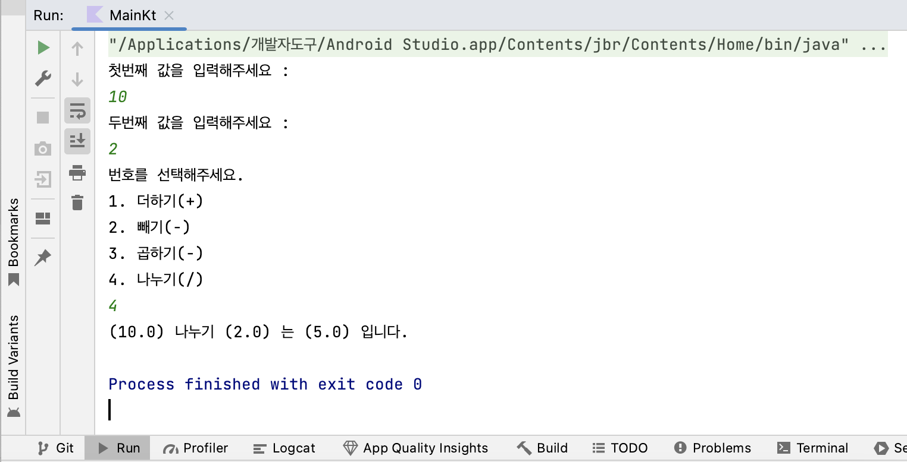

# [Kotlin] Calculator 만들기


* toc
{:toc}
---


## Main.kt

```kotlin
package com.example.myapplication

fun main() {
    
    println("첫번째 값을 입력해주세요 : ")
    var num1= readLine()!!.toDouble()
    println("두번째 값을 입력해주세요 : ")
    var num2= readLine()!!.toDouble()

    println("번호를 선택해주세요.\n1. 더하기(+)\n2. 빼기(-)\n3. 곱하기(-)\n4. 나누기(/)")
    var button= readLine()!!.toInt()

    //계산기 호출
    var calc =Calculator(AddOperation())
    var sub=SubstractOperation()
    var mul=MultiplyOperation()
    var div=DivideOperation()
    var result : Double

    when(button){
        1-> {
            result = calc.operate(num1, num2)
            println("(${num1}) 더하기 (${num2}) 는 (${result}) 입니다.")
        }
        2-> {
            calc= Calculator(sub)
            result = calc.operate(num1,num2)
            println("(${num1}) 빼기 (${num2}) 는 (${result}) 입니다.")
        }
        3-> {
            calc=Calculator(mul)
            result = calc.operate(num1, num2)
            println("(${num1}) 곱하기 (${num2}) 는 (${result}) 입니다.")
        }
        4-> {
            calc=Calculator(div)
            result = calc.operate(num1, num2)
            println("(${num1}) 나누기 (${num2}) 는 (${result}) 입니다.")
        }
        else-> {
            println("올바르지 않은 번호입니다.\n번호를 다시입력해주세요")
        }
    }


}
```


## Class `Calculator`

```kotlin
class Calculator(private val operation: AbstractOperation){
    fun operate(a:Double,b:Double):Double{
        return operation.operate(a,b)
    }

}
```


## Class `AbstractOperation`

```kotlin
//추상 클래스는 기본적인 설계만 정의 되있는 구체화되지않은 클래스이다.
//클래스 내의 프로퍼티나 메소드도 abstract로 선언가능,초기값선언도 가능!
abstract class AbstractOperation {
    //하지만 추상메소드이기때문에 하위 클래스에서 반드시 재정의해야한다.
    abstract fun operate(a:Double,b:Double):Double
}
```


## Class `AddOperation`

```kotlin
class AddOperation : AbstractOperation(){
    override fun operate(a: Double, b: Double): Double {
        return a + b
    }
}
```


## Class `SubstractOperation`

```kotlin
class SubstractOperation : AbstractOperation(){
    override fun operate(a: Double, b: Double): Double{
        return a - b
    }
}
```


## Class `MultiplyOperation`

```kotlin
class MultiplyOperation : AbstractOperation(){
    override fun operate(a: Double, b: Double): Double {
        return a * b
    }
}
```


## Class `DivideOperation`

```kotlin
class DivideOperation : AbstractOperation(){
    override fun operate(a: Double, b: Double): Double {
        return a / b
    }
}
```


## 결과


