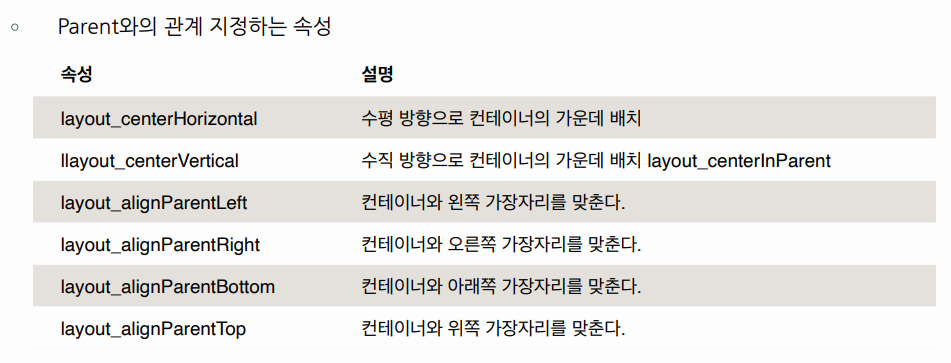

# [Kotlin] Android UI - Layout

* toc
{:toc}
---

## **1) 레이아웃(Layout) 이란?**

* ViewGroup의 파생 클래스로서, 포함 된 View를 정렬하는 기능
* UI를 쉽게 정리하는 방법이다!


## **2) 레이아웃의 여러가지 종류**

### Linear Layout

쉽게 말하면 컨테이너에 포함 된 뷰들을 **수직** 또는 **수평**으로 일렬 배치하는 레이아웃 이다.

* 주요 속성
  * orientation
    * `Vertical` : 위에서 아래로 수직정렬
    * `Horizontal` : 왼쪽에서 오른쪽으로 수평 정렬


LinearLayout의 자식들은 중첩(overrap)되지 않고,지정한 방향으로 쌓이는(stacked)형태로 표시된다.

---

### Relative Layout

뷰를 서로 간의 위치 관계나 컨테이너와의 위치 **관계**를 지정하여 배치하는 레이아웃이다.

* 주요속성



---

### Table Layout

표 형식으로 차일드를 배치하는 레이아웃이다.

쉽게 말하면 자식(Children) View위젯들을 테이블(행과 열로 구성)로 나누어 표시하는  Layout클래스이다.

정해진 규칙에 따라 크기가 결정되므로, layout_width/height를 지정할 필요가  없다.

* 주요속성
  * `stretchColumns` : 늘릴 열을 지정(인텍스는 0부터 시작 됨)

---

### Frame Layout

컨테이너에 포함된 뷰들을 전부 좌상단에 배치하는 레이아웃이다.

- 하나의 자식 View위젯만 표시 할 때 사용하는 Layout클래스이다.
- FrameLayout에 여러 View위젯을 자식으로 추가하면 겹쳐진 형태로 표시되며,가장 최근에 추가된 View위젯이 가장 상위(ontop)에 표시된다.

---

### Constraint Layout

제약 조건을 사용해 화면을 구성하는 방법이다.

실무에서 가장 많이 사용하는 방법이라고 한다.

* 가장 많이 사용하는 이유는?		
  * RelativeLayout에선 불가능했던 자식 뷰간의 상호 관계 정의 가능하다.
  * LinearLayout을 써야만 했던 뷰비율 조절도 간단히 가능하다.
  * 뷰계층을 **간단**하게 할 수 있어 유지보수도 좋고 성능도 좋다.


## **3) 실습 과제**


주어진 조건과 같이 UI를 만들어보자!

### UI 레이아웃 구성

- **LinearLayout내에 3개의 LinearLayout을 추가하고 각각의 weight를 1로 사용**
- Linear Layout
  - **Button3개를 세로로 배치**
  - **Layout_gravity를 이용해 위치 조정**
- Relative Layout
  - **Layout margin : 10dp**
  - **Button5를 우측 상단에 고정**
  - **Button4를 Button5 왼쪽에 배치, 오른쪽margin20dp**
  - **Button6을 Button4 아래로 배치, 왼쪽margin10dp**
- Constraint Layout
  - **Button7을 레이아웃 중앙에 배치**
  - **Button8을 Button7 오른쪽 같은 높이에 배치, 왼쪽margin20dp**
  - **Button9를 Button7 아래로 배치**

---

## **과제 완료 - 결과코드**

```kotlin
<?xml version="1.0" encoding="utf-8"?>
<LinearLayout xmlns:android="http://schemas.android.com/apk/res/android"
    xmlns:app="http://schemas.android.com/apk/res-auto"
    xmlns:tools="http://schemas.android.com/tools"
    android:layout_width="match_parent"
    android:orientation="vertical"
    android:layout_height="match_parent"
    tools:context=".MainActivity">

    <LinearLayout
        android:orientation="vertical"
        android:layout_width="match_parent"
        android:layout_height="wrap_content"
        android:layout_weight="0.4"
        android:background="@color/puple"

        tools:ignore="MissingConstraints">

        <Button
            android:id="@+id/btn1"
            android:layout_width="100dp"
            android:layout_height="wrap_content"
            android:layout_gravity="left"
            android:text="Button1" />

        <Button
            android:id="@+id/btn2"
            android:layout_width="100dp"
            android:layout_height="wrap_content"
            android:layout_gravity="center"
            android:text="Button2" />

        <Button
            android:id="@+id/btn3"
            android:layout_width="100dp"
            android:layout_height="wrap_content"
            android:layout_gravity="right"
            android:text="Button3" />
    </LinearLayout>

    <RelativeLayout
        android:layout_width="match_parent"
        android:layout_height="wrap_content"
        android:background="@color/green"
        android:layout_weight="0.4"


        >

        <Button
            android:id="@+id/btn4"
            android:layout_width="100dp"
            android:layout_height="wrap_content"
            android:layout_marginStart="10dp"
            android:layout_marginTop="10dp"
            android:layout_marginEnd="10dp"
            android:layout_marginRight="20dp"
            android:layout_marginBottom="10dp"
            android:layout_toLeftOf="@id/btn5"
            android:text="Button4" />

        <Button
            android:id="@+id/btn5"
            android:layout_width="100dp"
            android:layout_height="wrap_content"
            android:layout_alignParentRight="true"
            android:layout_marginStart="10dp"
            android:layout_marginTop="10dp"
            android:layout_marginEnd="10dp"
            android:layout_marginBottom="10dp"
            android:text="Button5" />

        <Button
            android:id="@+id/btn6"
            android:layout_width="100dp"
            android:layout_height="wrap_content"
            android:layout_below="@id/btn4"
            android:layout_marginStart="10dp"
            android:layout_marginTop="10dp"
            android:layout_marginEnd="10dp"
            android:layout_marginBottom="10dp"
            android:text="Button6" />

    </RelativeLayout>

    <androidx.constraintlayout.widget.ConstraintLayout
        android:orientation="vertical"
        android:layout_width="match_parent"
        android:layout_height="wrap_content"
        android:background="@color/yellow"
        android:layout_weight="0.4">


        <Button
            android:id="@+id/btn7"
            android:layout_width="wrap_content"
            android:layout_height="wrap_content"
            android:text="Button7"
            app:layout_constraintBottom_toBottomOf="parent"
            app:layout_constraintEnd_toEndOf="parent"
            app:layout_constraintStart_toStartOf="parent"
            app:layout_constraintTop_toTopOf="parent" />

        <Button
            android:id="@+id/btn8"
            android:layout_width="wrap_content"
            android:layout_height="wrap_content"
            android:layout_marginStart="20dp"
            android:text="Button8"
            app:layout_constraintBottom_toBottomOf="parent"
            app:layout_constraintStart_toEndOf="@+id/btn7"
            app:layout_constraintTop_toTopOf="parent" />

        <Button
            android:id="@+id/btn9"
            android:layout_width="wrap_content"
            android:layout_height="wrap_content"
            android:layout_marginTop="5dp"
            android:text="Button9"
            app:layout_constraintEnd_toEndOf="parent"
            app:layout_constraintStart_toStartOf="parent"
            app:layout_constraintTop_toBottomOf="@+id/btn7" />
    </androidx.constraintlayout.widget.ConstraintLayout>


</LinearLayout>
```


## **과제 완료 - UI**


