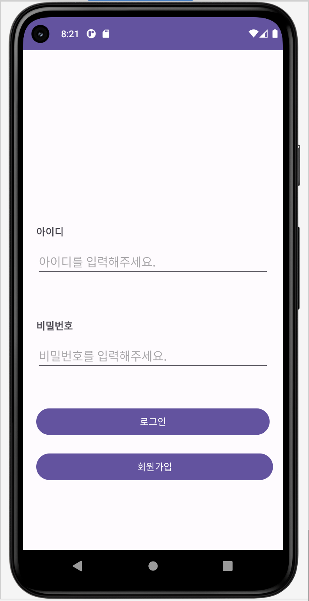
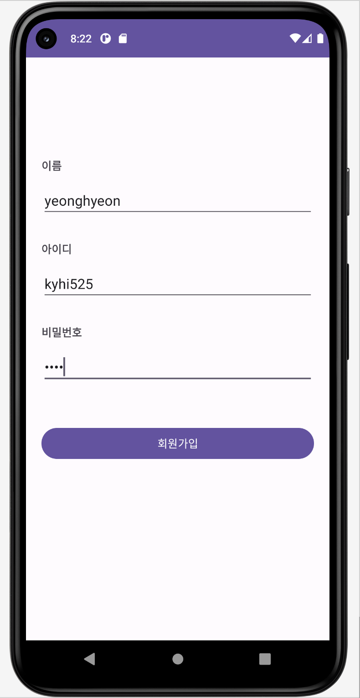
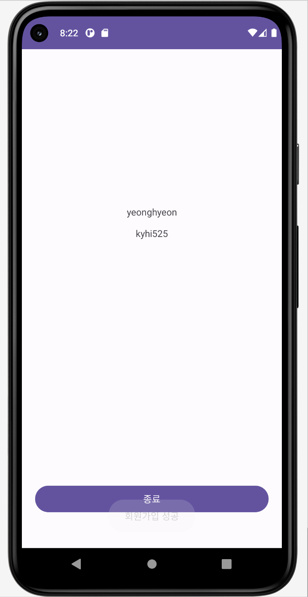

# [TIL] 자기소개 앱만들기(1)

* toc
{:toc}
---

## **1) Intent**

저번시간 액티비티와 인텐트에대해 간단히 알아보았다.

이번은 인텐트를 사용해서 값을 전달해주는 간단한 프로젝트를 진행해 보았다.

현재 자기소개 앱 프로젝트를 진행중인데 `SignUpActivity.kt` 액티비티에서 값을 입력하면 `HomeActivity.kt` 액티비티로 값을 전달해 주도록하는 과제를 진행했다.


### 💡 **Goal : 자기 소개 앱 만들기**

```
- UI Layout과 다양한 Widget들을 다룰 수 있어요.
- Intent를 사용할 수 있어요.
- Widget 에 대한 이벤트를 처리 할 수 있어요.
```


---

#### Lv1. 로그인 페이지 만들기 (SignInActivity)

- 새 프로젝트를 만들고 MainActivity의 이름을 SignInActivity로 바꿔주세요.
- 로고 이미지는 원하는 이미지로 넣어주세요.
- 아이디, 비밀번호를 입력받는 EditText를 넣어주세요. (미리보기 글씨 있어야함)
- 비밀번호 EditText는 입력 내용이 가려져야 합니다.
- 로그인 버튼을 누르면 HomeActivity가 실행됩니다. (Extra로 아이디를 넘겨줍니다.)
- 아이디/비밀번호 모두 입력 되어야만 로그인 버튼이 실행됩니다. (“로그인 성공”이라는  토스트 메세지 출력)
- 아이디/비밀번호 중 하나라도 비어 있다면 “아이디/비밀번호를 확인해주세요” 라는 토스트 메세지 출력
- 회원가입 버튼을 누르면 SignUpActivity가 실행됩니다.


##### 코드설명

```kotlin
package com.example.introduce
class SignInActivity : AppCompatActivity() {
    override fun onCreate(savedInstanceState: Bundle?) {
        super.onCreate(savedInstanceState)
        setContentView(R.layout.activity_sign_in)

        val idText = findViewById<EditText>(R.id.idText)
        val pwText = findViewById<EditText>(R.id.pwText)
        val signIn =findViewById<Button>(R.id.signIn)
        val signUp =findViewById<Button>(R.id.signUp)

        signIn.setOnClickListener {
            val id = idText.text.toString().trim()
            val password = pwText.text.toString().trim()

            if (id.isEmpty() || password.isEmpty()) {
                // 아이디 또는 비밀번호가 비어있는 경우
                Toast.makeText(this, "아이디/비밀번호를 확인해주세요.", Toast.LENGTH_SHORT).show()
            } else {
                // 로그인 성공
                Toast.makeText(this, "로그인 성공", Toast.LENGTH_SHORT).show()
                //HomeActivity로 화면전환
                val intent=Intent(this,HomeActivity::class.java)
                startActivity(intent)

            }
        }
        //SignUpActivity화면으로 전환
        signUp.setOnClickListener {
            val intent=Intent(this,SignUpActivity::class.java)
            startActivity(intent)
        }
    }
}
```


---


#### Lv2. 회원가입 페이지 만들기 (SignUpActivity)

- SignpActivity를 생성해 주세요.
- 타이틀 이미지는 원하는 이미지로 넣어주세요.
- 이름, 아이디, 비밀번호 모두 입력 되었을 때만 회원가입 버튼이 눌립니다.
- 셋 중 하나라도 비어있으면 “입력되지 않은 정보가 있습니다.” 라는 토스트 메세지 출력
- 비밀번호 EditText는 입력 내용이 가려져야 합니다.
- 회원가입 버튼이 눌리면 SignInActivity로 이동합니다. (finish 활용)


##### 코드설명

```kotlin
class SignUpActivity : AppCompatActivity() {
    override fun onCreate(savedInstanceState: Bundle?) {
        super.onCreate(savedInstanceState)
        setContentView(R.layout.activity_sign_up)

        val signUpname = findViewById<EditText>(R.id.signUpName)
        val signUpId = findViewById<EditText>(R.id.signUpId)
        val signUpPw = findViewById<EditText>(R.id.signUpPw)
        val btnSignUp = findViewById<Button>(R.id.btnSignUp)

        btnSignUp.setOnClickListener {
            val name = signUpname.text.toString().trim()
            val id = signUpId.text.toString().trim()
            val password = signUpPw.text.toString().trim()

            if (id.isEmpty() || password.isEmpty() || name.isEmpty()) {
                // 아이디 또는 비밀번호가 비어있는 경우
                Toast.makeText(this, "입력되지 않은 정보가 있습니다.", Toast.LENGTH_SHORT).show()
            } else {
                // 로그인 성공
                Toast.makeText(this, "회원가입 성공", Toast.LENGTH_SHORT).show()

                //SignnUp 데이터를 Home 으로 전달
                val edit_name=findViewById<EditText>(R.id.signUpName)
                val edit_id=findViewById<EditText>(R.id.signUpId)
                val data_name =edit_name.text.toString()
                val data_id =edit_id.text.toString()
                val intent = Intent(this,HomeActivity::class.java)
                intent.putExtra("Id Data",data_id)
                intent.putExtra("name Data",data_name)
                startActivity(intent)

                // SignIn화면으로 전환
                finish()
            }
        }
    }


}
```


---


#### Lv3. 자기소개 페이지 만들기 (HomeActivity)

- HomeActivity를 생성해 주세요.
- SignInActivity에서 받은 extra data(아이디)를 화면에 표시해주세요.
- ImageView, TextView 외에 각종 Widget을 활용해 자유롭게 화면을 디자인 해주세요.
  - 이름, 나이, MBTI 등 자기소개등이 들어가는 위젯을 자유롭게 디자인해주세요.
- 종료 버튼이 눌리면 SignInActivity로 이동합니다. (finish 활용)


##### 코드설명

```kotlin
class HomeActivity : AppCompatActivity() {
    override fun onCreate(savedInstanceState: Bundle?) {
        super.onCreate(savedInstanceState)
        setContentView(R.layout.activity_home)

        //데이터 받아오기
        val data_name =intent.getStringExtra("name Data")
        val data_id =intent.getStringExtra("Id Data")

        val edit_name=findViewById<TextView>(R.id.homeId)
        val edit_id=findViewById<TextView>(R.id.homeName)

        edit_name.setText(data_name)
        edit_id.setText(data_id)

        //화면 종료
        val btn_close=findViewById<Button>(R.id.close)
        btn_close.setOnClickListener {
            finish()
        }
    }
}
```


---

## **2) 결과 - UI**





이렇게 화면이 구현 되었고, 현재는 이름과 아이디만 값을 넘겨오도록 구현 하였다.

간단한 부분이지만 헷갈리는것이 있었기에 기본적인 문법을 되잡아갈 수 있는 시간이 되었던것 같다.

이번프로젝트 완성을위해 끝까지 달려보자!!👊🏻

