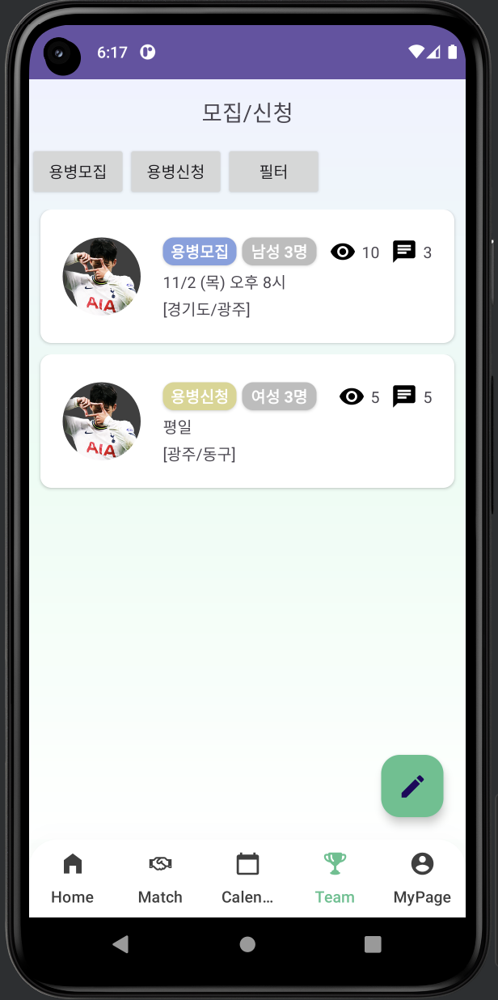

# [Kotlin] 글작성시 조회수 구현하기

* toc
{:toc}

---



이프로젝트에서 리사이클러뷰를 사용중이다. 

글을 작성하고 아이템을 클릭했을때 조회수가 하나씩 추가되도록 구현 하고 싶어 기능을 구현하기 시작했다.


## 1) 리사이클러뷰 어댑터에 클릭아이템 추가하기

본인은 리스트뷰어댑터를 사용 중이다! 여기서 아이템을 클릭했을때 카운트가 올라가는 동작이 필요하기 때문에 

ItemClick 이벤트를 추가해주었다.

```kotlin
class TeamListAdapter(
    private val onClick: (TeamItem) -> Unit,
    private val onIncrementViewCount: (TeamItem) -> Unit,
) : ListAdapter<TeamItem, TeamListAdapter.ViewHolder>(
    object : DiffUtil.ItemCallback<TeamItem>() {
        override fun areItemsTheSame(oldItem: TeamItem, newItem: TeamItem): Boolean {
            return oldItem == newItem
        }

        override fun areContentsTheSame(oldItem: TeamItem, newItem: TeamItem): Boolean {
            return oldItem == newItem
        }
    }
) {

    ...

    override fun onCreateViewHolder(parent: ViewGroup, viewType: Int): ViewHolder =
        when (viewType) {
            TeamItemViewType.Recruit.ordinal ->
                RecruitViewHolder(
                    TeamItemBinding.inflate(
                        LayoutInflater.from(parent.context),
                        parent,
                        false
                    ),
                    onClick,
                    onIncrementViewCount//클릭이벤트 추가
                )

            TeamItemViewType.Application.ordinal ->
                ApplicationViewHolder(
                    TeamItemBinding.inflate(
                        LayoutInflater.from(parent.context),
                        parent,
                        false
                    ),
                    onClick,
                    onIncrementViewCount//클릭이벤트 추가
                )

            else -> UnknownViewHolder(
                TeamUnknownItemBinding.inflate(
                    LayoutInflater.from(parent.context),
                    parent,
                    false
                )
            )
        }

    override fun onBindViewHolder(holder: ViewHolder, position: Int) {
        holder.onBind(getItem(position))
    }

    class RecruitViewHolder(
        private val binding: TeamItemBinding,
        private val onClick: (TeamItem) -> Unit,
        private val onIncrementViewCount: (TeamItem) -> Unit,//클릭이벤트 추가
    ) : ViewHolder(binding.root) {

        override fun onBind(item: TeamItem) = with(binding) {
            ...
                itemView.setOnClickListener {
                    onClick(item)
                    onIncrementViewCount(item) // 클릭 시 조회수 증가
                }
            }
        }
    }

    class ApplicationViewHolder(
        private val binding: TeamItemBinding,
        private val onClick: (TeamItem) -> Unit,
        private val onIncrementViewCount: (TeamItem) -> Unit,
    ) : ViewHolder(binding.root) {

        override fun onBind(item: TeamItem) = with(binding) {
            ...

                itemView.setOnClickListener {
                    onClick(item)
                    onIncrementViewCount(item) // 클릭 시 조회수 증가
                }
            }
        }
    }

    class UnknownViewHolder(
        binding: TeamUnknownItemBinding,
    ) : ViewHolder(binding.root) {

        override fun onBind(item: TeamItem) = Unit
    }

}
```

* **onIncrementViewCount** : item이 클릭했을때 viewCount가 올라가는 동작을 하기위해 추가해주었고 아래 **onCreateViewHolder** 에도 같이 추가를 해준다.
* 본인은 2개의 타입을 분리하여 아이템이 추가되도록 구현을 했기 때문에 
  * **RecruitViewHolder**, **ApplicationViewHolder** 에도 각각 추가해준다.


## 2) 어댑터가 연결된 프래그먼트로 이동하여 동작을 추가해준다.

```kotlin
private val listAdapter by lazy {
    TeamListAdapter(onClick = { item ->
        val intent = TeamDetailActivity.newIntent(item, requireContext())
        startActivity(intent)
    }, onIncrementViewCount = { item ->
        viewModel.incrementViewCount(item)//viewcount가 올라가는 함수로 연결
    }
    )
}
```

* 리사이클러뷰를 사용하는 프래그먼트로 돌아가 item이 클릭되었을때 동작을 추가해준다.

* 본인은 **viewModel** 을 사용하기 때문에 viewModel로 **동작을 분리**해주었다.


## 3) 동작 함수 추가

```kotlin
fun incrementViewCount(item: TeamItem) {
    if (item is TeamItem.RecruitmentItem) {
        val currentList = list.value.orEmpty().toMutableList()
        val updatedItem = item.copy(viewCount = item.viewCount + 1)
        val index = currentList.indexOf(item)
        if (index != -1) {
            currentList[index] = updatedItem
            _list.value = currentList
        }
    } else if (item is TeamItem.ApplicationItem) {
        val currentList = list.value.orEmpty().toMutableList()
        val updatedItem = item.copy(viewCount = item.viewCount + 1)
        val index = currentList.indexOf(item)
        if (index != -1) {//현재 인덱스가 -1이 아니면
            currentList[index] = updatedItem//현재리스트 인덱스를 업데이트한다
            _list.value = currentList
        }
    }
}
```

* 기존에 **`TeamItem`** 라는 **datamodel**속에 **viewCount**를 선언해놨었다.
* 인자로 **`TeamItem`**모델을 받아왔기 때문에 접근이 가능하게된다.
* `TeamItem`은 `RecruitmentItem` 또는 `ApplicationItem` 타입으로 나뉘기 때문에 if elif로 구현하였다.

* **val currentList = list.value.orEmpty().toMutableList()** :
  * 현재 `_list`의 값을 가져와서 빈 리스트인 경우 빈 리스트로 초기화한다. 그리고 이를 수정 가능한 리스트로 변환한다.

* **val updatedItem = item.copy(viewCount = item.viewCount + 1)** :
  * 현재 `item`을 복사하여 `viewCount`를 1 증가시킨 `updatedItem`을 생성한다.

* `index`가 -1이 아닌 경우

  * 현재 리스트에서 `index` 위치의 아이템을 `updatedItem`으로 교체한다.

  *  `_list`의 값을 `currentList`로 업데이트합니다.


이렇게 하면 item 클릭시 viewcount가 업데이트 되어 하나씩 증가하게된다!
