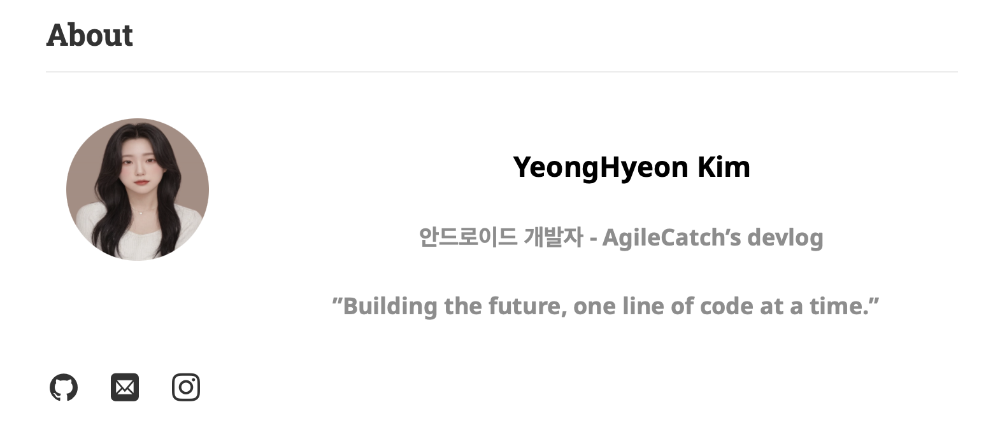
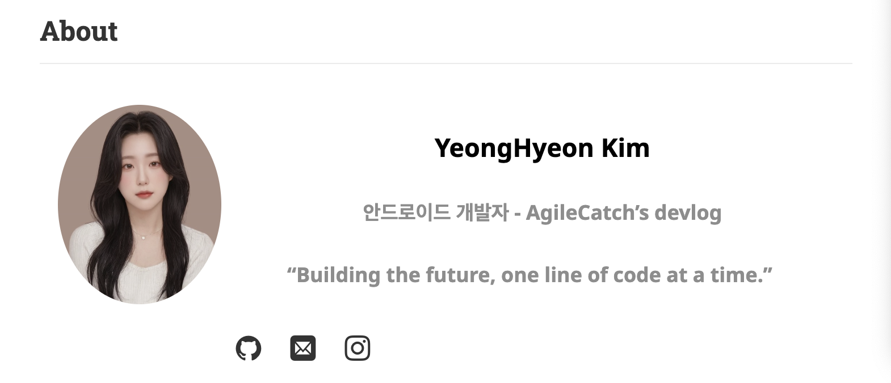

# [Jekyll.hydejack] about이미지 크기 변경

Dev블로그 꾸미기에 열중인 찰나 내블로그에 눈에 밟히는것이 생겼다.

프로필사진을 설정하는데 사진이 아래와같이 동그랗게 나와 눌린것 같이 보이는 현상이 발생했다. 

이부분은 아주 간단히도 _sass > my-style.scss파일의 .content .avatar의 height를 auto로수정하므로 아래와같이 고쳐졌다!

###### [BEFORE]

###### [AFTER]

사진도 키우고 세로 비율을 자동으로 바꿔나서 훨씬 깔끔해진모습이다!
