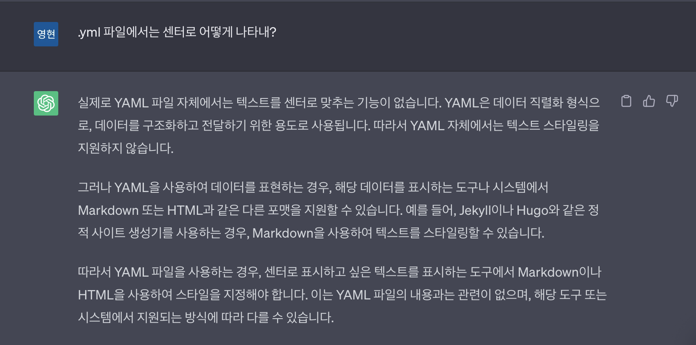
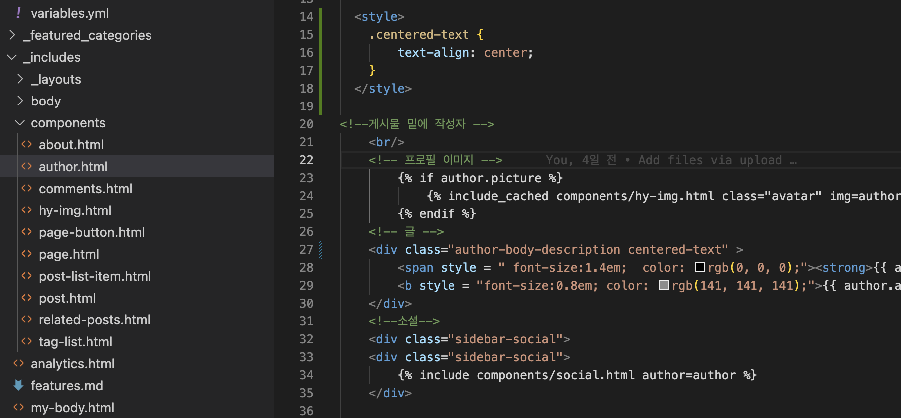

# [Jekyll.hydejack] about글 센터정렬

이전 포스트에 이어서 aout에 있는 나에대한 설명을 센터로 수정해보겠다!

_data> authors.yml이 경로는 어바웃에있는 나의 소개와이름을 수정하는 부분이다.

about에 있는 나의소개를 수정하고 컴파일을 해보았는데 화면에 예쁘지않게 보이기 시작했다.

글씨가 겹쳐서 잘린다!

Html, yml부분은 지식이 전무하기에 Chat GPT의 도움을 받았다.

문제를 물어보니 yml파일에서는 센터로 맞출수 있는 기능이 없단다!

그래서 다시 물어보았다.

라고 친절히 알려주어 관련된 파일경로를찾았다!

_includes> componets> author.html

먼저 위의 내용과 같이 스타일을 추가한다!

그리고 <!-- 글 --> 아래에있는 클래스이름의 뒷부분에 centered-text를 추가해주면 

    <strong>{{ author.name | markdownify }}</strong>
    <b style="font-size: 0.8em; color: rgb(141, 141, 141);">{{ author.about | markdownify }}</b>

완성!