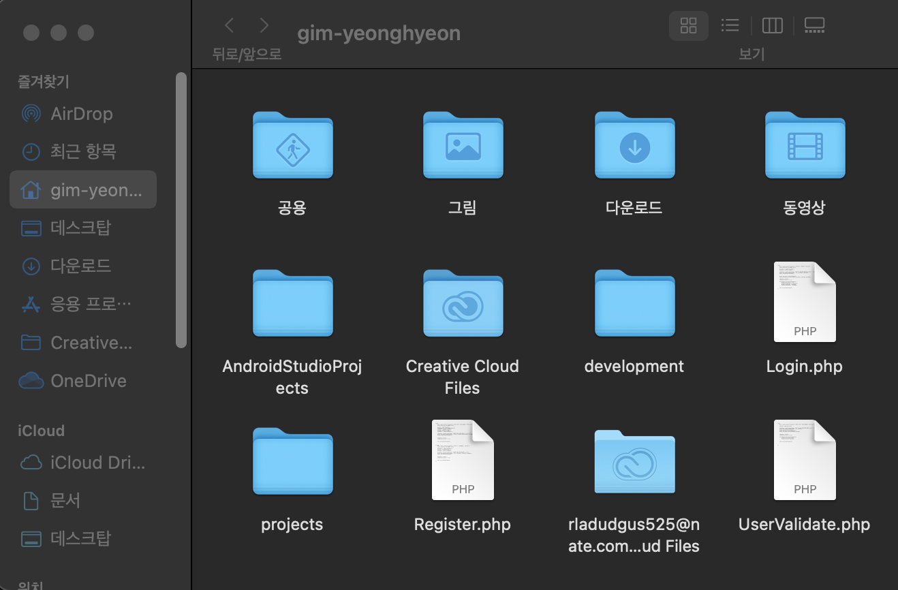
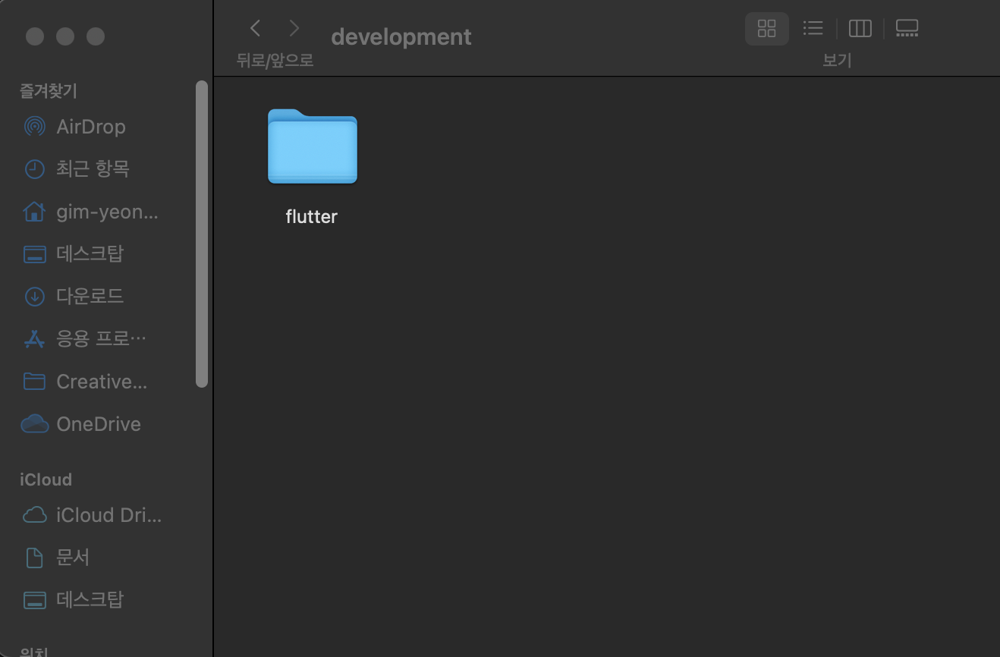

# [Flutter] 맥북 플러터 설치방법 & Xcode 설치오류


✔ 맥에서 플러터를 설치하는 과정 중  **필수 사항**으로 먼저 확인해야 할것이 있다.

###  노트북 필수사양 확인하기

💻 **Mac 필수사양: 버전 10.11 이상**


## 1) 권장사항

1. **macOS**(내 Mac OS 사양 확인해보기!)

2. **여유 용량: 50GB**( **iOS 개발시 필요한 Xcode가 용량이 많이 필요하다**)

   

- 확인 방법

  1. 화면 좌상단의 **Apple 로고 클릭**

  2. **이 Mac에 관하여 클릭**

     

  3. **Mac OS 버전을 확인**해보자.

  

## 2) 설치 프로그램

[꿀팁!] 설치할 프로그램 한 줄 요약! 

- Flutter : Android와 iOS 앱을 하나의 코드로 구현할 수 있도록 도와주는 프레임워크 
- VSCode : 코드를 작성할 때 사용하는 에디터 
-  Android Studio : Android 앱을 개발하기 위해 필요한 IDE. 에뮬레이터 포함 
- Xcode : iOS 앱을 개발하기 위해 필요한 IDE. 에뮬레이터 포함

## 3) 설치 방법

**[프레임워크 설치하기]**

1. 먼저 flutter 를 설치할 폴더를 만들어야한다. 

* Downloads 폴더를 먼저 열어준다. (아래와 같이 유저명과 같은 이름의 폴더로 이동하면 된다.)
* 이제 여기에 development 라는 이름의 폴더를 생성한다.
* 이제 생성한 폴더에 flutter 압축 파일을 다운로드한다. (Chrome 브라우저에서 [링크](https://docs.flutter.dev/get-started/install/macos)를 열어준다.)



* 밑으로 조금 스크롤한 뒤, 파란색 버튼을 클릭해 다운로드를 진행한다.




* 이후 다운로드 한 플러터 zip파일을 development >flutter안에 압축해제해준다.

**[환경 변수 설정]**

* 바탕화면에서 사과 아이콘 → 이 Mac에 관하여를 클릭하여 macOS 버전을 확인한다.
* macOS 버전을 확인한 뒤, 해당하는 명령어를 복사한다.


- macOS 카타리나(Catalina) `**이상**`버전 명령어 (최신 버전은 여기에요!)

```bash
echo 'export PATH="$PATH:$HOME/development/flutter/bin"' >> ~/.zshrc && source ~/.zshrc
```

- macOS 모하비(Mojave) **`이하`** 버전 명령어

```bash
echo 'export PATH="$PATH:$HOME/development/flutter/bin"' >> 	~/.bash_profile && source ~/.bash_profile
```

* 복사한 명령어를 터미널에 붙여넣기 한후 실행한다.

* 다음 명령어는 flutter의 버전을 확인하는 명령어이다. 아래 명령어를 복사해 다시터미널에붙여넣고 실행한다.

```bash
flutter --version
```

실행하면 Building flutter tool... 이라고 출력되고 잠시 후 아래와 같이 Flutter 버전이 출력되면 Flutter 설치 완료!

* 다음 명령어를 복사해 터미널에 붙여넣고 실행한다.(Flutter 개발하는데 필요한 항목들의 상태를 확인하는 명령어이다.)


```bash
flutter doctor
```


**[에디터 설치하기]**

- VSCode 설치

  1. [링크](https://code.visualstudio.com/download)에 접속해 애플 아이콘 하단에 있는 파란색 Mac 버튼을 클릭한다.
  2. 폴더를 다운로드 한후 압축을 해제하면 아래와같은 팝업이 뜨는데 열기 해준후 다운로드한다.

  

  

* VSCode는 Flutter 뿐만 아니라 다양한 개발을 모두 할 수 있는 통합 에디터다. VSCode에서 Flutter 앱 개발을 하려면 VSCode에 Extension 탭에서 아래 목록의 Extension 들을 설치해야 한다.

	​	Flutter : VSCode에서 Flutter 개발 환경 지원 

	​	Dart : Flutter 개발 시 사용되는 Dart 개발 환경 지원

    

* VS코드를 설치한후 실행하면 좌측에 extension 아이콘(동그라미)을 선택해 준다.

  

* flutter 라고 검색한 뒤, 해당 익스텐션을 선택하고 install 버튼을 눌러 설치한다.


* 위 `flutter` 익스텐션을 설치하면서 `dart` 익스텐션도 일반적으로 함께 설치가 된다

  `dart` 라고 검색하신 뒤 혹시 설치가 안되었다면 해당 익스텐션도 같이 설치한다. `uninstall`이라고 뜬다면 이미 설치가 된 것이니 넘어가시면 된다.


**[IDE 설치하기]**

- Android Studio 설치

  [링크](https://developer.android.com/studio)에 접속한 뒤, `Download Android Studio` 버튼을 눌러준다.

- Intel 칩을 사용하는 맥북은 왼쪽 Mac with Intel chip을 Apple 칩을 사용하는 맥북은 오른쪽 Mac with Apple chip을 선택한다.


* 아래와 같은 창이 뜨면 왼쪽에 Android Studio를 드래그해서 Applications에 떨어뜨려설치해준다.


* Android Studio에서 More Actions를 선택한 뒤 SDK Manager를 선택해 준다.


* 그러면 아래와 같이 Preferences for New Projects 팝업이 뜨면 SDK Tools 탭을 선택 → Android SDK Command-line Tools (latest) 선택 → Apply 를 선택해 준다.


* 설치가 완료되면 Finish 버튼을 눌러준다.

* 이후 디바이스를 만들어 줄 것이다.

  More Actions → Virtual Device Manager (또는 AVD Manager)를 선택해 준다.


​		이미 Device 가 있는 분들은 아래 절차를 진행하지 않아도 된다.

* (Device 가 없는 경우) **Create Virtual Device...**를 선택해 준다.
* 하드웨어를 선택하는 화면이 나오면 Next를 눌러서 기본으로 설정된 Pixel 2 휴대폰을 설치하도록 한다.


* 휴대폰에 설치할 Android OS를 선택하는 화면입니다. Q 옆에 있는 Download 버튼을 클릭하여 OS를 다운로드해 준다.

  

* 설치후 Q 옆에다운로드 표시가 없어졌으면 넥스트 클릭
* Finish 버튼을 눌러 Virtual Device 설치를 완료해주기


* 독스에 있는 Android Studio 아이콘을 우클릭한 뒤 종료 버튼을 눌러를 Android Studio를 종료해 줘야한다.

터미널에서 flutter doctor라고 입력한 뒤 엔터를 누릅니다. 아래와 같이 Android toolchain의 좌측에  [!] 표시가 되어있다.


문제를 해결하기 위해 flutter doctor --android-licenses를 복사해서 터미널에 붙여 넣고 실행해 준다. 실행시 라이센스에 대한 동의를 여러번 구하는데, y를 입력하고 엔터를 눌러 진행해 준다.


모든 동의가 완료되면 All SDK package licenses accepted 라고 뜬다.


마지막으로 터미널에 flutter doctor 를 입력했을 때 아래와 같이 Android toolchain, Android Studio 가 체크 완료되면 완료!


**[Xcode설치]**

* [링크](https://xcodereleases.com/)를 클릭해 열어준다.

컴퓨터 사양을 확인후 사양에 맞는 

