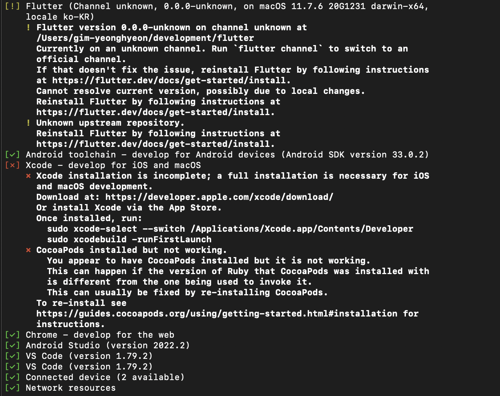
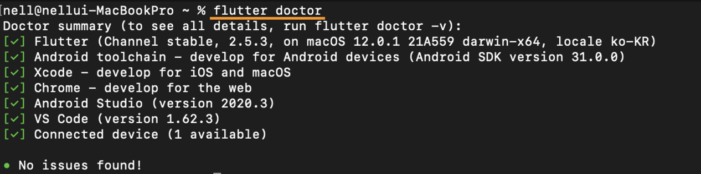

# [Flutter] 맥북 Xcode 설치오류


* toc
{:toc}
---

✔ 맥에서 플러터를 설치하는 과정 중  **필수 사항**으로 먼저 확인해야 할것이 있다.

💻 **Mac 필수사양: 버전 10.11 이상**(노트북 필수사양 확인하기)


### **[Xcode설치]**

* 플러터 설치->[링크](https://xcodereleases.com/)를 클릭해 열어준다.

​	컴퓨터 사양을 확인후 사양에 맞는 Xcode를 설치해주었다.

* 이후 Homebrew를 설치해 주었다.

```bash
/bin/bash -c "$(curl -fsSL https://raw.githubusercontent.com/Homebrew/install/HEAD/install.sh)"
```


* 다음으로 CocoaPods을 설치해 보겠다. (아래 명령어를 복사해 터미널에서 붙여넣고 엔터를 눌러준다.)

```bash
brew install cocoapods
sudo gem install cocoapods
```

이 과정에서 오류가 발생했다!!



GPT에게 물어보니 cocoaPods을 다운로드 하는와중에 오류가 났다고 한다.
그래서 아래와같이 터미널 명령어를 실행해주었다.

* Ruby를 업데이트하기 위해 RVM (Ruby Version Manager)을 설치한다.

```bash
\curl -sSL https://get.rvm.io | bash -s stable
```

* RVM을 활성화한다. 터미널에서 다음 명령을 실행한다.

```bash
source ~/.rvm/scripts/rvm
```

* Ruby 2.7.0을 설치한다. 터미널에서 다음 명령을 실행한다.

```bash
rvm install 2.7.0
```

* 설치된 Ruby 2.7.0을 사용하도록 설정한다. 터미널에서 다음 명령을 실행한다.

```bash
rvm use 2.7.0 --default
```

* Ruby 버전이 업데이트되었으므로 CocoaPods를 설치할 수 있다. 터미널에서 다음 명령을 실행한다.

```bash
sudo gem install cocoapods
```


하지만 다시 아래와같은 오류가 났다.

(Ruby 버전을 업데이트하는 과정에서 문제가 발생했고, Ruby 2.7.0을 설치하고 설정하려고 했지만 제대로 되지 않았다고 한다.)

```bash
ERROR:  Error installing cocoapods:
	The last version of activesupport (>= 5.0, < 8) to support your Ruby & RubyGems was 6.1.7.3. Try installing it with `gem install activesupport -v 6.1.7.3` and then running the current command again
	activesupport requires Ruby version >= 2.7.0. The current ruby version is 2.6.6.146.
gim-yeonghyeon@gim-yeonghyeon-ui-MacBookPro ~ % 
```

이후 루비버전을 업데이트하고 CocoaPods을 설치해보았다.

*  터미널에서 다음 명령을 실행하여 Ruby를 업데이트한다.

```bash
brew install rbenv
rbenv install 2.7.0
rbenv global 2.7.0
```

* Ruby 업데이트 후에는 다음 명령으로 `gem`을 업데이트한다.

```bash
gem update --system
```

* 이제 다시 CocoaPods을 설치해보자.

```bash
sudo gem install cocoapods
```


마지막으로 터미널에 flutter doctor 를 입력했을 때 아래와 같이 모든 항목에 초록색체크가 표시되면 완료!



