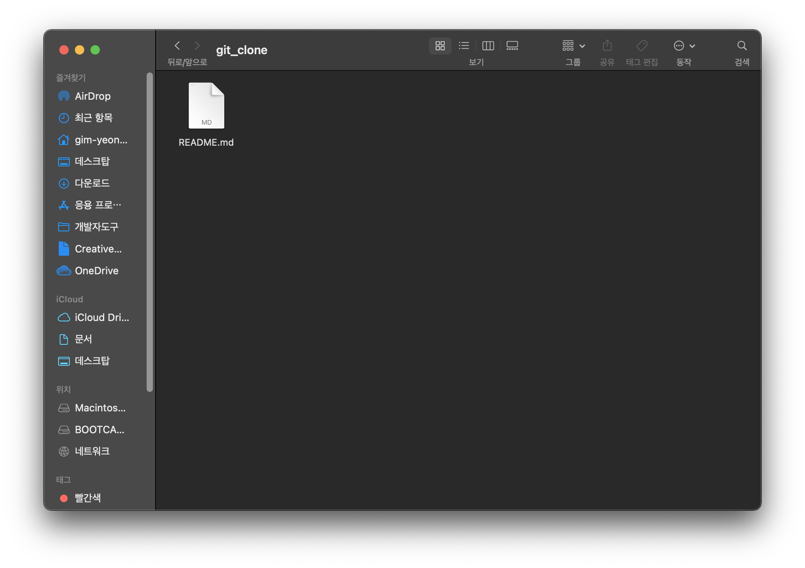
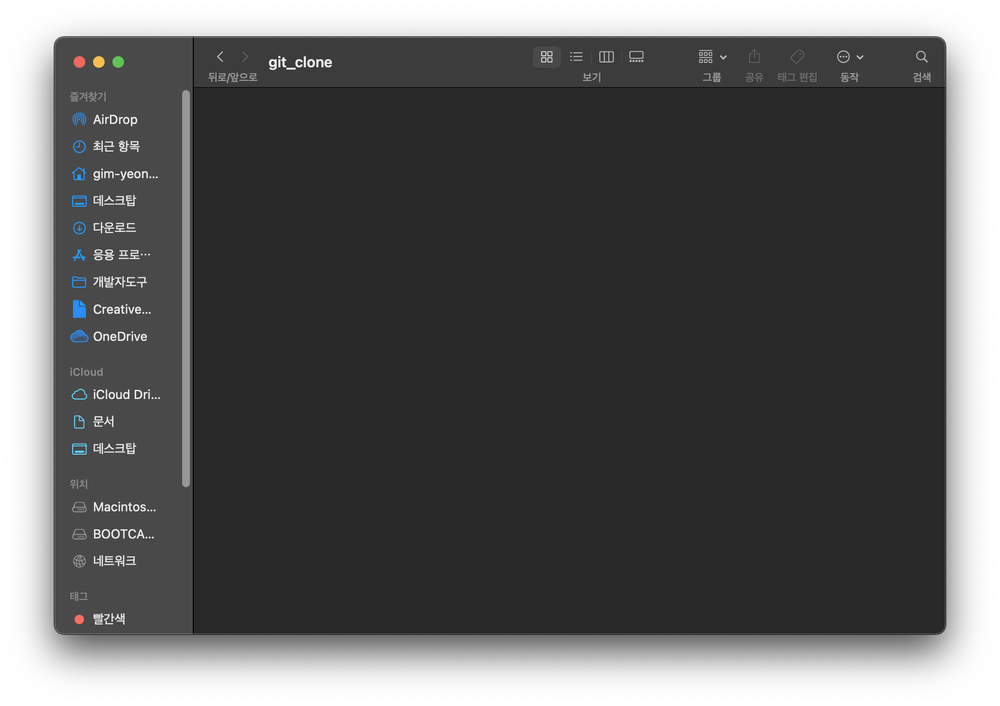
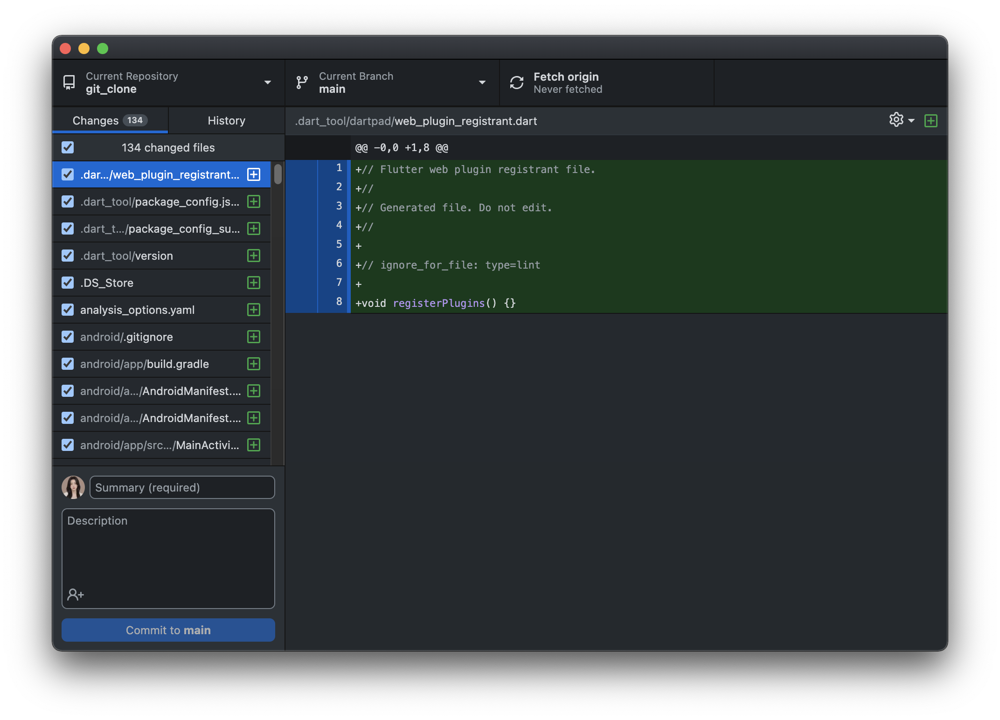

# [GitHub] 레포지토리 쉽게 연결하는 방법

자기 컴퓨터(Local) 폴더에 Github쉽게 연결하는방법

* toc
{:toc}
---

## 1. 깃허브 레포지토리 생성

내가연결하고싶은 파일이름으로 깃허브 레포지토리를 생성해준다.

### 이때주의 해야할점! 

- Public 체크!

- Add a README file 체크!

## 2. 파일 이동하기

 git_clone(내가 클론하고싶은 파일)의 파일을 잠시 다른 경로로 옮겨준다.

-> 나는 아래의 Flutter경로에 있던 git_clone파일을 데스크탑으로 이동해주었다.

## 3.  GitHub Desktop에들어가 연결하기

 Add > Clone Repository...>

만들었던 레포지토리를 찾아 클릭한후 동일한 이름으로 클론해준다.

이후 기존경로에 파일이 생성되었는지 확인해보자.

파일 내용을살펴보면 Rademe 파일이 있을것이다. 이것을 삭제해준다.

 바탕화면에 있던 git_clone파일 내용을  Flutter파일 안에 있는 git_clone으로 옮겨주었다.

## 4. 확인하기

파일을 옮기고 GitHub Desktop에 들어가확인해보자.

파일이 정상적으로 클론된것을 확인되었다.

커밋을 해보자!

깃허브 레포지토리를 확인해보니 정상적으로 파일이 연결된 것 을 볼 수 있었다!

