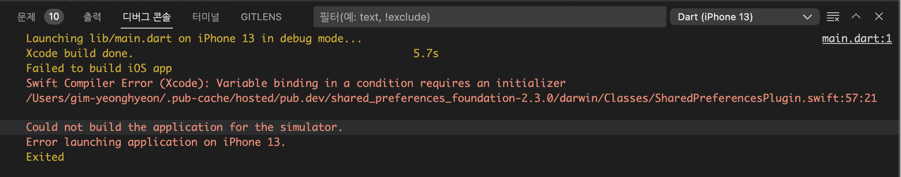
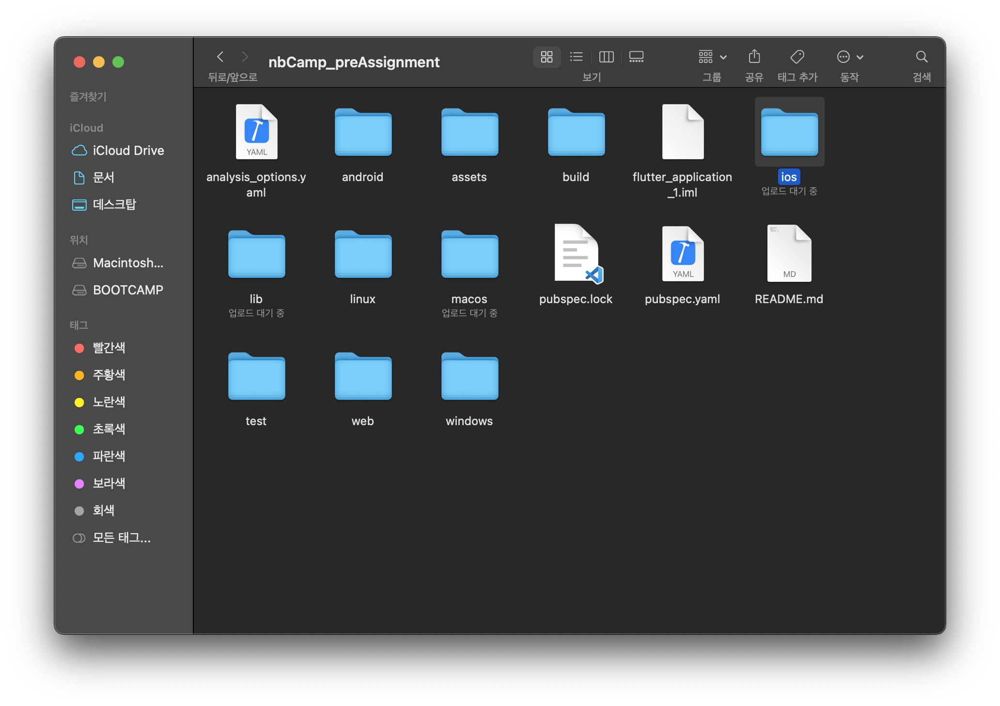
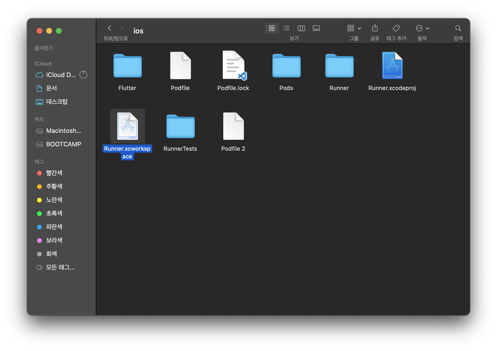
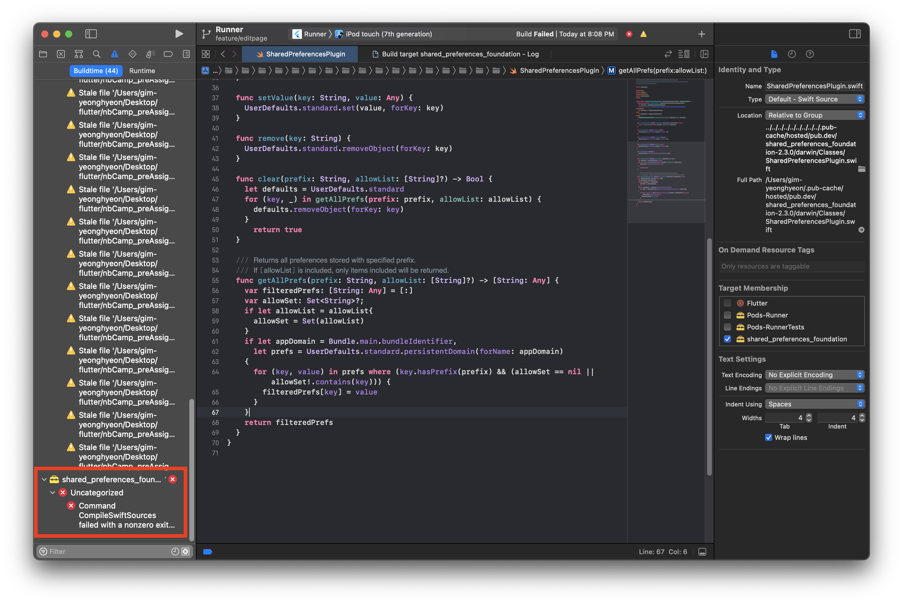
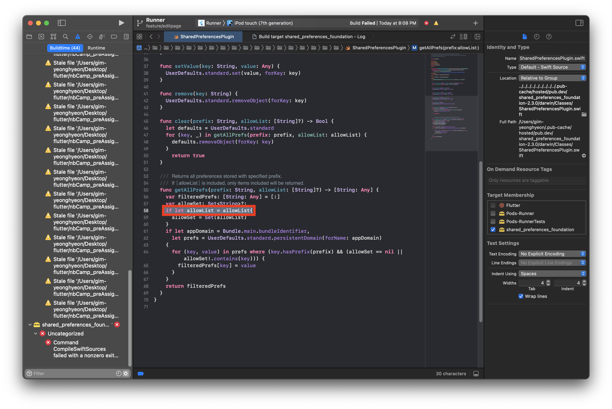
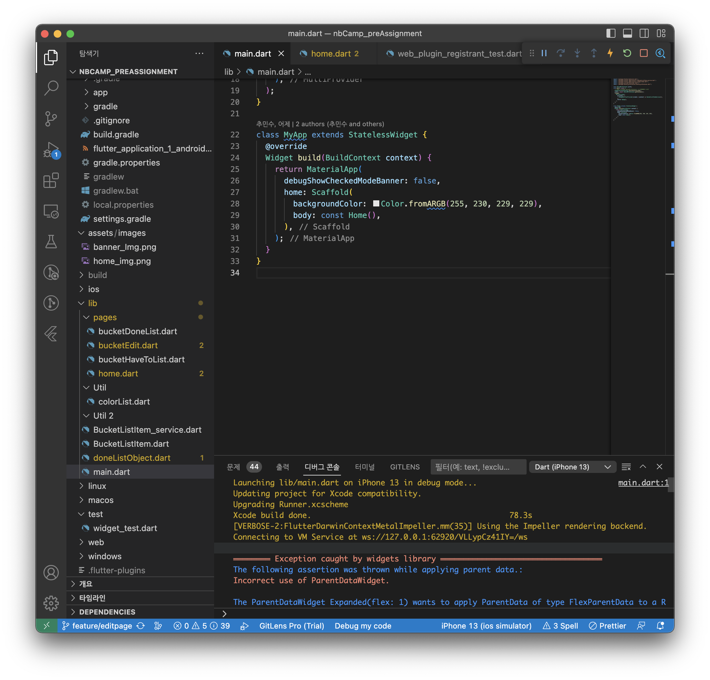

---

layout: post
title: 트러블 슛팅
accent_image: 
  background: url('/assets/img/me/wave3.jpg') center/cover
  overlay: false
accent_color: '#fff'
theme_color: '#fff'
description: >
  문제해결
invert_sidebar: true
categories :
 - devlog	
 - fixit

---

# [Flutter] Swift Compiler Error (Xcode)

VScode사용중 오류가 발생했다.


팀 프로젝트 진행중 pull하는 과정에 갑자기 이런오류가 발생..

이전에 업데이트 했던적도 없었던터라 굉장히 당혹스러웠다. 

```
Swift Compiler Error (Xcode): Variable binding in a condition requires an initializer
/Users/gim-yeonghyeon/.pub-cache/hosted/pub.dev/shared_preferences_foundation-2.3.0/darwin/Classes/SharedPreferencesPlugin.swift:57:21
```

오류를 살펴보니 아래경로 폴더의 57번째줄에 오류가 있다고 한다.


## Troubleshooting-1 터미널

본인 플러터 터미널에서 아래와같은 명령어 입력 후 실행

```
flutter pub cache repair
```

```
flutter pub upgrade shared_preferences_foundation
```

```
//본인플러터 경로에서 실행 ex) cd Desktop/flutter/(파일이름)
rm ios/Podfile
flutter pub upgrade
flutter pub get
cd ios
pod update
cd ..
flutter clean
flutter run
```

위와같은 명령어를 순차대로 입력해봤을때도 여전히 똑같은 오류발생

코드를찾아볼수록 Xcode의 문제인것같아 Xcode를 삭제하고 다시 설치해보기로하였다.


## Troubleshooting-2 Xcode 재설치

1. 터미널에서 아래 명령어 실행

```
sudo /Developer/Library/uninstall-devtools --mode=all
```

여기서 not found가 나와도 상관없다.

2. 응용프로그램 폴더에서 `Xcode`를 휴지통으로 보낸다.

3. 아래 세 명령어를 순서대로 사용하여 찌꺼기 파일을 지워준다

```
sudo rm -rf ~/Library/Developer/
```

```
sudo rm -rf ~/Library/Caches/com.apple.dt.Xcode
```

```
sudo rm -rf /Library/Developer/CommandLineTools
```


그리고 [링크](https://agilecatch.github.io/devlog/fixit/2023-06-16-%ED%94%8C%EB%9F%AC%ED%84%B0%EC%84%A4%EC%B9%98/) 를 클릭하여 Xcode를 설치해준다!

하였지만 똑같은 오류 발생하여 발견된 경로의 파일을 들어가보았다.


## Troubleshooting-3 Xcode 파일 경로찾기(오류해결완료)



보여진 오류 메시지를 보면 Swift 컴파일러가 `"Variable binding in a condition requires an initializer"`오류를 보고하고 있다. 

파일의 경로를 찾기위해 `본인의 플러터 경로`로 들어간다.



화면에 보이는` iOS 폴더`를 들어간다.

`Runner.xcworkspace`를 실행시켜준다.

/Users/gim-yeonghyeon/.pub-cache/hosted/pub.dev/shared_preferences_foundation-2.3.0/darwin/Classes/`SharedPreferencesPlugin.swift:57:21` 경로를 찾았다!

화면에서 보였던  파일의 경로를 찾아 들어가주었다.

이 오류는 조건문에서 변수 바인딩을 할 때 초기화 값을 제공해야 함을 의미한다고한다.

```swift
//오류발생 메세지
if let allowList {
```

```swift
//오류수정 완료
if let allowList = allowList {
```

이렇게 수정하여 변수를 옵셔널 바인딩하면서 초기화해주었다.



수정후 플러터로 돌아와 디버깅을해보니 오류가 잘 해결되고 ios에뮬레이터가 실행된 것 을 볼 수있었다!🙌🏻
