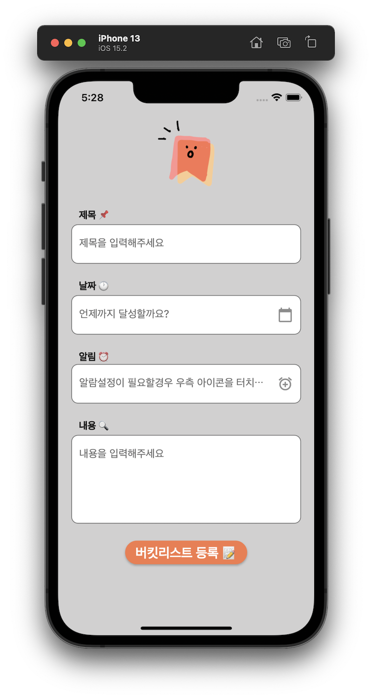

# [Flutter] 아이콘버튼 클릭 오류


* toc
{:toc}


---


버켓리스트 어플 제작중 아이콘버튼이 클릭되지 않는 오류가 발생했다.


```dart
//버켓 수정페이지.
InkWell(
    //팝업기능 구현해야함
    child: IgnorePointer(
      child: TextField(
        decoration: InputDecoration(
          border: OutlineInputBorder(
            borderRadius: BorderRadius.circular(10.0),
          ),
          hintText: '언제까지 달성할까요?',
          filled: true,
          fillColor: Colors.white,
          suffixIcon: IconButton(
            icon: Icon(Icons.calendar_today), //달력아이콘
            onPressed: () async {
              selectedDate = await showDatePicker(
                context: context,
                initialDate: DateTime.now(),
                firstDate: DateTime(2000),
                lastDate: DateTime(2024),
              );
              setState(() {});
        			},
          	),
        	),
        	controller: TextEditingController(
         	text: selectedDate != null ? selectedDate.toString(): '',
        ),
      ),
    ),
  ),

```

아이콘 클릭이 작동하지 않는 이유는 `InkWel`l 위젯으로 감싼` TextField`가 `IgnorePointer` 위젯으로 덮여있기 때문이었다.

`IgnorePointer` 위젯은 자식 위젯에 대한 사용자 입력을 무시하므로, 아이콘 클릭이 동작하지 않게 된것이다. 


## 오류해결

 아이콘 클릭이 작동하도록 수정하려면 IgnorePointer 위젯을 제거하고, `TextField`를 직접 `InkWell` 위젯으로 감싸 주어야 한다.

```dart
InkWell(
  onTap: () async {
    selectedDate = await showDatePicker(
      context: context,
      initialDate: DateTime.now(),
      firstDate: DateTime(2000),
      lastDate: DateTime(2024),
    );
    setState(() {});
  },
  child: TextField(
    decoration: InputDecoration(
      border: OutlineInputBorder(
        borderRadius: BorderRadius.circular(10.0),
      ),
      hintText: '언제까지 달성할까요?',
      filled: true,
      fillColor: Colors.white,
      suffixIcon: IconButton(
        icon: Icon(Icons.calendar_today), //달력아이콘
        onPressed: null,
      ),
    ),
    controller: TextEditingController(
      text: selectedDate != null ? selectedDate.toString() : '',
    ),
  ),
),
```

오류 해결후 `onPressed` 콜백이 `null`로 설정되어 있었다. 

아이콘 클릭이 작동하도록 수정하기 위해서는 `onPressed` 콜백을 아이콘을 클릭했을 때 호출되는 함수로 설정해야한다.

```dart
InkWell(
    onTap: () {},
    child: TextField(
      decoration: InputDecoration(
       border: OutlineInputBorder(
        borderRadius: BorderRadius.circular(10.0),
        ),
        hintText: '언제까지 달성할까요?',
        filled: true,
        fillColor: Colors.white,
        suffixIcon: IconButton(
         icon: Icon(Icons.calendar_today), //달력아이콘
         onPressed: () {
         /달력팝업 후 날짜선택부분
            Future<DateTime?> selectedDate = showDatePicker(
              context: context,
              initialDate: DateTime.now(),
              firstDate: DateTime(2000),
              lastDate: DateTime(2030),
              builder: (BuildContext context, Widget? child) {
               return Theme(
                data: theme.copyWith(
                 colorScheme: theme.colorScheme.copyWith(
                  primary: const Color.fromARGB(
                          255, 251, 212, 127), // 달력 헤더의 색상 변경
                      onPrimary: Colors.white, // 달력 헤더 텍스트 색상 변경
                      onSurface: Colors.orange, // 선택한 날짜의 색상 변경
                    ),
                    textTheme: theme.textTheme.copyWith(
                      displayLarge: TextStyle(
                       color: ColorList().yellow, // 달력 날짜 텍스트 색상 변경
                      ),
                    ),
                  ),
                  child: child!,
                );
              },
           );
            selectedDate.then((date) {
              if (date == null) {
                return null;
              }
              dateController.text =
                  DateFormat('yyyy-MM-dd').format(date);
              bucketListItemService.updateItem(
                  index: index,
                  title: titleController.text,
                  content: contentController.text,
                  dttm: dateController.text);
            });
          },
        ),
      ),
      controller: dateController,
    ),
    ),
```

이렇게 수정하면 달력아이콘 클릭과 날짜받아오기가 잘된다.


## 데모화면



