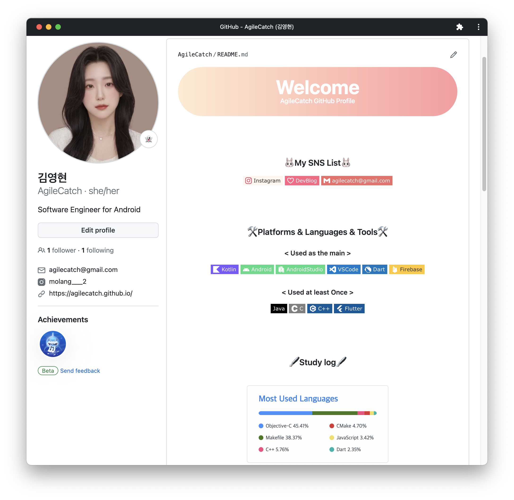
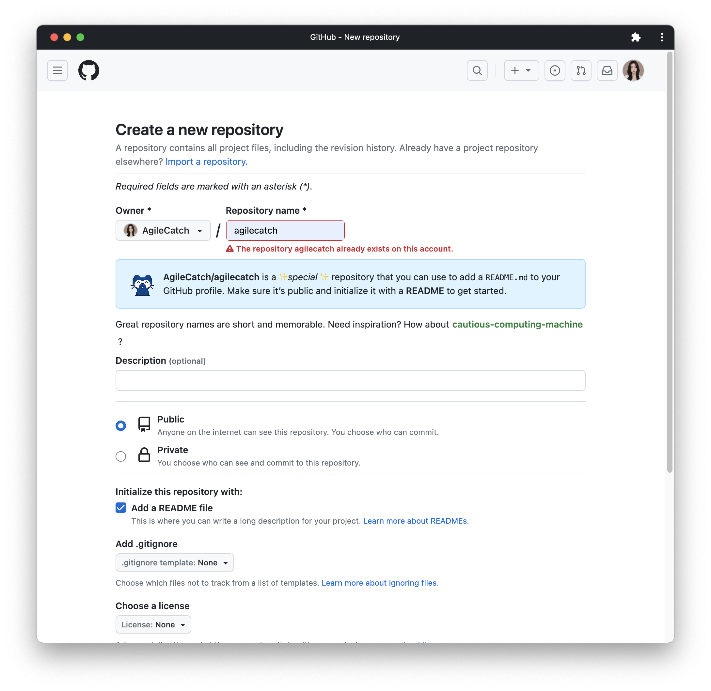

# [Git] Github Profie꾸미기


* toc
{:toc}
---


Github에 README.md를 이용해 프로필을 꾸며보자!





## 1) Repository 생성하기


github user name과 동일한 이름의 `Repository`를 만들면 *You found a secret!*이라는 메시지와 함께 `README.md` 파일로 깃헙 프로필을 작성할 수 있다.

Github 접속 > `Repository` > `New` 클릭하여 신규 repository를 생성해준 뒤 이름을 본인의 username과 동일하게 입력한다.



확인 버튼을 누르면 respotiroy가 만들어지고, `Add a README file` 옵션을 활성화한 후  `README.md` 파일을 함께 생성한다. 


본인은 이미 만든 파일이기때문에 생성되지않는다!


이후 상단오른쪽의 본인의 프로필사진을 클릭하여가보면  `README.md` 파일이 생성된 것을 볼 수 있는데 여기서 프로필을 꾸밀 수 있다.


## 2) 헤더

헤더 부분은  [capsule-render](https://github.com/kyechan99/capsule-render) 라는 오픈API를 사용하였다.

본인은 아래와 같이 구성하였다 참고하실분들은 참고하시길!

```

```


배경색을 정할 수 있는데

그라디언트를 사용하고 싶어서 [webgradients](https://webgradients.com) 사이트를 참고하여 만들었다.


## 3) 뱃지

뱃지들은 [shields](https://shields.io)에서 사용할 수 있도록 마련되어있다. 
여러 스타일의 뱃지가 있으니 이것도 자신의 취향대로 사용하면 된다.

뱃지의 색과 아이콘을 바꾸고싶다면 [Simple Icon](https://simpleicons.org/?q=github)  추천한다 여기서 아이콘을 검색하고 색을지정해주면 나만의 뱃지를 만들 수 있다.

* 인스타그램 뱃지

```
<a href="https://www.instagram.com/본인인스타아이디/" target="_blank"></a>
```


* 내가 사용하는 언어뱃지

```

```


## 4) Study log

깃허브에서 내가 자주사용하는 언어만 보여주는 부분이다!

```
[&layout=compact)](https://github.com/본인깃허브아이디/github-readme-stats)
```


이렇게해서 간단하게 프로필을꾸며보았다! 

사용할수있는 위젯들도여러가지 있으니 하고싶은것은 찾아서 등록해주면 좋을 것 같다.

