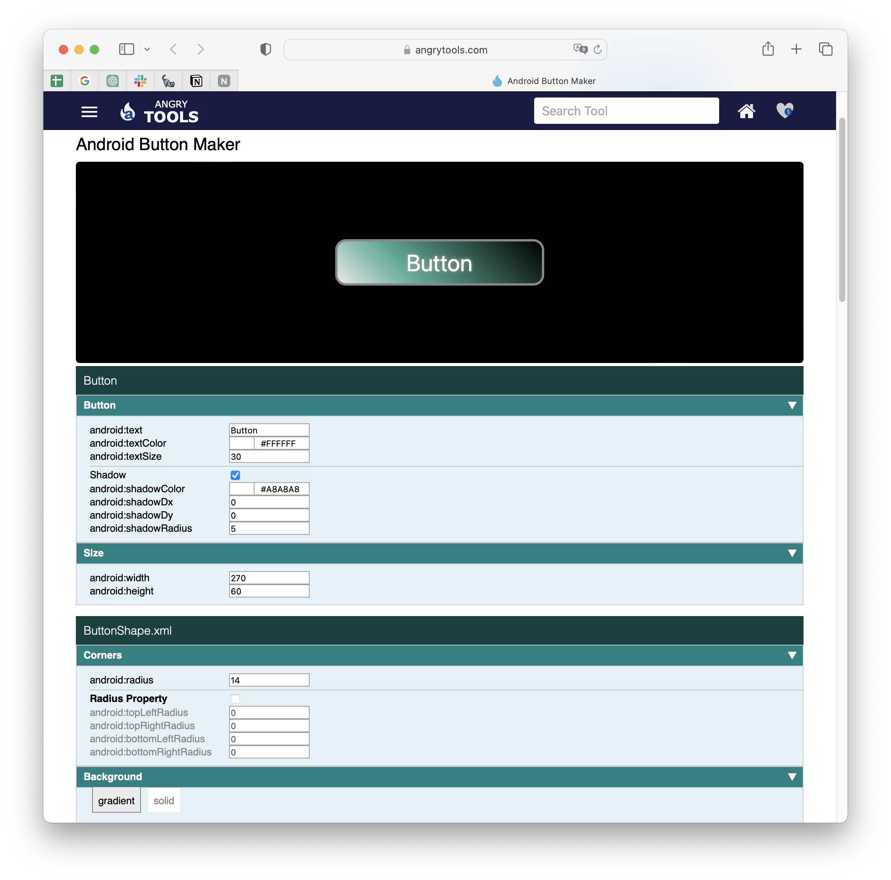
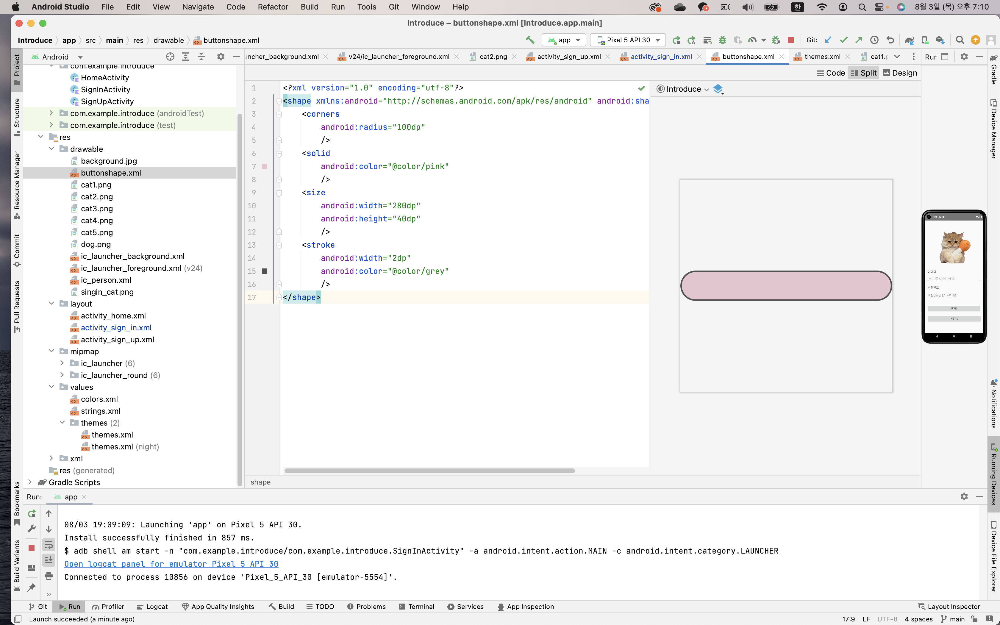
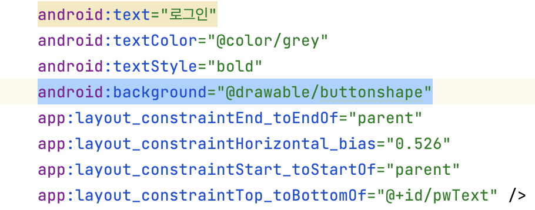
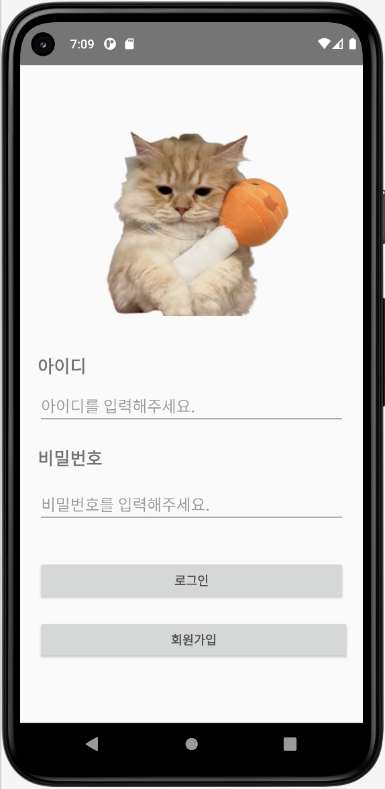

# [Android] Button 커스텀하기


* toc
{:toc}
---

안드로이드 xml파일에서 버튼을 하나씩 수정하다보니 귀찮다 생각이 들어

버튼을 한번에 수정할 수있는 툴을 사용하기로 했다.

 [<u>버튼 커스텀하기</u>](https://github.com/kyechan99/capsule-render) 를 사용하면 디자인을 하는 동시에 Android화면에 적용할 수 있어서 간편하다.


## Android Button Maker

위 링크를 클릭해 들어가면 



위와 같은 화면이 나오는데 원하는 버튼으로 수정후 아래로 스크롤 하면

`buttonshape.xml` , `Button` 코드가 나온다.


## `buttonshape.xml` , `Button`



* `drawable` 파일 안에 `buttonshape.xml` 파일을 만들어 추가해준다

* 그리고   `Button` 코드는 버튼을 커스텀하던 xml로 돌아가 적용해준다.




```kotlin
android:background="drawable/내가만든파일이름"
```

* `buttonshape.xml` 을 적용하는 방법이다.
* 위코드를 복사하여 만들던 <Button 안에 넣어주면 쉽게 적용된다.


## Before & After

