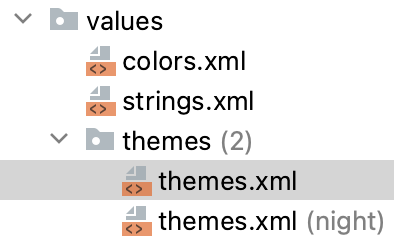
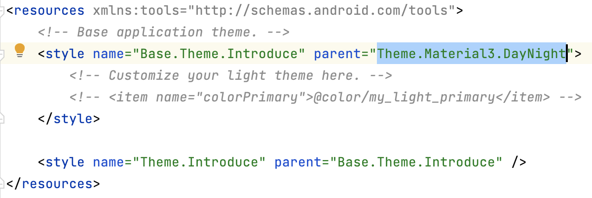

# [Android] Button 배경색 적용 안되는 오류


이후 버튼의 배경색을 지정하기위해 xml파일에 백그라운드로넣어줬지만 배경색이 바뀌지 않는오류를 발견했다.

이는 App의 기본 테마가 적용되어 있어서 그런것이였다. 이 테마를 변경해보자.




* `Values> themes>themes.xml`로 접속한다.




```kotlin
parent='Theme.AppCompat.Light'
```

* `Theme.Material3.DayNight` -> `Theme.AppCompat.Light` 로 변경해준다.


그러면 밝은 테마로 바뀌면서 설정한 배경사진이 적용될 것이다!


