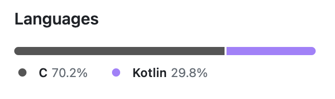
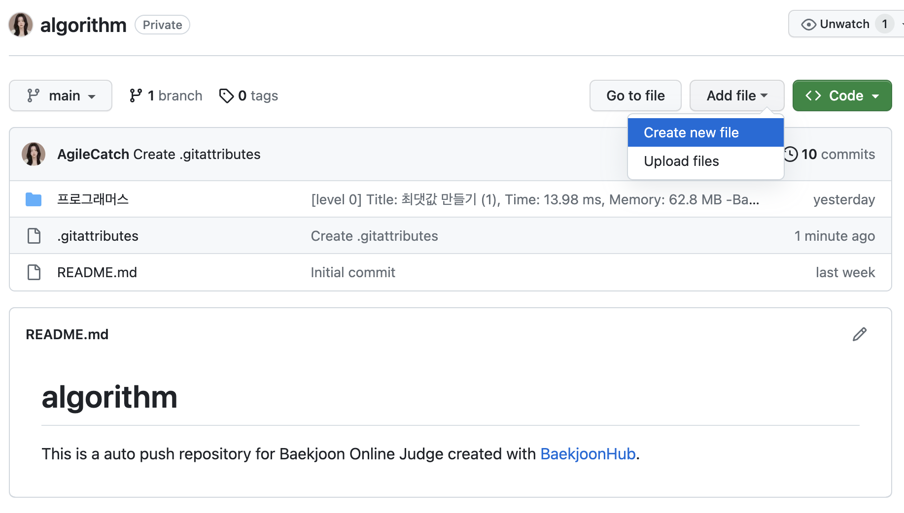
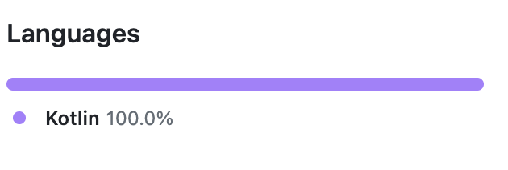

# [GitHub] Repositorie 주 언어 변경

깃허브를 사용하다보면 많이 사용한 Languages를 정리해 그래프로 보여주는 기능이있다.

본인은 백준허브를 연결해서 C언어로 알고리즘 풀이를 시작했는데 이후 Kotlin으로 변경을 하게되었다.




 C언어보다 Kotlin을 사용해 문제를 많이 풀었음에도 불구하고 Languages그래프 비율이 C가 더 많은 현상이 있기에 알아보니

언어비율에 미치는 것은 파일의 갯수가 아닌 **파일의 크기**라고한다.

즉, 큰 서브 코드 파일이 올라게되면서 자신의 주 코드 비율이 밀려날 수 있다. 

그래프에서 C언어를 제하기로 하였다. 방법은 아래와 같다.


## 1. Repositorie접속



* 상단에 `Add file`  > `Create new file` 클릭


```
.gitattributes//제목으로 입력해줍니다.
*.c linguist-detectable=false//내용으로 입력해줍니다.
```

* Languages에서 C언어를 제하는 방법이다. 이렇게 파일을 만들고 커밋하면 완료!
* 반대로 인식해야할 내용이 있다면 `*.java linguist-detectable=true` 이렇게 하면된다.


```
* linguist-vendored //Language 전체를 무시하도록 설정
*.kt linguist-vendored=false //코틀린은 제외
```

- 만약 무시해줄 언어가 너무 많다면 전체를 무시해준 다음 내가 표시할 언어만 인식하도록 설정해주면 된다.




