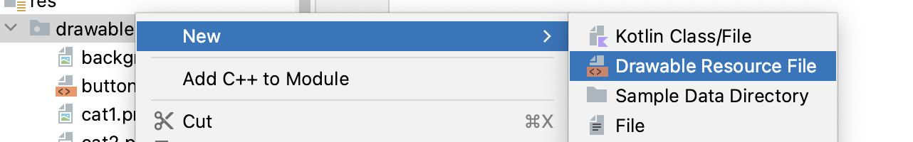
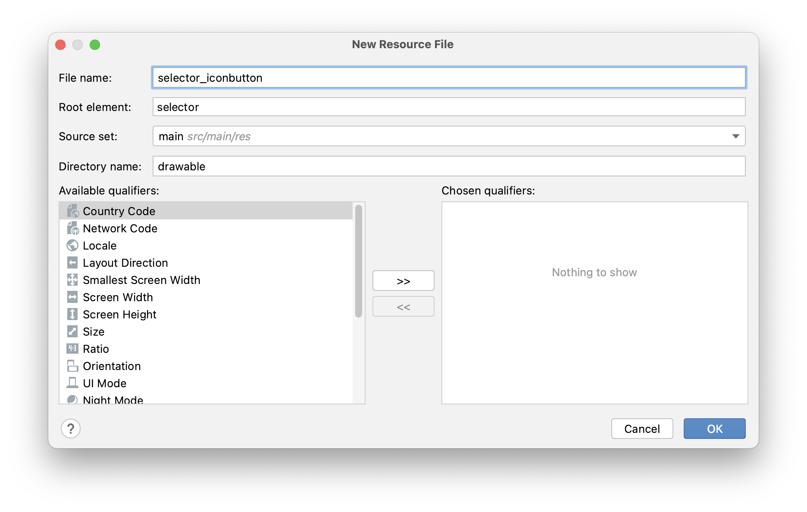
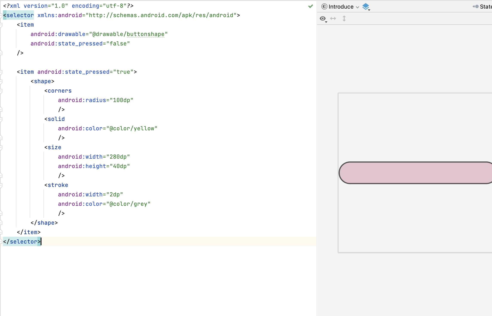
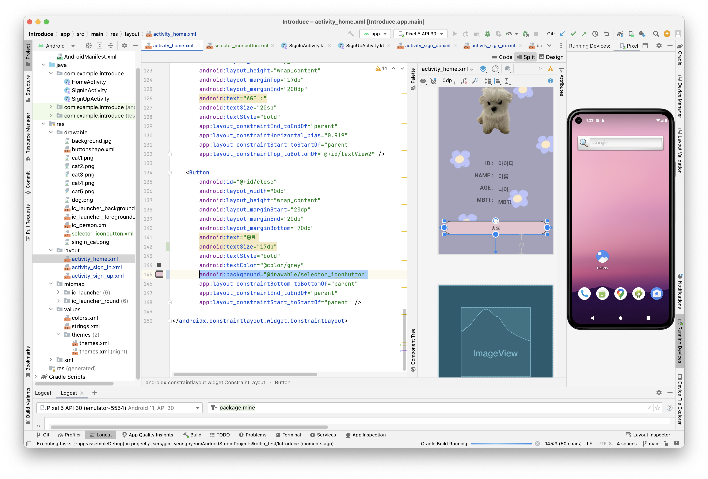
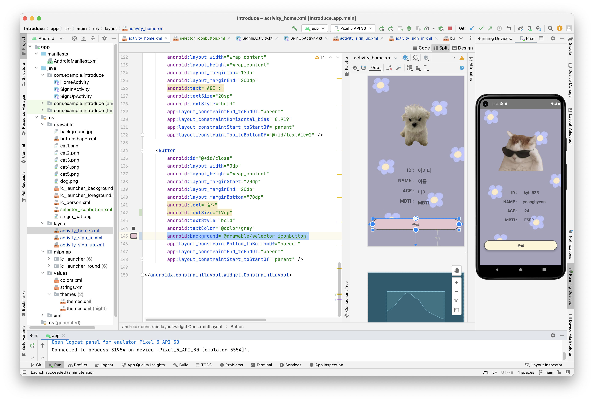
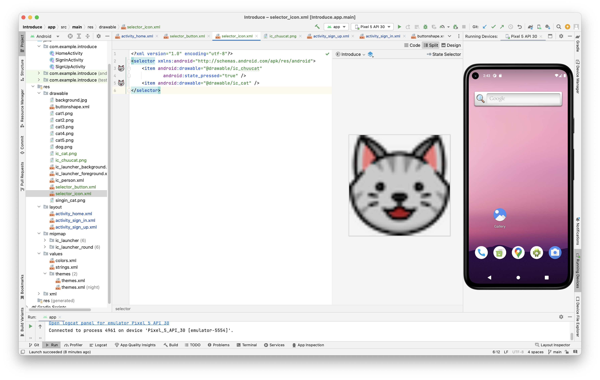
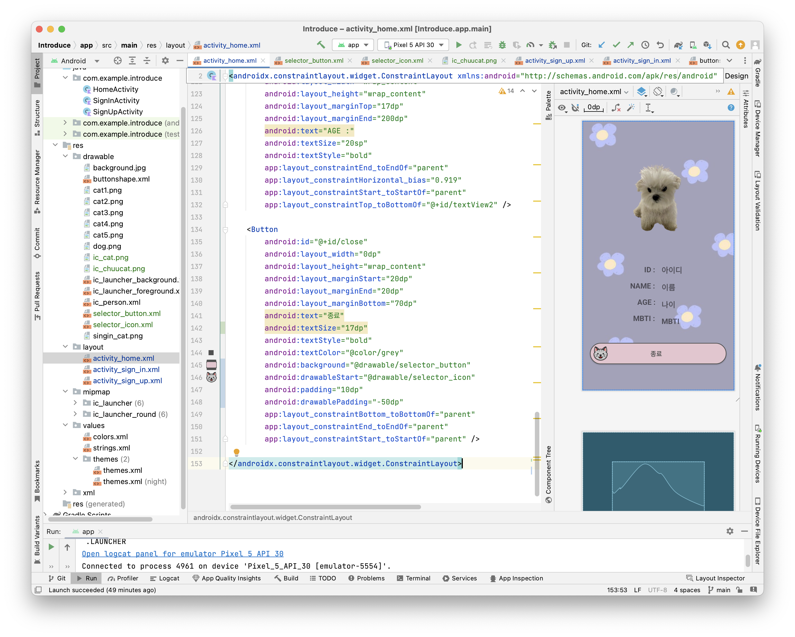

# [Android] selector 버튼 만들기

* toc
{:toc}
---

오늘은 버튼을 클릭했을때 배경이 바뀌는 이펙트를 넣고싶어 찾아보니 `selector` 를 사용해 할 수 있다고한다.

그런이유로 selector로 버튼 만들기 & 클릭했을때 아이콘 변경하기를 해보겠다.


## **selector란?**

안드로이드에서 selector(선택자)는 

* 버튼, 레이아웃, 텍스트 등과 같은 뷰의 상태에 따라 다른 리소스를 선택하는 데 사용되는 XML 파일이다.

이렇게 하면 뷰의 상태에 따라 서로 다른 리소스를 적용할 수 있어서 사용자 인터페이스를 효과적으로 다양화할 수 있다.

* selector는 버튼의 상태에 따라 다른 배경 이미지, 텍스트 색상 등을 지정하는 데 사용된다. 
  * 예를 들어 버튼을 누를 때와 누르지 않을 때, 버튼에 포커스가 있을 때와 없을 때, 버튼이 비활성화 상태일 때와 활성화 상태일 때 등을 구분하여 서로 다른 디자인을 적용할 수 있다.

* selector는 res/drawable 디렉토리에 XML 파일로 저장된다.
*  XML 파일에는 상태별로 리소스를 지정하는 `<item>` 태그들이 포함되어 있다.
  *  각 `<item>` 태그는 상태와 관련된 속성을 정의하고, 해당 상태일 때 적용할 리소스를 지정한다.


## **selector를 이용해서 버튼 만들기**





* drawable > New > Drawable Rescurcefile
* 파일 이름을 작성해주시고 Root elemont를확인해 selector로 되어있는지 확인하고 xml을 만든다.

---



만들어진 파일의 `<item></item>` 안에 각 내용을 작성해준다.

```xml
<selector xmlns:android="http://schemas.android.com/apk/res/android">
    <item
        android:drawable="@drawable/buttonshape"//기존에 있던버튼디자인
        android:state_pressed="false"//버튼이 눌리지않았을때
    />

    <item android:state_pressed="true">//버튼이 눌렸을때
        <shape>
            <corners
                android:radius="100dp"
                />
            <solid
                android:color="@color/yellow"
                />
            <size
                android:width="280dp"
                android:height="40dp"
                />
            <stroke
                android:width="2dp"
                android:color="@color/grey"
                />
        </shape>
    </item>
</selector>
```

* `android:state_pressed="false"` 버튼이 눌리지 않았을때의 리소스를 적용해준다.

* `android:state_pressed="tue"` 버튼이 눌렸을때의 리소스를 적용해준다.




```xml
android:background="@drawable/selector_button"
```

* 적용시킬 xml파일에 들어가 `background`를 방금만든 xml로연결해준다. (위 코드를 추가해주기)

* 그리고 코드를 실행시켜주면!

  

### 결과 UI



위 사진과같이 배경색이 변경되는걸 볼 수 있다. 


## **(응용) 버튼에 이미지 icon 추가하기**

버튼을 눌렀을때 아이콘 이미지도함께 변경되도록 해보겠다.

---

💡**준비사항!**

* 변경시 필요한 아이콘 2개 찾기! 필자는  [<u>무료icon찾기</u>](https://www.flaticon.com/kr/) 를 사용하여 icon2개를 다운로드 해줬다.
* 다운받은 icon drawabl에 넣기

---




* `selector_background.xml`을 만든것 과같이 xml파일 만들어준다.

* 다음과 같이 `state_pressed` 를 **ture** 로 설정해준다.



```xml
 android:drawableStart="@drawable/selector_icon"
```

* 적용시켜줄 xml에 위 코드를 추가해준다.


### 결과 UI

