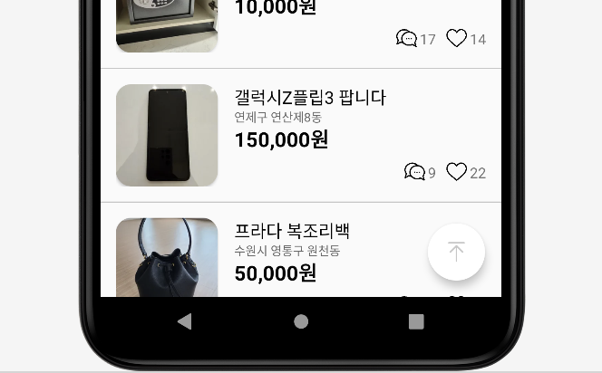
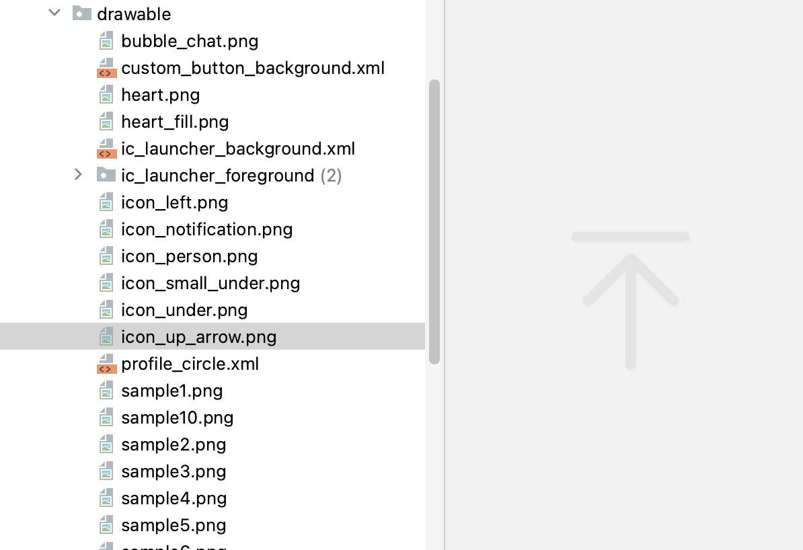
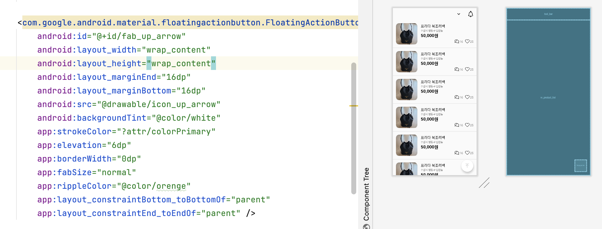

# [Android] FAB을 사용해 페이지 상단으로 자동 스크롤 버튼 만들기

* toc
{:toc}
---

## **FAB 이란?**

**플로팅 작업 버튼(FAB)**은 앱 UI의 기본 작업을 트리거하는 원형 버튼이다.

오늘은 이 버튼을사용해 **상단으로 자동으로 스크롤**해주는 버튼을 만들 것이다.



- `Floating Action Button` 작업버튼 예시이다.


## **1) 이미지 추가**



* res/**drawable** 의 위치에 **버튼에 사용할 이미지**를 찾아 추가해준다.

---

## **2) 레이아웃에 FAB 버튼 추가**



```xml
<com.google.android.material.floatingactionbutton.FloatingActionButton
        android:id="@+id/fab_up_arrow"
        android:layout_width="wrap_content"
        android:layout_height="wrap_content"
        android:layout_marginEnd="16dp"
        android:layout_marginBottom="16dp"
        android:src="@drawable/icon_up_arrow" 
        android:backgroundTint="@color/white"
        app:elevation="6dp"
        app:borderWidth="0dp"
        app:fabSize="normal"
        app:rippleColor="@color/orenge"
        app:layout_constraintBottom_toBottomOf="parent"
        app:layout_constraintEnd_toEndOf="parent" />
```

* `backgroundTint` : 버튼 **배경색**을 설정할 수 있다.
* `elevation` : 버튼의 그림자를 설정할 수 있다.

- `borderWidth` : 버튼의 **테두리 두께**를 설정할 수 있다.
- `fabSize` : 버튼의 **사이즈**를 지정할수 있다. 지금은 **normal**로 설정되어있다.
- `rippleColor` : 버튼을 클릭할 때 나타나는 리플(파동) 효과의 색상을 지정한다.
  - 버튼을 클릭했을때 주황색으로 설정했다.

---

## **3) FAB 동작 적용 하기**

```kotlin
val recyclerView = binding.rvProductList
recyclerView.adapter = adapter
recyclerView.layoutManager = LinearLayoutManager(this)

// 플로팅 버튼 및 스크롤 설정
val fabUpArrow = binding.fabUpArrow
recyclerView.addOnScrollListener(object : RecyclerView.OnScrollListener() {
   override fun onScrolled(recyclerView: RecyclerView, dx: Int, dy: Int) {
       if (dy > 0) {
           fabUpArrow.show() // 아래로 스크롤하면 플로팅 버튼 보이기
       } else {
           fabUpArrow.hide() // 위로 스크롤하면 플로팅 버튼 숨기기
       }
   }
  })

fabUpArrow.setOnClickListener {
   recyclerView.smoothScrollToPosition(0) // 최상단으로 스크롤
   }
```

본인은 **recyclerView**를 사용했기 때문에 **어댑터**를 사용해서 연결해주었다. 

- `fabUpArrow` : 생성한 FAB버튼 ID값.
- `rvProductList` : 생성한 리사이클러뷰의 ID값
- `addOnScrollListener` : 사용하여 리사이클러뷰에 **스크롤 이벤트를 감지**하는 리스너를 추가한다.
- `dy`는 수직 스크롤 변화량(delta)를 나타내며, 양수인 경우 아래로 스크롤하는 동작을 의미한다.
  - `dy > 0`인 경우에는 **아래로 스크롤 중**이므로 **플로팅 버튼을 보이도록** 설정하고
  -  `dy <= 0`인 경우에는 **위로 스크롤 중**이므로 **플로팅 버튼을 숨기도록** 설정한다.
- `setOnClickListener` : 플로팅 액션 버튼의 **클릭 이벤트 리스너**를 설정한다.
  - 클릭 이벤트가 발생하면 `smoothScrollToPosition(0)`을 호출하여 리사이클러뷰를 최상단으로 **부드럽게 스크롤**한다.


## **📱결과**


### 스크롤 상단 이동!

- 스크롤을 최상단으로 이동시키는 플로팅 버튼 기능 추가
- 플로팅 버튼은 스크롤을 아래로 내릴 때 나타나며, 스크롤이 최상단일때 사라진다.
- 플로팅 버튼을 누르면 스크롤을 최상단으로 이동시킨다.
- 플로팅 버튼은 나타나고 사라질때 fade 효과가 있다.
- 플로팅 버튼을 클릭하면(pressed) 아이콘 색이 변경된다.
