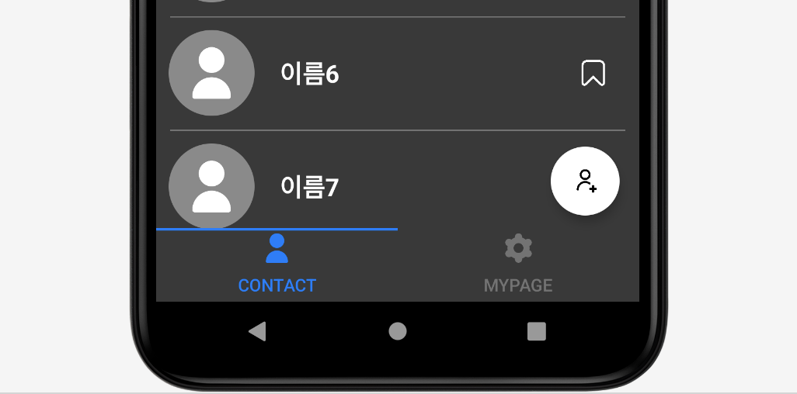
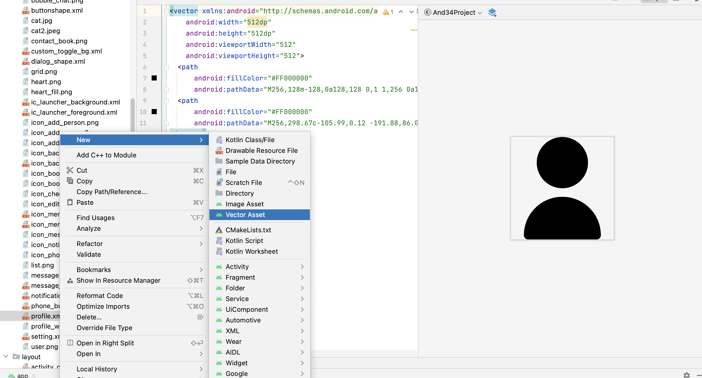
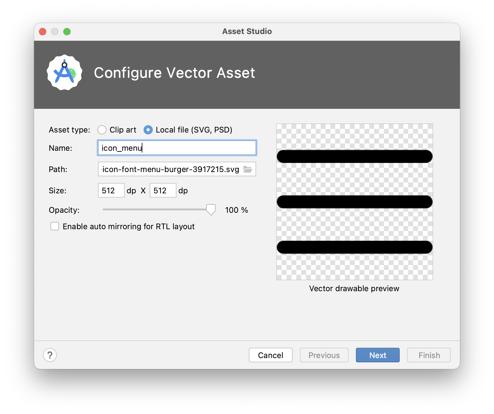
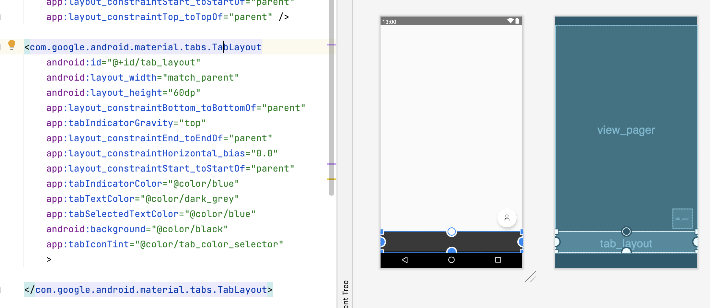

# [Android] Tablayout 커스텀하기

* toc
{:toc}
---




`TabLayout`은 말 그대로 프래그먼트의 **페이지를 변경해주는 버튼**이라고 생각하면 쉽다.

본인은 탭 레이아웃에 아이템을 넣기위해 png파일을 사용했지만 사진이 잘리고, 색을 변경할수 없다는것을 알았다.

그리고 svg를 사용하는 방법을알아 적용할 수 있게되어 그 방법을 소개해주겠다.


**오늘의 목표:** 탭 레이아웃에 **아이콘**을 추가하고 클릭시 색상이 변경되도록 구현 해 보자!


## 💡**준비사항**

먼저 탭 레이아웃에 넣을 **아이콘**을 구해야 한다.

[falaticon](https://www.flaticon.com/kr/search?word=%EB%A9%94%EB%89%B4&type=uicon)사이트에 접속하여 필요한 아이콘을 ***svg***로 받아준다!

우리는 벡터값을 이용할 거기때문에 꼭 ***svg***로 다운받아줘야한다.





* **Drawable > New > Vector Asset**을 이용해 아이콘을 추가해줄 것이다.





* 다운로드 받았던 ***svg***를 `Path` 경로로 추가해주고 이름도 설정해준다.

이처럼 필요한 아이콘을 추가해주고 시작해보자!


## **1) xml에 추가하기**




먼저 탭 레이아웃을 사용하기위해 xml에 추가해줘야 한다.

본인은 뷰페이저와 함께 사용할 것이다.


---

```xml
<com.google.android.material.tabs.TabLayout
        android:id="@+id/tab_layout"
        android:layout_width="match_parent"
        android:layout_height="60dp"
        app:layout_constraintBottom_toBottomOf="parent"
        app:tabIndicatorGravity="top"
        app:layout_constraintEnd_toEndOf="parent"
        app:layout_constraintHorizontal_bias="0.0"
        app:layout_constraintStart_toStartOf="parent"
        app:tabIndicatorColor="@color/blue"
        app:tabTextColor="@color/dark_grey"
        app:tabSelectedTextColor="@color/blue"
        android:background="@color/black"
        app:tabIconTint="@color/tab_color_selector"
        >
    </com.google.android.material.tabs.TabLayout>
```

* `app:layout_constraintBottom_toBottomOf="parent"`: 이것은 **탭 레이아웃을 화면 하단에 배치**하는 데 사용된다.
* `app:tabIndicatorGravity="top"`: **탭 선택 표시기의 위치**를 설정합니다. "top"으로 설정하면 선택한 탭 아래에 표시된다. 본인은 레이아웃을 아래에 배치했기때문에 탭선택표시를 위쪽으로 해줬다.
* `app:tabIndicatorColor="@color/blue"`: 선택한 탭 아래에 표시되는 **선택 표시기의 색상**을 설정한다.
* `app:tabTextColor="@color/dark_grey"`: **탭의 텍스트 색상**을 설정합니다.
* `app:tabSelectedTextColor="@color/blue"`: **선택된 탭의 텍스트 색상**을 설정합니다.
* `android:background="@color/black"`: **탭 레이아웃의 배경 색상**을 설정합니다.
* `app:tabIconTint="@color/tab_color_selector"`: 탭에 아이콘을 표시하는 경우 **아이콘의 색상을 설정**한다. 
* `@color/tab_color_selector`는 색상 선택기 리소스를 나타내며 탭 선택 상태에 따라 적절한 색상을 지정할 수 있다.


## **2)Selector 만들어주기**

위 코드를 그대로 복사해넣으면 `app:tabIconTint="@color/tab_color_selector"` 에 오류가 발생할 것이다.

탭을 선택했을때 색을 변경하기위한 셀렉터를 만들어보자.


* 위와 같이 **res > color**폴더가 없으면 아래와 같은 경로로 만들어주고 시작하자.


**[color 폴더 생성경로]**


```xml
<?xml version="1.0" encoding="utf-8"?>
<selector xmlns:android="http://schemas.android.com/apk/res/android">
    <item android:color="@color/blue"
        android:state_selected="true"/>
    <item android:color="@color/dark_grey"/>
</selector>
```

* 폴더를 생성한 후 `tab_color_selector.xml`을 생성해준다.
* `android:state_selected` (**선택됐을때**): @color/blue
* 그외 : @color/dark_grey

위와같이 지정해주면 잘 적용 될것이다!


## **3) Activity와 연결**

```kotlin
//탭레이아웃 설정
        tabLayout.addTab(tabLayout.newTab().setText("Contact"))
        tabLayout.addTab(tabLayout.newTab().setText("Mypage"))
        //Tab 아이콘 설정
        tabLayout.getTabAt(0)?.setIcon(R.drawable.profile)
        tabLayout.getTabAt(1)?.setIcon(R.drawable.setting)
        
        // TabLayout의 탭 선택 리스너 설정
        tabLayout.addOnTabSelectedListener(object : TabLayout.OnTabSelectedListener {
            override fun onTabSelected(tab: TabLayout.Tab?) {
                if (tab != null) {
                    viewPager2.currentItem = tab.position // 선택된 탭에 해당하는 페이지로 이동
                }
            }

            override fun onTabUnselected(tab: TabLayout.Tab?) {
                // 사용하지 않음
            }

            override fun onTabReselected(tab: TabLayout.Tab?) {
                // 사용하지 않음
            }
        })
```

위와같이 탭 레이아웃을 연결하기위해 액티비티 **onCreate**안에 설정해주었다.

* `addTab` 탭 레이아웃의 이름을 설정해준다.
* `getTabAt` 을 사용해 아이콘을 추가해줄 것이다. 
  * int 값으로 받아오기때문에 0번째, 1번째로 설정을 해준후 원하는 아이콘을 추가해준다.


이렇게 실행하게되면 글씨와 아이콘 모두 색상을 변경할 수 있게된다 !
