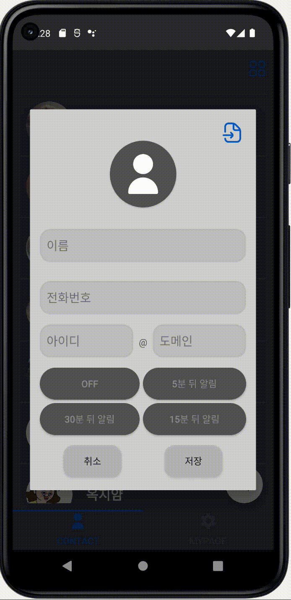
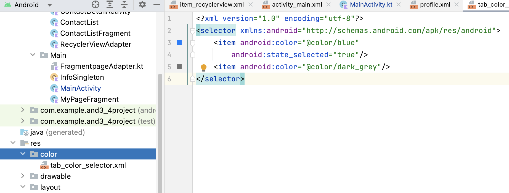
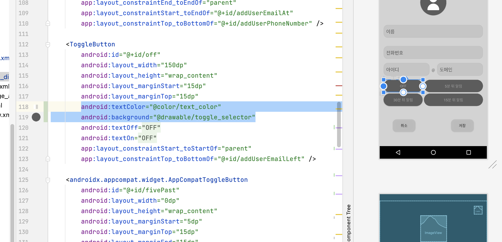
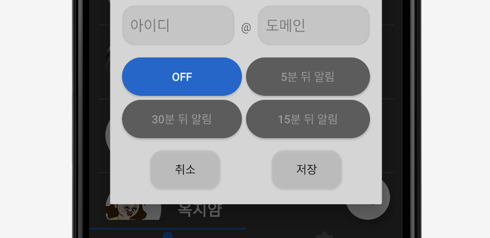

# [Android] Togglebutton 커스텀하기

* toc
{:toc}
---


`Toggle button`은  두가지 상태중에 하나로 토글되어지도록 만든 버튼이다. 

토글 두가지 상태 중 하나를 선택할 수 있다는 점에서 라디오 버튼을 떠올릴 수 도 있지만, **불이 꺼지고 켜지는 상태**를 표시하는 스위치 같은 역할을 해준다.




오늘은 이 토글버튼을 커스텀 해볼 것이다.


## **1) 배경색 바꾸기**

### **xml 추가하기**

토글버튼은 버튼이 ***on***일때, ***off*** 일때 상태가 둘이니 두개의 xml 파일을 만들어줘야한다.

**res > drawable >** 경로로 `button_on.xml`, `button_off.xml` 을 생성해준다.


#### button_on.xml 

```xml
<?xml version="1.0" encoding="utf-8"?>
<shape xmlns:android="http://schemas.android.com/apk/res/android" android:shape="rectangle" >
    <corners
        android:radius="50dp"
        />
    <solid
        android:color="@color/blue"
        />
    <padding
        android:left="0dp"
        android:top="0dp"
        android:right="0dp"
        android:bottom="0dp"
        />
</shape>
```


#### button_off.xml

```xml
<?xml version="1.0" encoding="utf-8"?>
<shape xmlns:android="http://schemas.android.com/apk/res/android" android:shape="rectangle" >
    <corners
        android:radius="50dp"
        />
    <solid
        android:color="@color/dark_grey"
        />
    <padding
        android:left="0dp"
        android:top="0dp"
        android:right="0dp"
        android:bottom="0dp"
        />
</shape>
```

---

그리고 같은 경로로 selector를 만들어 줄 것이다.

#### Toggle_selector.xml

```
<?xml version="1.0" encoding="utf-8"?>
<selector xmlns:android="http://schemas.android.com/apk/res/android">
    <item android:state_checked="true" android:drawable="@drawable/button_on" />
    <item android:drawable="@drawable/button_off" />
</selector>
```

* **state_checked="true"** : 토글버튼이 ***on*** 상태 일때
* 그 밑은 토글 버튼이 ***off*** 상태 일때 이다.


## **2) 글자 색 바꾸기**



* 글자색도*** on***,***off*** 상태에 따라 변경할 수 있다.
* 위와 같이 **res > color**폴더가 없으면 아래와 같은 경로로 만들어주고 시작하자.


#### text_color.xml

```
<?xml version="1.0" encoding="utf-8"?>
<selector xmlns:android="http://schemas.android.com/apk/res/android">
    <item android:state_checked="true" android:color="@color/white" />
    <item android:color="@color/light_grey"/>
</selector>
```

* **state_checked="true"** : 토글버튼이 ***on*** 상태 일때
* 그 밑은 토글 버튼이 ***off*** 상태 일때 이다.


## **3) 적용하기**

이제 적용하는 일만 남았다.



```xml
<ToggleButton
        android:id="@+id/off"
        android:layout_width="150dp"
        android:layout_height="wrap_content"
        android:layout_marginStart="15dp"
        android:layout_marginTop="15dp"
        android:textColor="@color/text_color"
        android:background="@drawable/toggle_selector"
        android:textOff="@string/off"
        android:textOn="@string/off"
        app:layout_constraintStart_toStartOf="parent"
        app:layout_constraintTop_toBottomOf="@+id/addUserEmailLeft" />
```

*  **android:textColor** : 글자색상 변경

* **android:background** : 배경색상 변경


이렇게 적용하면 쉽게 커스텀을 할 수 있게된다!


