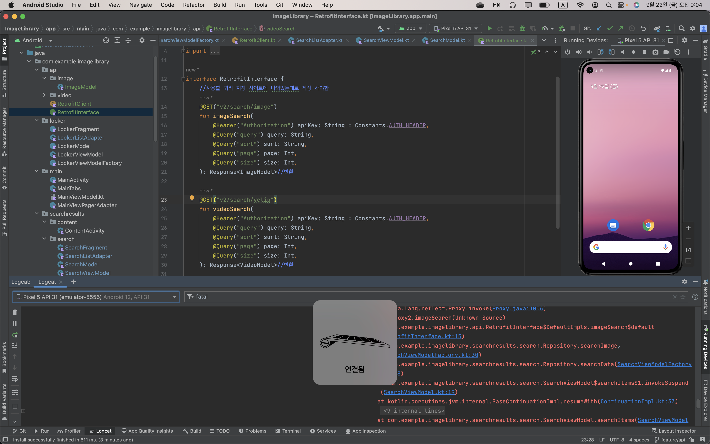
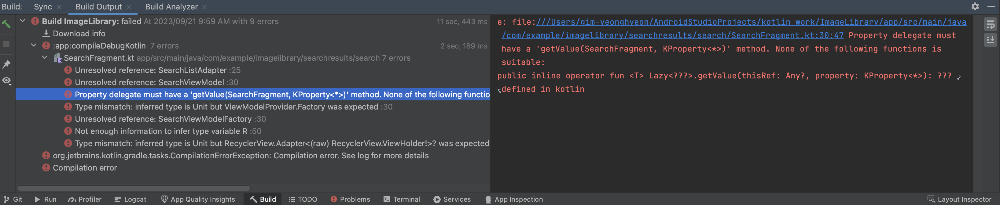
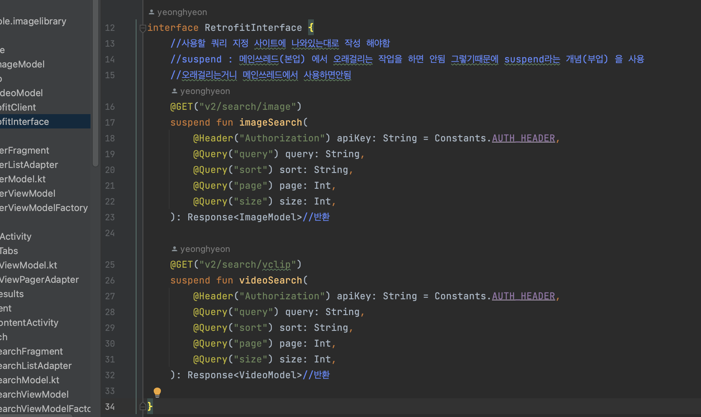
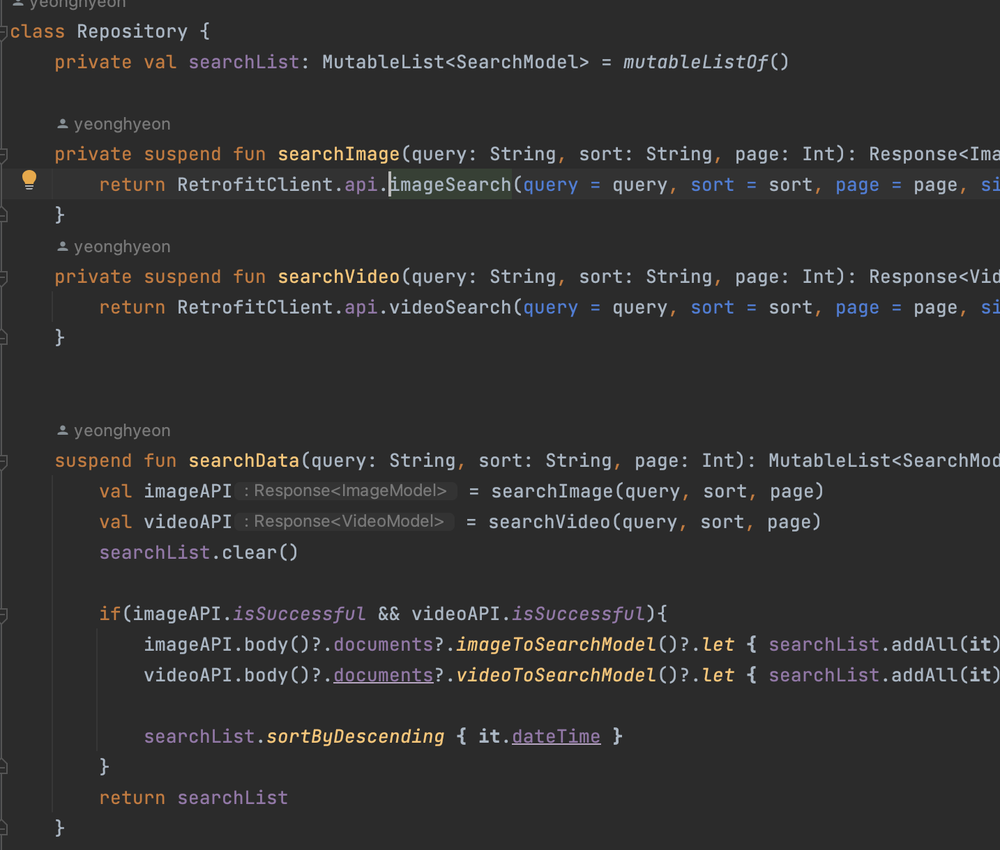
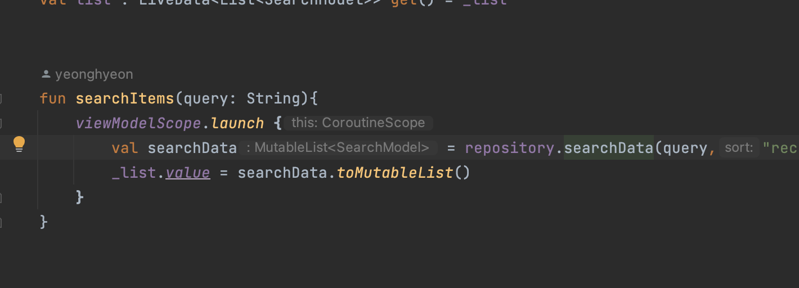
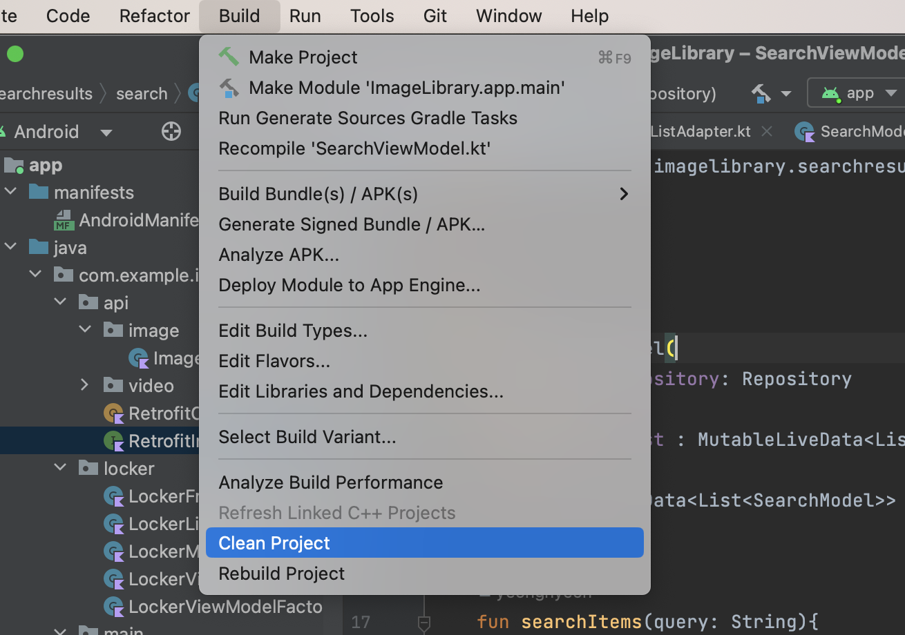
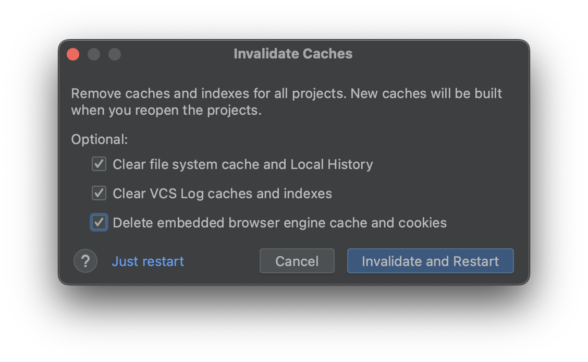

# [Android] Retrofit "Unable to create call adapter for retrofit2 xxx ..." 오류 해결방법



API를 연결하는 도중 **레드로핏** 관련해  아래와 같은 오류가 반복적으로 나타났다.

코드를 여러번 살펴봐도 문법적인 오류는 발생하지 않았고 , 오랜시간을 쏟아 오류를찾아 봤지만 답이 나오지 않았다!

```

java.lang.IllegalArgumentException: Unable to create call adapter for class java.lang.Object

```


그렇게 오류 해결 방법중 3가지 방법을 공유해 보도록 하겠다! 

## ☄️ **오류해결 방법**

##### **1) 코루틴 사용 시 코루틴 블록에서 호출하는 메소드의 fun 앞에 suspend 키워드를 붙였는지 확인하자.** 



필자의 경우에는 **Retrofit_Interface** 내의 **fun** 앞에 **suspend**를 붙이지 않았었다!(사진은 붙여준 뒤임)


💡**suspend가 무엇인가?** 

쉽게 말하자면  메인쓰레드(본업) 에서 오래걸리는 작업을 하면 안된다고 한다. 

그렇기때문에 suspend라는 개념(부업) 을 사용 하여 메인에서 소비를 하지않도록 해주는 것이고 

 **suspend**는 오래걸리는 작업이니 메인쓰레드에서 사용하면안됨! 의 표시와 같다고 생각하면 된다.


이 인터페이스를 사용하는 다른 함수들도 **suspend**가 잘 붙어있는지 확인해주자!





* 다른 부분은 잘 구현되어 있는 모습을 볼 수 있다.

이렇게 구현 한 후 여전히 오류가 발생했고 이후 아래 내용으로 오류가 고쳐졌다!

**2) 빌드 클린 프로젝트**



1. Build > Clean Project 를 클릭하여 빌드내역을 삭제해준다.



2. File > Invalidate Caches 를 클릭하여 모든 캐시내역을 삭제해준다!


이것으로 문제가 해결됐다 역시 정체불명 오류는 한번씩 클린 프로젝트와 캐시내역을 삭제해주면 해결된다^^..!
