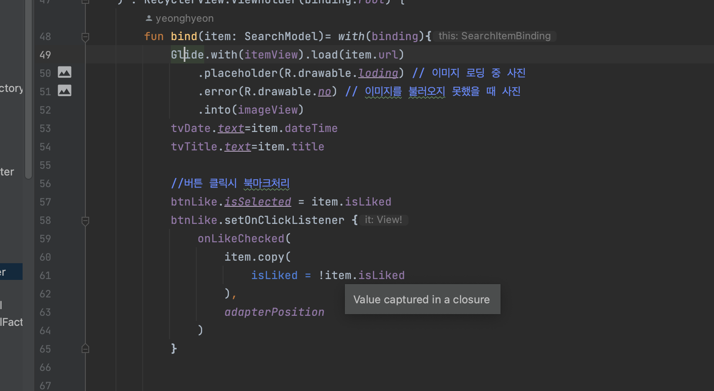
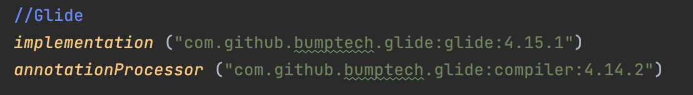
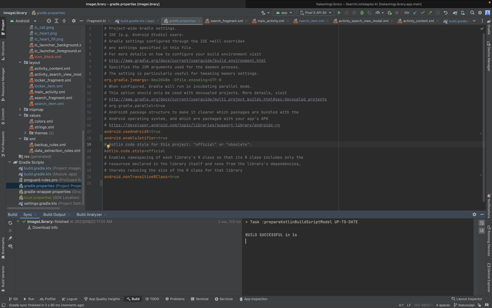
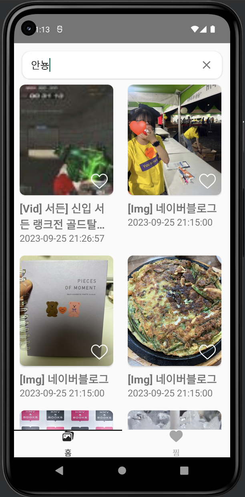

# [Android] Glid 오류 해결방법



```
Your project has set `android.useAndroidX=true`, but configuration `:app:debugRuntimeClasspath` still contains legacy support libraries, which may cause runtime issues.
This behavior will not be allowed in Android Gradle plugin 8.0.
Please use only AndroidX dependencies or set `android.enableJetifier=true` in the `gradle.properties` file to migrate your project to AndroidX (see https://developer.android.com/jetpack/androidx/migrate for more info).
The following legacy support libraries are detected:
:app:debugRuntimeClasspath -> com.github.bumptech.glide:glide:4.9.0 -> com.github.bumptech.glide:gifdecoder:4.9.0 -> com.android.support:support-annotations:27.1.1
:app:debugRuntimeClasspath -> com.github.bumptech.glide:glide:4.9.0 -> com.android.support:support-fragment:27.1.1
:app:debugRuntimeClasspath -> com.github.bumptech.glide:glide:4.9.0 -> 
```


리사이클러뷰 어댑터를 연결하는 도중 위와 같이 **Glid**가 사용되지 않는 오류가 발생했다.


## ☄️ **오류해결 방법**

**1) 프로젝트의 `build.gradle` 파일을 열어 `dependencies` 종속성이나 충돌이 있는지 확인하자.**

이 오류는 Android 프로젝트에서 종종 발생하는 종속성 충돌 문제였다.

나의 경우에는 `androidx.core:core:1.9.0`와 `com.android.support:support-compat:27.1.1` 모듈에서 동일한 클래스가 중복되어 있다고 나와 있었고, 



위와 같이 변경해주고 **Sync** 해 주었다.


이활동으로도 오류가 해결되지 않아 더 구글해보았고, 두번째 방법으로 오류를 해결할 수 있었다.


**2) Gradle Scripts - gradle.properties에서 AndroidX enable해주기**

이 오류 메시지는 AndroidX와 지원 라이브러리 (Support Library) 간의 충돌을 나타낸것이였다.

AndroidX는 Android의 새로운 라이브러리 세트로, 이전의 지원 라이브러리를 대체하는데,

현재 프로젝트에서는 AndroidX를 사용하도록 설정했지만 여전히 라이브러리를 사용하고 있는 모듈이 있었고, 이는 런타임 시 문제를 일으킬 수 있다고 한다.

AndroidX enable시켜주지 않아서 발생한 것으로 Gradle Scripts - gradle.properties 파일에서 아래 두줄만 추가해주면 된다.

```
android.useAndroidX=true
android.enableJetifier=true
```




이렇게 오류가해결 되었고 이미지와 비디오 api를 잘 불러올 수 있었다!

