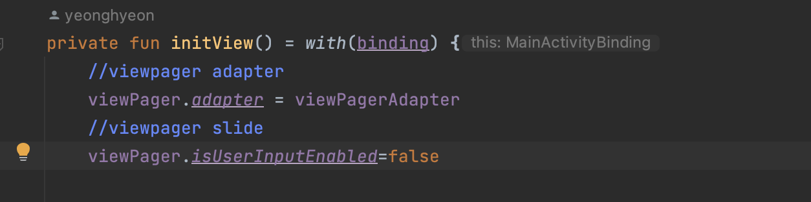

# [Android] Viewpager2 - Recyclerview 스크롤 중복

* toc
{:toc}
---


ViewPager2 안에 가로로 슬라이되는 Recyclerview 아이템을 2개 넣었었다.

하지만 리사이클러뷰를 가로로 슬라이드 하게되면 프래그먼트가 슬라이드되어 다른 화면으로 넘어가는 문제가 발생했다.

문제를 찾아보니 기본적으로 Viewpager2는 중첩된 스크롤뷰를 지원하지 않고 , 또한 ViewPager2는 final 클래스라 다른 커스텀 클래스를 만들어 상속받을 수 없는 상황이였다.


그래서! 개인적으로는 scroll 영역이 겹치는 경우에는 사용자 편의성이 현저히 떨어지기 떄문에,
궁극적인 컨셉 변경이 저는 가장 효율적이라 생각했고, 다음과같이 오류를 수정해보려 하였다.


## 해결방법 1 - NestedScrollableHost 사용

[구글 개발자 문서](https://github.com/android/views-widgets-samples/blob/master/ViewPager2/app/src/main/res/layout/item_nested_recyclerviews.xml#L43) 를 참고해보면 샘플이 나와있는데 그중 ***NestedScrollableHost*** 를 사용했다.

사용방법은 간단한데 

```
   <androidx.core.widget.NestedScrollView
        android:layout_width="0dp"
        android:layout_height="0dp"
        app:layout_constraintBottom_toTopOf="@+id/tab_layout"
        app:layout_constraintEnd_toEndOf="parent"
        app:layout_constraintStart_toStartOf="parent"
        app:layout_constraintTop_toTopOf="parent">
        <androidx.viewpager2.widget.ViewPager2
            android:id="@+id/view_pager"
            android:layout_width="match_parent"
            android:layout_height="0dp"
            app:layout_constraintBottom_toTopOf="@+id/tab_layout"
            app:layout_constraintEnd_toEndOf="parent"
            app:layout_constraintStart_toStartOf="parent"
            app:layout_constraintTop_toTopOf="parent" />
    </androidx.core.widget.NestedScrollView>
```

```
<androidx.recyclerview.widget.RecyclerView
                android:id="@+id/rv_home_section2"
                android:layout_width="match_parent"
                android:layout_height="wrap_content"
                android:orientation="horizontal"
                android:nestedScrollingEnabled="true"
                app:layoutManager="androidx.recyclerview.widget.LinearLayoutManager"
                tools:listitem="@layout/video_item" />
```

* 위와 같이 사용하던 Viewpager2를 **NestedScrollView**  로 감싸고 하위 리사이클러뷰에 

* **android:nestedScrollingEnabled="true"** 를 넣어주는 것이다.
* ViewPager -> NestedScrollableHost -> ScrollView(RecyclerView) 순으로 자식이어야 한다.


 

##### 🎯 문제점

: 리사이클러뷰가 슬라이드 되긴 하지만, UX상 굉장히 불편한 오류가 되었다.

어느 구간을 슬라이드하면 프래그먼트가 넘어가고, Recyclerview 가 슬라이드 되지 않았다.


## 해결방법 2 - 뷰페이저가 연결된 액티비티에서 프래그먼트가 슬라이드 되지 않도록 막기

위에서 말한 방법대로라면 , 피해가 극심하고, 프로젝트의 완성기간이 얼마 남지 않아 

이미 구조변경하기에 너무 늦어버렸다고 생각해 두번째 방법을 통해 오류를 수정하였다.

 viewPager 스크롤 기능 끄기 (viewPager2.isUserInputEnabled) nestedScroll 컨셉 조정하기,

CustomViewPager로 스크롤 터치 이벤트 영역을 recyclerView 영역을 제외하도록 변경하기 등의 방법도 있지만 

나는 **프래그먼트가 슬라이드 되지 않도록** 구현하기로 하였다.



```
//viewpager slide
        viewPager.isUserInputEnabled=false
```

* Viewpager가 사용되고 있는 액티비티에서 위 코드를 활성화 해줬다.
* 위와 같이 구현하면 리사이클러 아이템을 슬라이드 할때 프래그먼트가 넘어가지 않는다


## 💬 느낀점

이러한 부분때문에 기능과 어울리는 위젯이 선택되어야하는 이유에 대해서 다시한번 생각해 보게 되었다. 

ex) homeFragment 가로 스크롤 대신 세로 스크롤 recyclerView UI 구현하기(viewPAger와 recycelrVIew의 스크롤 방향 분리)

viewPager 말고 tabLayout이나 navigationDrawer BottomnavigationBar 적용하기 등. (viewPager 선택하지 않기 ) 등등 다양한 경우를 생각해보고 프로젝트에 맞는로직을 작성해야겠다고 느꼈다.

