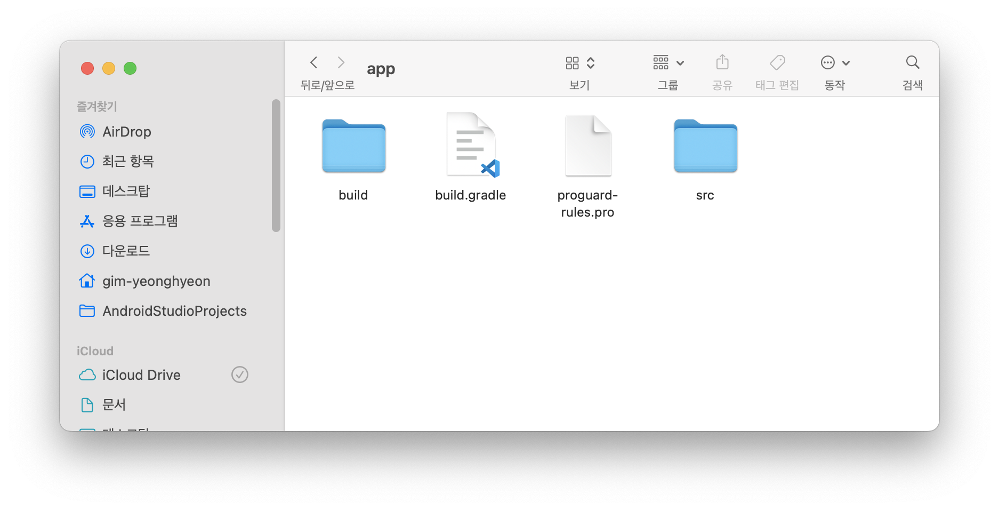
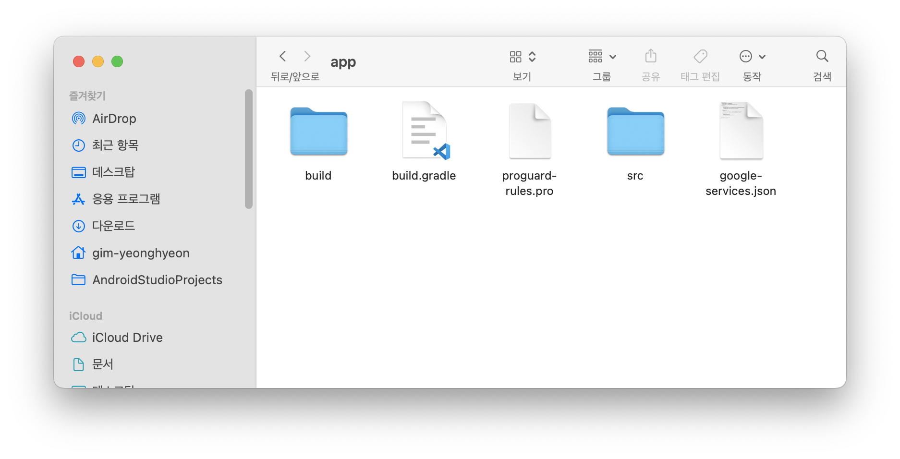

# [Android] Firebase 사용중 "google-services.json" 오류

* toc
{:toc}


---


```
Execution failed for task ':app:processDebugGoogleServices'.
> File google-services.json is missing. 
  The Google Services Plugin cannot function without it. 
  Searched locations: /Users/gim-yeonghyeon/AndroidStudioProjects/matching-manager/app/src/debug/google-services.json, /Users/gim-yeonghyeon/AndroidStudioProjects/matching-manager/app/src/debug/google-services.json, /Users/gim-yeonghyeon/AndroidStudioProjects/matching-manager/app/src/google-services.json, /Users/gim-yeonghyeon/AndroidStudioProjects/matching-manager/app/src/debug/google-services.json, /Users/gim-yeonghyeon/AndroidStudioProjects/matching-manager/app/src/Debug/google-services.json, /Users/gim-yeonghyeon/AndroidStudioProjects/matching-manager/app/google-services.json
```


새로운 프로젝트를 구현하던중 파이어 베이스를 연결하고 앱을 빌드하니 `google-services.json` 파일이 필요하다는 오류가 발생했다.

기존에 파일을 넣고 머지를 했으나 누락이 된 것 같았다!


이 문제를 해결하기 위해서 확인해볼 것이 있었다.


## 해결방법



1. **`google-services.json` 파일 위치 확인:**
   
   * `google-services.json` 파일이 안드로이드 프로젝트의 `app` 폴더에 위치해 있는지 확인해보자.
   
   - 본인의 경우에는 파일이 존재하지 않았다!
   
   



2. **`google-services.json` 파일 다시 다운로드:**

- Firebase [콘솔](https://console.firebase.google.com/) 에 들어가 파일을 다시 다운로드 하자!
  - 연결한 프로젝트를 선택한 후
  - 프로젝트 개요 페이지에서 Android 아이콘을 볼 수 있습니다. 이를 클릭하여 앱을 추가하고
  - 지침에 따라 `google-services.json` 파일을 다운로드하자.
  - 다운로드한 `google-services.json` 파일을 안드로이드 프로젝트의 `app` 폴더에 넣어주자.


이렇게 하면 오류가 사라지고 정상적으로 앱이 빌드되는것을 확인할 수 있다.
