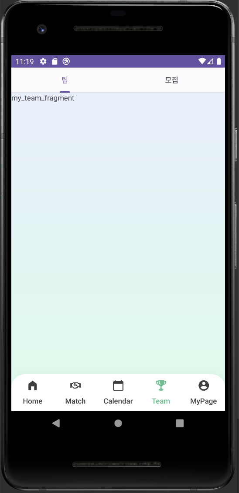
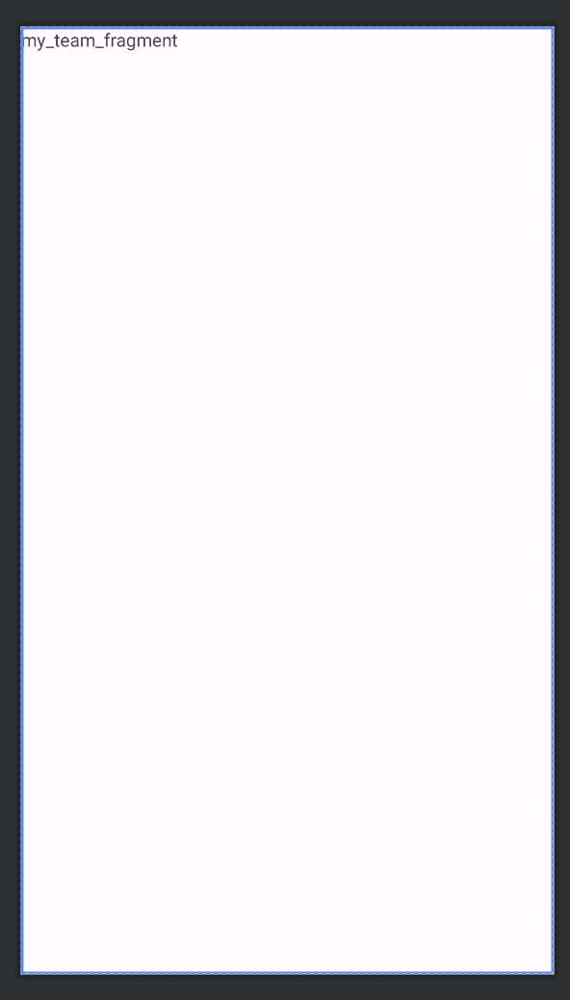
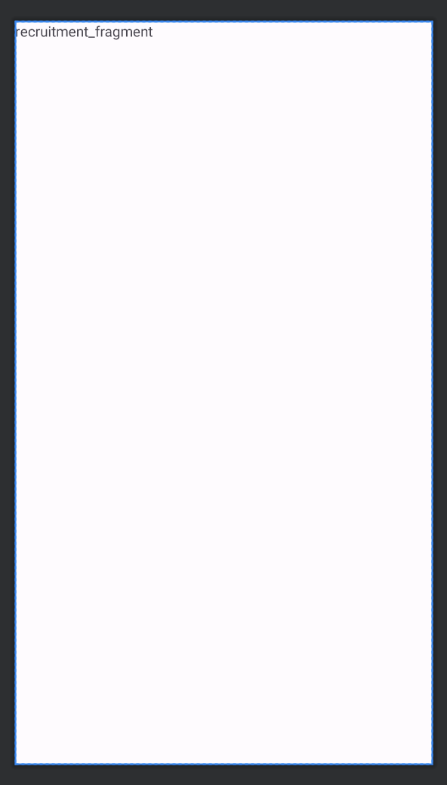

# [Android] Fragment안에 Viewpager2넣기

* toc
{:toc}
---




## 1)Fragment안에 Viewpager2넣기

```xml
<?xml version="1.0" encoding="utf-8"?>
<androidx.constraintlayout.widget.ConstraintLayout xmlns:android="http://schemas.android.com/apk/res/android"
    xmlns:tools="http://schemas.android.com/tools"
    android:layout_width="match_parent"
    android:layout_height="match_parent"
    xmlns:app="http://schemas.android.com/apk/res-auto"
    tools:context=".ui.team.TeamFragment">

    <com.google.android.material.tabs.TabLayout
        android:id="@+id/tabLayout"
        android:layout_width="match_parent"
        android:layout_height="0dp"
        app:layout_constraintBaseline_toTopOf="parent"
        app:layout_constraintLeft_toLeftOf="parent"
        app:layout_constraintRight_toRightOf="parent"/>

    <androidx.viewpager2.widget.ViewPager2
        android:id="@+id/viewPager"
        android:layout_width="match_parent"
        android:layout_height="0dp"
        app:layout_constraintBottom_toBottomOf="parent"
        app:layout_constraintEnd_toEndOf="parent"
        app:layout_constraintStart_toStartOf="parent"
        app:layout_constraintTop_toBottomOf="@+id/tabLayout" />

</androidx.constraintlayout.widget.ConstraintLayout>
```

* 기존에 생성해둔 프래그먼트안에 Viewpager2를 연결하기 위해서 
* **TabLayout** : 상단의 버튼으로 화면을 이동할 수 있는 버튼 역할을 할  탭레이아웃 부착
* **ViewPager2** : 화면이 전환되는 부분을 보여주기위한 뷰페이저 부착


## 2) menuTab 만들기

```
data class TeamTab(
    val fragment: Fragment,//fragment
    val title: Int,//탭에 대한 제목
)
```

* 프래그먼트를 data ArrayList로 관리하기위해 위와같이 클래스파일을 하나 만들어 주었다.


## 3)프래그먼트 만들어주기




```kotlin
class MyTeamFragment : Fragment() {
    private var _binding: MyTeamFragmentBinding? = null
    private val binding get() = _binding!!

    companion object {
        fun newInstance() = MyTeamFragment()
    }


    override fun onCreateView(
        inflater: LayoutInflater, container: ViewGroup?,
        savedInstanceState: Bundle?
    ): View? {
        _binding = MyTeamFragmentBinding.inflate(inflater, container, false)
        return binding.root
    }

    override fun onViewCreated(view: View, savedInstanceState: Bundle?) {
        super.onViewCreated(view, savedInstanceState)

        initView()
    }

    private fun initView() = with(binding) {

    }

    override fun onDestroy() {
        super.onDestroy()
        _binding = null
    }
}
```

* 본인은 **2개의 프래그먼트**를 뷰페이저에 연결하기위해 위와 같이 2개의 프래그먼트를 생성해주었다.
  * **MyTeamFragment**
  * **RecruitmentFragment**
  * 내용은 동일하다!


## 4)ViewPagerAdapter설정 (탭레이아웃,뷰페이저 업댑터)

```kotlin
class TeamViewPagerAdapter(private val activity: FragmentActivity) :
    FragmentStateAdapter(activity) {
    private val fragments = ArrayList<TeamTab>()

    init {
        fragments.add(
            TeamTab(MyTeamFragment.newInstance(), R.string.team_myteam)
        )
        fragments.add(
            TeamTab(RecruitmentFragment.newInstance(), R.string.team_recruitment)
        )
    }

    fun getTitle(position: Int): Int {
        return fragments[position].title
    }

    //화면의 갯수
    override fun getItemCount(): Int {
        return fragments.size
    }

    //프래그먼트를 정의해 화면에 꼿아주는것
    override fun createFragment(position: Int): Fragment {
        return fragments[position].fragment
    }

}
```

* 다음과같이 뷰페이저 어댑터를설정하여 버튼에 이름이 보이도록 하였다.
* **FragmentActivity**를 activity로 받아오고


## 5)뷰페이저 어댑터 프래그먼트에 연결

```kotlin
package com.example.matching_manager.ui.team

import android.os.Bundle
import androidx.fragment.app.Fragment
import android.view.LayoutInflater
import android.view.View
import android.view.ViewGroup
import androidx.fragment.app.FragmentActivity
import com.example.matching_manager.databinding.TeamFragmentBinding
import com.example.matching_manager.ui.main.MainActivity
import com.google.android.material.tabs.TabLayoutMediator

class TeamFragment : Fragment() {
    private var _binding: TeamFragmentBinding? = null
    private val binding get() = _binding!!

    private val viewPagerAdapter by lazy { TeamViewPagerAdapter(requireActivity() as FragmentActivity) }

    companion object {
        fun newInstance() = TeamFragment()
    }


    override fun onCreateView(
        inflater: LayoutInflater, container: ViewGroup?,
        savedInstanceState: Bundle?
    ): View? {
        _binding = TeamFragmentBinding.inflate(inflater, container, false)
        return binding.root
    }

    override fun onViewCreated(view: View, savedInstanceState: Bundle?) {
        super.onViewCreated(view, savedInstanceState)

        initView()
    }

    private fun initView() = with(binding) {
        //view pager adapter
        viewPager.adapter = viewPagerAdapter

        // TabLayout x ViewPager2
        TabLayoutMediator(tabLayout, viewPager) { tab, position ->
            tab.setText(viewPagerAdapter.getTitle(position))
        }.attach()

    }

    override fun onDestroy() {
        super.onDestroy()
        _binding = null
    }
}
```

* 현재 프래그먼트가 연결된 액티비티를 사용하기 위해  `requireActivity()` 함수를 사용하여 현재 프래그먼트가 연결된 액티비티를 얻었다.
* 그리고 binding을 통해 **view pager adapter** 와 **TabLayout** 을 연결해주었다.


## 스크롤 중첩문제 ! 

이렇게 하면 프래그먼트안에 뷰페이저가 들어가게된다 하지만 좌우슬라이드가 중첩이 되어 UX가 매끄럽지 않게 되는데 

이점을 해결하고자 TeamFragment 안에 있는 Viewpager의 스크롤을 제한하기로 하였다. 

```kotlin
//viewpager slide
viewPager.isUserInputEnabled=false
```

이 방법으로 프래그먼트 안에 뷰페이저 구현이 완료 되었다!
