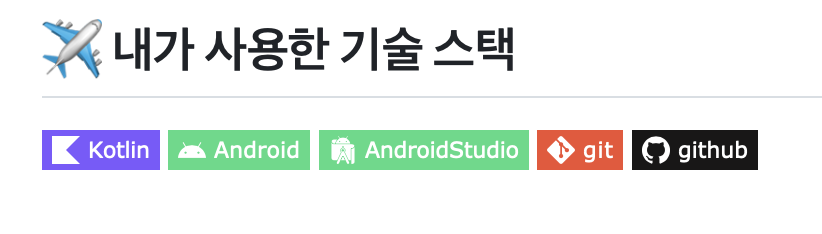
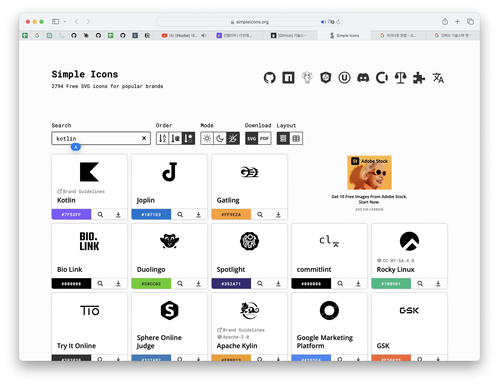

# [GitHub] READE.md 기술스택 뱃지 만들기

* toc
{:toc}
---



오늘은 위와같이 깃허브 READE.md에 내가 사용한 기술 스택을 뱃지로 넣을 수 있는 방법을 공유 하겠다.

README.md는 마크다운 언어로 작성 해야하기 때문에 기본 구조는 아래와 같다.


##  1) 기본 구조

```markdown

```

* 위 내용에서 한글로 된 부분은 하고싶은 값으로 직접 입력해 주면 된다.

* 그렇다고 아무값이나 입력하는것이 아니라 [***Simple Icons Click!***](https://simpleicons.org) ⬅️ 링크를 클릭하여 아이콘과 컬러를 가져올 수 있다.

  

* 다음과 같이 **Kotlin** 을 예시로 검색해보았다.

* 아이콘을 클릭하여 복사한 후 `기술스택 아이콘` 에 붙여 넣어주고

* `표시할 이름`에는 넣고싶은 값을 넣으면 되는데 나는 ***Koltlin***을 넣어주었다.

* 색상을 복사하여 `색상` 에 붙여 넣어주면 된다.

* 물론 커스텀이 가능해서 원하는 아이콘과 색상을 마음대로 설정할 수 있다!

* 아래는 내가 적용한 코틀린 의 예시이다.

```markdown

```


---

## 2) 스타일 설정

뱃지의 스타일은 총 4가지로 설정할 수 있다.

본인은 **flat-square**를 사용했다.


1. **Flat Square 스타일:**

   

```markdown
   
```


2. **Flat 스타일:**


```markdown
   
```


3. **Plastic 스타일:**


```markdown
   
```


4. **For the Badge 스타일:**


```markdown
   
```


위와같이 간단히 필요한 기술 스택을 추가할 수 있게 되었다!

