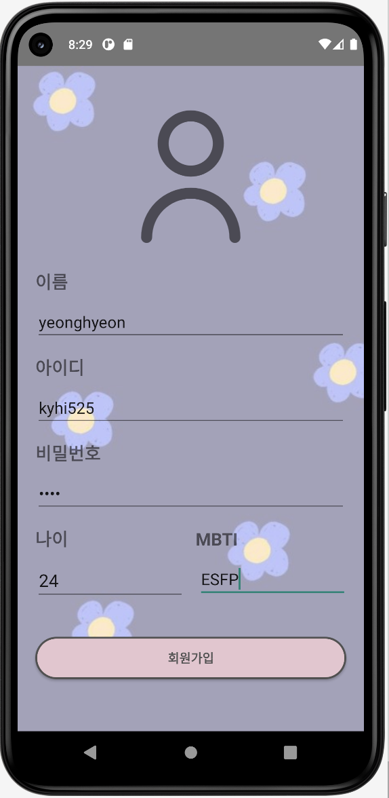
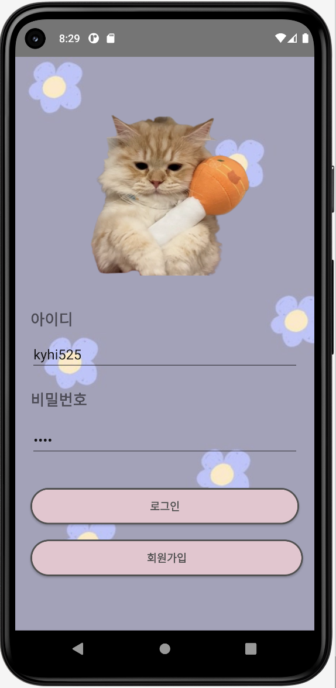
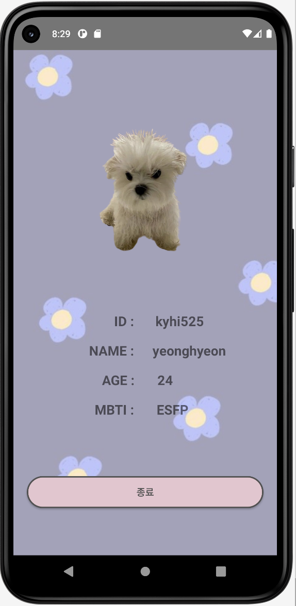

# [TIL] 자기소개 앱만들기(2)

* toc
{:toc}
---

## **1) Intent**

저번시간에 이어 추가 과제를 진행해 보기로 하였다.


### 1. **화면 이동 + @**

- 회원 가입페이지에서 입력한 아이디/비밀번호가 로그인 화면으로 돌아올 때 자동 입력되는 기능!
- Hint! `registerForActivityResult` 를 알아봅시다.


### 2. 자기 소개 랜덤 사진

- 5장의 사진을 등록합니다. (drawable 폴더)
- 자기소개 페이지가 시작될 때 5장 중 랜덤으로 1장의 사진이 표시됩니다.

---

#### ⚙️ 로그인 페이지 만들기 (SignInActivity)

* 회원가입 페이지에서 아이디 , 비밀번호를 입력한후 로그인을 누르면 자동으로 입력되있도록 구현.
* 다른 기본 정보 데이터 값을 받아오도록 구현.
* 회원가입에서 받아온 아이디/비밀번호 가 다르면 로그인 되지않도록 수정.
* 데이터를 홈 화면으로 전달하는 intent 사용.


##### 코드설명

```kotlin
class SignInActivity : AppCompatActivity() {
    override fun onCreate(savedInstanceState: Bundle?) {
        super.onCreate(savedInstanceState)
        setContentView(R.layout.activity_sign_in)

        val idText = findViewById<EditText>(R.id.idText)
        val pwText = findViewById<EditText>(R.id.pwText)
        val signIn =findViewById<Button>(R.id.signIn)
        val signUp =findViewById<Button>(R.id.signUp)

        //데이터 받아오기
        val data_name =intent.getStringExtra("name Data")
        val data_id =intent.getStringExtra("id Data")
        val data_pw=intent.getStringExtra("pw Data")
        val data_age=intent.getStringExtra("age Data")
        val data_mbti=intent.getStringExtra("mbti Data")

        //아이디 비밀번호 자동입력
        idText.setText(data_id)
        pwText.setText(data_pw)

        signIn.setOnClickListener {
            val id = idText.text.toString().trim()
            val password = pwText.text.toString().trim()

            if (id.isEmpty() || password.isEmpty()) {
                // 아이디 또는 비밀번호가 비어있는 경우
                Toast.makeText(this, "아이디/비밀번호를 확인해주세요.", Toast.LENGTH_SHORT).show()
            } else if (data_id != id || data_pw!=password) {

                Toast.makeText(this, "아이디와 비번호를 다시 확인해주세요.", Toast.LENGTH_SHORT).show()
            }else if (data_id==id || data_pw==password){
                // 로그인 성공
                Toast.makeText(this, "로그인 성공", Toast.LENGTH_SHORT).show()

                //HomeActivity로 화면전환
                val intent=Intent(this,HomeActivity::class.java)
                //데이터 넘겨주기
                intent.putExtra("name Data",data_name)
                intent.putExtra("id Data",data_id)
                intent.putExtra("pw Data",data_pw)
                intent.putExtra("age Data",data_age)
                intent.putExtra("mbti Data",data_mbti)
                startActivity(intent)
            }
        }
        //SignUpActivity화면으로 전환
        signUp.setOnClickListener {
            val intent=Intent(this,SignUpActivity::class.java)
            startActivity(intent)
        }
    }
}
```


---


#### ⚙️ 회원가입 페이지 만들기 (SignUpActivity)

- 정보를 모두 입력하지 않을시 회원가입이 되지않도록 구현.
- 입력한 정보를 Intent 를 사용하여 SignInActivity로 전달.
- 회원가입 버튼이 눌리면 SignInActivity로 이동하도록 수정. (finish 활용)


##### 코드설명

```kotlin
package com.example.introduce

import android.content.Intent
import androidx.appcompat.app.AppCompatActivity
import android.os.Bundle
import android.widget.Button
import android.widget.EditText
import android.widget.Toast

class SignUpActivity : AppCompatActivity() {
    override fun onCreate(savedInstanceState: Bundle?) {
        super.onCreate(savedInstanceState)
        setContentView(R.layout.activity_sign_up)

        val signUpname = findViewById<EditText>(R.id.signUpName)
        val signUpId = findViewById<EditText>(R.id.signUpId)
        val signUpPw = findViewById<EditText>(R.id.signUpPw)
        val btnSignUp = findViewById<Button>(R.id.btnSignUp)
        val signUpAge = findViewById<EditText>(R.id.signUpAge)
        val signUpMBTI = findViewById<EditText>(R.id.signUpMBTI)

        btnSignUp.setOnClickListener {
            val name = signUpname.text.toString().trim()
            val id = signUpId.text.toString().trim()
            val password = signUpPw.text.toString().trim()
            val age = signUpAge.text.toString().trim()
            val mbti = signUpMBTI.text.toString().trim()

            if (id.isEmpty() || password.isEmpty() || name.isEmpty() || age.isEmpty()|| mbti.isEmpty()) {
                // 정보들이 비어있는 경우
                Toast.makeText(this, "입력되지 않은 정보가 있습니다.", Toast.LENGTH_SHORT).show()
            } else {
                // 로그인 성공
                Toast.makeText(this, "회원가입 성공", Toast.LENGTH_SHORT).show()

                //SignUp 데이터를 SignIn 으로 전달
                val edit_name=findViewById<EditText>(R.id.signUpName)
                val edit_id=findViewById<EditText>(R.id.signUpId)
                val edit_pw=findViewById<EditText>(R.id.signUpPw)
                val edit_age=findViewById<EditText>(R.id.signUpAge)
                val edit_mbti=findViewById<EditText>(R.id.signUpMBTI)

                val data_name =edit_name.text.toString()
                val data_id =edit_id.text.toString()
                val data_pw=edit_pw.text.toString()
                val data_age=edit_age.text.toString()
                val data_mbti=edit_mbti.text.toString()

                val intent = Intent(this,SignInActivity::class.java)
                intent.putExtra("name Data",data_name)
                intent.putExtra("id Data",data_id)
                intent.putExtra("pw Data",data_pw)
                intent.putExtra("age Data",data_age)
                intent.putExtra("mbti Data",data_mbti)
                startActivity(intent)

                // SignIn화면으로 전환
                finish()
            }
        }
    }


}
```


---

#### ⚙️ 자기소개 페이지 만들기 (HomeActivity)

* 로그인시 랜덤으로 이미지가 변경되도록 구현.

- SignInActivity에서 받은 정보들을 화면에 표시.
- 종료 버튼이 눌리면 SignInActivity로 이동 (finish 활용)


##### 코드설명

```kotlin
class HomeActivity : AppCompatActivity() {

    private val imageArray = arrayOf(
        R.drawable.cat2,
        R.drawable.cat3,
        R.drawable.cat4,
        R.drawable.cat5,
        R.drawable.dog,

        // 여기에 추가적으로 랜덤으로 가져올 이미지 리소스 ID를 추가합니다.
    )
    override fun onCreate(savedInstanceState: Bundle?) {
        super.onCreate(savedInstanceState)
        setContentView(R.layout.activity_home)

        //랜덤사진 설정하기
        val homeImage = findViewById<ImageView>(R.id.homeImage)
        // 랜덤 숫자를 생성하여 이미지 배열에서 해당 인덱스의 이미지를 선택합니다.
        val randomIndex = Random.nextInt(imageArray.size)
        val randomImage = imageArray[randomIndex]
        homeImage.setImageResource(randomImage)

        //데이터 받아오기
        val data_name =intent.getStringExtra("name Data")
        val data_id =intent.getStringExtra("id Data")
        val data_age=intent.getStringExtra("age Data")
        val data_mbti=intent.getStringExtra("mbti Data")

        val homeName=findViewById<TextView>(R.id.homeName)
        val homeId=findViewById<TextView>(R.id.homeId)
        val homeAge=findViewById<TextView>(R.id.homeAge)
        val homeMBTI=findViewById<TextView>(R.id.homeMBTI)

        homeName.setText(data_name)
        homeId.setText(data_id)
        homeAge.setText(data_age)
        homeMBTI.setText(data_mbti)


        //화면 종료
        val btn_close=findViewById<Button>(R.id.close)
        btn_close.setOnClickListener {
            finish()
        }
    }
}
```


---

## **2) 결과 - UI**

* 로그인/회원가입/로그인(Id/pw자동입력)




* 이미지가 변경되는 홈화면




이렇게 화면이 구현 되었고, 회원가입때 입력했던 정보들이 홈으로 넘겨오도록 구현 하였다.

기본적인 기능들은 완성 했으니 다음주까지 추가기능들을 더넣어볼 예정이다.

