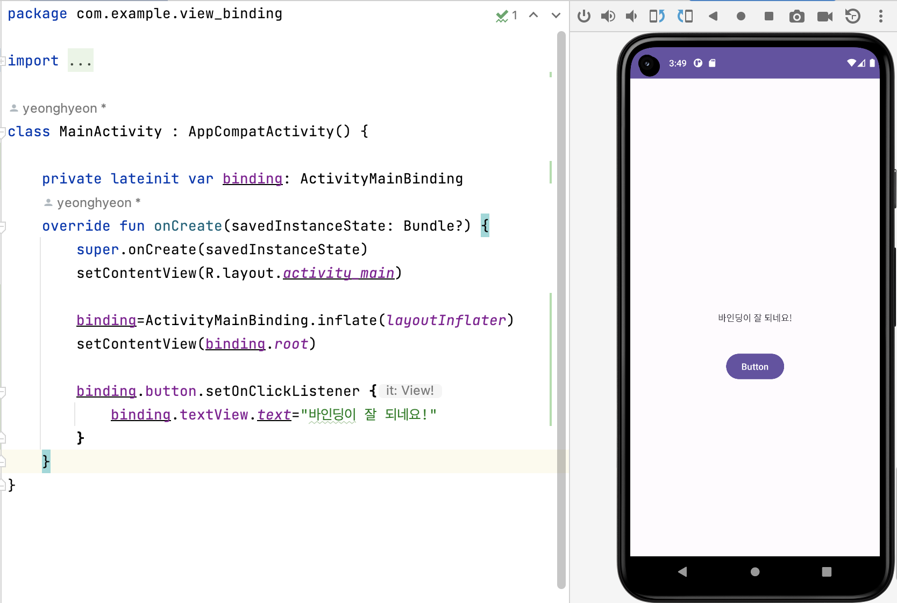

# [TIL] View Binding

* toc
{:toc}
---

Kotlin에서는 `findViewById` 대신 여러가지 이유로 뷰 바인딩 사용을권장하고있다.

그이유를 알아보자.

## **View Binding이란?**

* 뷰 바인딩은 뷰와 상호작용하는 코드를 쉽게 해주는 기능이다. 
* 뷰 바인딩을 허용하면 각 xml레이아웃마다 바인딩 클래스를 자동으로 생성하는데, 레이아웃에 ID가 있는 뷰에 **직접 참조**를 할 수 있다. 
* 대부분의 상황에서 뷰 바인딩은 **findViewById**를 대체한다. 

 

## **findViewById 와의 차이점**

공식문서에서는 다음과 같이 설명한다.

### 💡*View Binding*의 이점

* **Null Safety**: View Binding을 사용하면 Null Safety가 보장된다.
  * UI 요소를 바인딩할 때 null이 될 가능성이 없으므로 null 체크를 해야하는 상황을 줄일 수 있다.

* **Type Safety**: 각각의 바인딩 클래스는 해당하는 XML 레이아웃의 UI 요소에 대한 참조를 포함하므로, 해당 UI 요소에 대한 타입 안전성을 보장한다.

* **간결한 코드**: findViewById()와 같은 번거로운 코드 없이 UI 요소에 접근할 수 있으므로 코드가 더 간결하고 가독성이 높아진다.

* **성능 향상**: View Binding을 사용하면 바인딩 클래스가 컴파일 시 생성되므로 런타임 성능에도 이점이 있다.


## **코틀린에서 View Binding 설정방법**

### 1) gradle설정

```kotlin
android{
	...
    
    // AndroidStudio 3.6 ~ 4.0
    viewBinding{
    	enabled = true
    }
    
    // AndroidStudio 4.0 ~
    buildFeatures{
    	viewBinding = true
    }
}
```

---

### 2) Activity에서 설정

```kotlin
class MainActivity : AppCompatActivity() {

    private lateinit var binding: ActivityMainBinding
    override fun onCreate(savedInstanceState: Bundle?) {
        super.onCreate(savedInstanceState)
        setContentView(R.layout.activity_main)

        binding=ActivityMainBinding.inflate(layoutInflater)
        val view= binding.root
        setContentView(view)
    }
}
```

* `inflate`: xml에 있는 뷰를 객체화 시켜준다.
* 원래는 R.layout.activity_main을 넘겨주지만 이번에는 우리가 생성한 루트뷰를 넘겨준다.


```kotlin
binding.button.setOnClickListener {
            binding.textView.text="바인딩이 잘 되네요!"
        }
```

* 그리고 bindin된 객체 안에 있는 id에 접근하여 사용한다.
* `button` , `textview` 는 내가 xml에 지정해준 id값이다.


### 3) 결과


