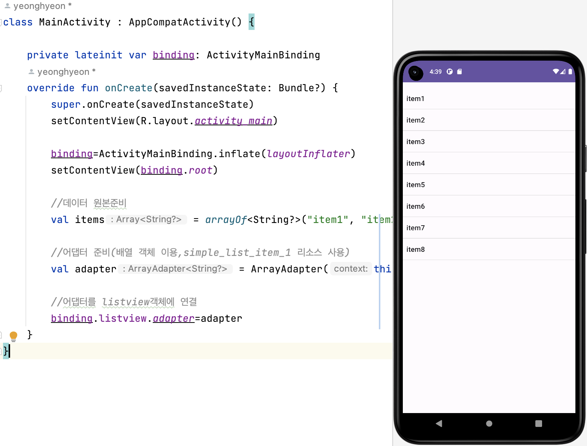
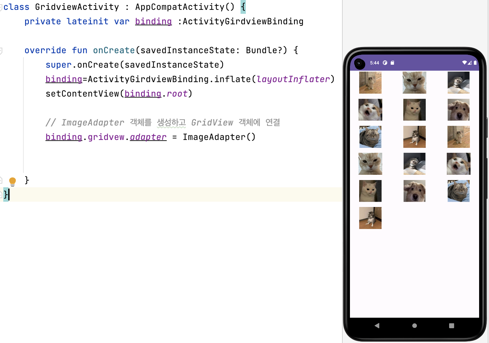

# [Kotlin] Adapter View(1) 사용해보기


* toc
{:toc}
---

## **Adapter View란?**

* 여러개의 항목을 다양한 형식으로 나열하고 선택할 수 있는뷰이다.
  * **리스트뷰(ListView)는 항목을 수직으로 나열시키는 방식**
  * **그리드뷰(GridView)는 항목을 격자 형태로 나열시키는 방식**


* 어댑터 뷰는 표시할 항목 데이터를 직접 관리하지 않고,**어댑터라는 객체로부터 공급**받는다.

  

 

## **어댑터 (Adapter) 란?**

* 데이터를 관리하며 **데이터 원본과 어댑터뷰(ListView, GridView) 사이의 중계 역할**이다.
* 사용자가 어댑터뷰의 특정 위치의 항목을 선택하였을 때, 어댑터뷰는 **선택된 항목, 항목ID, 항목뷰**를 어댑터의 `getItem()`, `getItemId()`,` getView()` 메소드를 통해 얻어와서 이를 **항목선택 이벤트 처리기**에 넘겨준다.


### 🔍어댑터뷰는 어떻게 데이터 항목을 표시할까?

1. 어댑터뷰가 어댑터를 사용하기 위해서는 **먼저 데이터 원본이 어댑터에 설정**되어야 하고, **어댑터뷰에는 어댑터가 설정**되어야 한다.
2. 어댑터뷰는 항목을 표시하기 위해서 먼저 **표시할 항목의 총 개수를 알 필요가 있을 것**입니다. 이 때, 어댑터 뷰는 어댑터의 `getCount()`란 메소드를 통해 현재 어댑터가 관리하는 **데이터 항목의 총 개수**를 반환한다.
3. 어댑터 뷰는 어댑터의 `getView()`란 메소드를 통해서 **화면에 실제로 표시할 항목뷰**를 얻고, **이를 화면에 표시**한다.

**💡 요약하면, 어댑터뷰는 어댑터에 정의된 인터페이스를 바탕으로 필요한 정보를 요청하여 항목뷰를 화면에 표시하거나 선택된 항목뷰를 처리한다.**


## **어댑터 종류**

### 1) BaseAdapter

- 어댑터 클래스의 공통 구현
- **사용자 정의 어댑터 구현 시** 사용


### 2) ArrayAdapter

- 객체 **배열**이나 **리소스에 정의된** 배열로부터 데이터를 공급받음


### 3) CursorAdapter

- **데이터베이스로**부터 데이터를 공급받음


### 4) SimpleAdapter

- 데이터를 Map(키,값)의 리스트로 관리
- 데이터를 XML파일에 정의된 뷰에 대응시키는 어댑터


## **어댑터 객체 생성**


- ArrayAdapter(Context context, int resource, int textViewResourceId, T[] objects)
  - context: 현재 컨텍스트
  - resource: 항목으로 표시될 텍스트 뷰의 리소스 ID


## **리스트 뷰(ListView)**

ListView는 어댑터 뷰의 대표 위젯으로서, 복수 개의 항목을 수직으로 표시한다.

어댑터를 사용해 간단한리스트뷰를 만들어보자.

### 1) xml파일에 ListView생성후 아이디부여

```xml
<?xml version="1.0" encoding="utf-8"?>
<LinearLayout xmlns:android="http://schemas.android.com/apk/res/android"
    android:orientation="vertical"
    android:layout_width="match_parent"
    android:layout_height="match_parent">

    <ListView
        android:id="@+id/listView"
        android:layout_width="match_parent"
        android:layout_height="match_parent"
       />
</LinearLayout>
```

---

### 2) 어댑터 객체 생성 & ListView객체에 어댑터 연결

```kotlin
class MainActivity : AppCompatActivity() {

    private lateinit var binding: ActivityMainBinding
    override fun onCreate(savedInstanceState: Bundle?) {
        super.onCreate(savedInstanceState)
        setContentView(R.layout.activity_main)

        binding=ActivityMainBinding.inflate(layoutInflater)
        setContentView(binding.root)

        //데이터 원본준비
        val items = arrayOf<String?>("item1", "item2", "item3", "item4", "item5", "item6", "item7", "item8")

        //어댑터 준비(배열 객체 이용,simple_list_item_1 리소스 사용)
        val adapter = ArrayAdapter(this,android.R.layout.simple_list_item_1,items)

        //어댑터를 listview객체에 연결
        binding.listview.adapter=adapter
    }
```

- 데이터 원본이 배열인 경우에 ArrayAdapter객체 사용
- ArrayAdapter 생성자
- 현재 화면 레이아웃(activity_main.xml)에 정의 된 뷰 중에서 **id**가 `listView`인 ListView 객체를 ViewBinding을 통해서 얻어온다.
- 얻어온 ListView객체에 생성된 어댑터 객체(예,ArrayAdapter객체-adapter)를 연결한다.


```kotlin
private lateinit var binding: ActivityListviewBinding

override fun onCreate(savedInstanceState: Bundle?) {
    super.onCreate(savedInstanceState)

    binding = ActivityListviewBinding.inflate(layoutInflater)
    setContentView(binding.root)


    //데이터 원본준비
    val items =
        arrayOf<String?>("item1", "item2", "item3", "item4", "item5", "item6", "item7", "item8")

    //어댑터 준비(배열 객체 이용,simple_list_item_1 리소스 사용)
    val adapter = ArrayAdapter(this, android.R.layout.simple_list_item_1, items)

    //어댑터를 listview객체에 연결
    binding.listview.adapter = adapter

}
```

---

### 📱 결과




## **그리드 뷰(GridView)**

GridView는 2차원 스크롤 가능한 그리드에 항목을 표시한다.
그리드뷰를 사용해보자!

### 1) xml파일에 GridView생성후 아이디부여

```xml
<?xml version="1.0" encoding="utf-8"?>
<androidx.constraintlayout.widget.ConstraintLayout xmlns:android="http://schemas.android.com/apk/res/android"
    xmlns:app="http://schemas.android.com/apk/res-auto"
    xmlns:tools="http://schemas.android.com/tools"
    android:layout_width="match_parent"
    android:layout_height="match_parent">

    <GridView
        android:id="@+id/gridvew"
        android:layout_width="match_parent"
        android:layout_height="match_parent"
        android:columnWidth="100dp"
        android:numColumns="auto_fit"
        android:verticalSpacing="10dp"
        android:horizontalSpacing="10dp"
        android:stretchMode="columnWidth"
        android:gravity="center"
        app:layout_constraintBottom_toBottomOf="parent"
        app:layout_constraintEnd_toEndOf="parent"
        app:layout_constraintStart_toStartOf="parent"
        app:layout_constraintTop_toTopOf="parent" />
</androidx.constraintlayout.widget.ConstraintLayout>
```

---

### 2) Adapter정의하기

```kotlin
package com.example.view_binding

import android.view.View
import android.view.ViewGroup
import android.widget.AbsListView
import android.widget.BaseAdapter
import android.widget.ImageView

class ImageAdapter :BaseAdapter(){
    //항목의 총 개수를 반환하기 위해 catIds 배열의 크기를 반환
    override fun getCount(): Int {
        return catIds.size
    }

    //특정 위치의 항목을 반환하기 위해 catIds 배열의 지정된 위치의 항목을 반환
    override fun getItem(position: Int): Any {
        return catIds[position]
    }

    //특정 위치의 항목 아이디를 반환하는 것인데, 여기서는 배열의 위치(순서)를 항목의 아이디로 간주함
    override fun getItemId(position: Int): Long {
        return position.toLong()
    }

    //getView 메소드는 첫번째 파라미터로 주어진 위치의 항목 뷰를 반환
    override fun getView(position: Int, convertView: View?, parent: ViewGroup?): View {
        val imageView:ImageView

        //catIds배열의 position 위치에 있는 이미지 리소스를 ImageView의 이미지로 설정하고,
        // 이 설정된 ImageView 객체를 그리드 뷰의 항목뷰로 반환
        if (convertView==null){
            imageView= ImageView(parent!!.context)
            imageView.layoutParams=AbsListView.LayoutParams(200,200)
            //CENTER_CROP은 종횡비를 유지하여 스케일링하며 뷰의 크기 이상으로 채우게 됨을 의미한다. 따라서 이미지 일부가 잘릴 수 있다.
            imageView.scaleType=ImageView.ScaleType.CENTER_CROP
            imageView.setPadding(8,8,8,8,)
        }else{
            //convertView는 이전에 생성된 항목뷰 (여기서는 ImageView)를 의미
            //새로운 이미지뷰 객체를 만들고 크기와 스케일타입, 패팅을 설정한다.
            // 만약 이전에 이미 만들어진 것이라면, 이를 재사용 한다.
            imageView = convertView as ImageView
        }
        imageView.setImageResource(catIds.get(position))
        return imageView
    }

    //ImageAdapter가 관리하는 데이터는 편의상 직접 ImageAdapter 내부에 Image 리소스 ID의 배열로 설정
    private val catIds = arrayOf<Int>(
        R.drawable.cat1,
        R.drawable.cat2,
        R.drawable.cat3,
        R.drawable.cat4,
        R.drawable.cat5,
        R.drawable.cat6,
        R.drawable.cat7,
        R.drawable.cat8,
        R.drawable.cat1,
        R.drawable.cat2,
        R.drawable.cat3,
        R.drawable.cat4,
        R.drawable.cat5,
        R.drawable.cat6,
        R.drawable.cat7,
        R.drawable.cat8,

    )
}
```

* 그리드 뷰의 항목으로 간단한 텍스트가 아닌 이미지를 사용하고자 하는 경우에는 그리드뷰의 항목으로 이미지를 공급하는 ImageAdapter를 BaseAdapter로부터 파생하여 정의한다.

---

### 3) Adapter를 생성하고 GridView객체에 연결

```kotlin
package com.example.view_binding

import androidx.appcompat.app.AppCompatActivity
import android.os.Bundle
import com.example.view_binding.databinding.ActivityGirdviewBinding

class GridviewActivity : AppCompatActivity() {
    private lateinit var binding :ActivityGirdviewBinding

    override fun onCreate(savedInstanceState: Bundle?) {
        super.onCreate(savedInstanceState)
        binding=ActivityGirdviewBinding.inflate(layoutInflater)
        setContentView(binding.root)

        // ImageAdapter 객체를 생성하고 GridView 객체에 연결
        binding.gridvew.adapter = ImageAdapter()


    }
}
```

- 그리드 뷰 설정의 마지막 단계는 ImageAdapter객체를 생성한다.
- 이를 GridView객체에 연결 한다.

---

### 📱 결과


