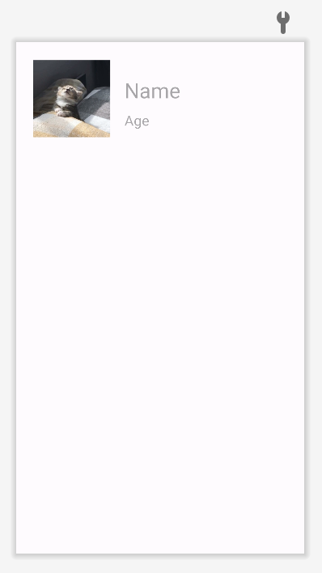
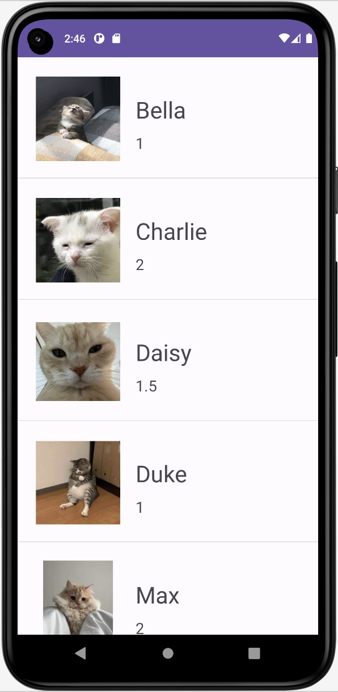
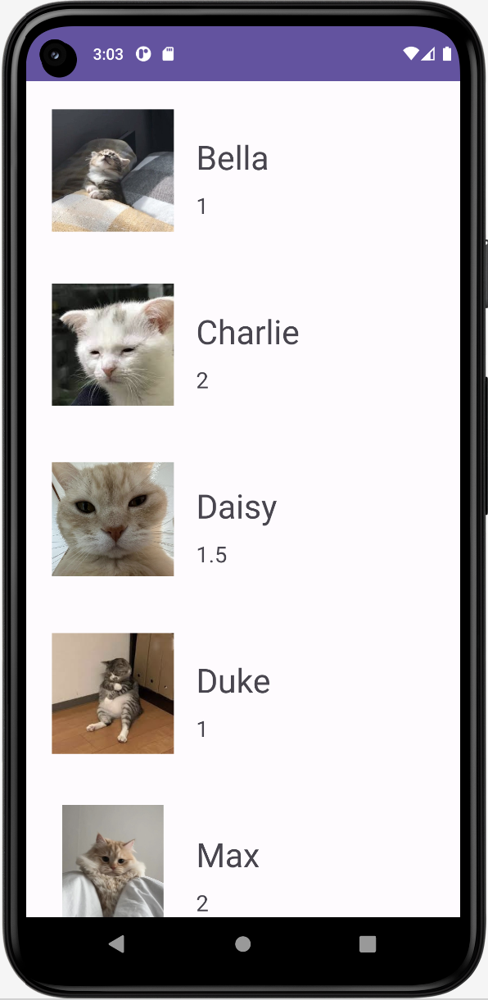

---

layout: post
title: 코틀린 배우기
image: /assets/img/blog/kotlin.png
accent_image: 
  background: url('/assets/img/me/wave3.jpg') center/cover
  overlay: false
accent_color: '#fff'
theme_color: '#fff'
description: >
  kotlin start!
invert_sidebar: true
categories :
 - devlog	
 - kotlin

---

# [Kotlin] Adapter View(2) 사용해보기

오늘은 어댑터 사용중 CustomView, RecyclerView를 사용해 볼 것이다.


* toc
{:toc}
---

## **CustomView 란?**


* 어댑터 뷰의 항목 하나는 단순한 문자열이나 이미지뿐만 아니라, **다수의 문자열이나 이미지를 포함**하는 뷰가 될 수 있다.

---

### 💡*CustomView*를 사용하기위해 설정해줘야하는 절차

1. 커스텀 항목을 위한 XML 레이아웃 정의
2. 항목 관련 데이터 클래스 정의
3. 어댑터 클래스 정의
4. 메인화면 레이아웃에 ListView 위젯 정의
5. 어댑터를 생성하고 어댑터뷰 객체에 연결


### **CustomView 예제**

#### 1)커스텀 항목을 위한 XML레이아웃 정의



```xml
<?xml version="1.0" encoding="utf-8"?>
<androidx.constraintlayout.widget.ConstraintLayout xmlns:android="http://schemas.android.com/apk/res/android"
    xmlns:app="http://schemas.android.com/apk/res-auto"
    xmlns:tools="http://schemas.android.com/tools"
    android:layout_width="match_parent"
    android:layout_height="wrap_content"
    android:padding="20dp">


    <ImageView
        android:id="@+id/iv_cat"
        android:layout_width="110dp"
        android:layout_height="113dp"
        android:layout_marginStart="4dp"
        android:layout_marginTop="4dp"
        app:layout_constraintStart_toStartOf="parent"
        app:layout_constraintTop_toTopOf="parent"
        app:srcCompat="@drawable/cat" />

    <TextView
        android:id="@+id/tv_name"
        android:layout_width="wrap_content"
        android:layout_height="wrap_content"
        android:layout_marginStart="20dp"
        android:layout_marginTop="24dp"
        android:hint="Name"
        android:textSize="30dp"
        app:layout_constraintStart_toEndOf="@+id/iv_cat"
        app:layout_constraintTop_toTopOf="@+id/iv_cat" />

    <TextView
        android:id="@+id/tv_age"
        android:layout_width="wrap_content"
        android:layout_height="wrap_content"
        android:layout_marginStart="20dp"
        android:layout_marginBottom="12dp"
        android:hint="Age"
        android:textSize="20dp"
        app:layout_constraintBottom_toBottomOf="@+id/iv_cat"
        app:layout_constraintStart_toEndOf="@+id/iv_cat" />
</androidx.constraintlayout.widget.ConstraintLayout>
```

* res/layout 하위에 item.xml 이라는 새로운 xml 파일 생성해준다.

---

#### 2) 항목 관련 데이터 클래스 정의

```kotlin
data class MyItem(val aIcon:Int, val aName:String, val aAge:String) {}
```

* 항목뷰에 표시할 데이터를 정의한 **MyItem 클래스**를정의한다.
* 필요한 데이터값을 연결해준다.

* 코틀린의 **데이터 클래스(Data Class)**는 데이터를 다루는데 최적화된 클래스로 equals(), hashCode(), toString(), copy(), componentN() 5가지 유용한 함수들을 내부적으로 자동으로 생성한다.

---

#### 3) 어댑터 클래스정의

```kotlin
package com.android.customitemview

class MyAdapter(val mContext: Context, val mItems: MutableList<MyItem>) : BaseAdapter() {

    // MyAdapter 클래스가 관리하는 항목의 총 개수를 반환
    override fun getCount(): Int {
        return mItems.size
    }

    // MyAdapter 클래스가 관리하는 항목의 중에서 position 위치의 항목을 반환
    override fun getItem(position: Int): Any {
        return mItems[position]
    }

    // 항목 id를 항목의 위치로 간주함
    override fun getItemId(position: Int): Long {
        return position.toLong()
    }

    // position 위치의 항목에 해당되는 항목뷰를 반환하는 것이 목적임
    override fun getView(position: Int, convertView: View?, parent: ViewGroup?): View {

        var convertView = convertView
        if (convertView == null) convertView = LayoutInflater.from(parent?.context).inflate(R.layout.item, parent, false)

        val item : MyItem = mItems[position]

        // convertView 변수로 참조되는 항목 뷰 객체내에 포함된 객체를 id를 통해 얻어옴
        val iconImageView = convertView?.findViewById<View>(R.id.iconItem) as ImageView
        val tv_name = convertView.findViewById<View>(R.id.textItem1) as TextView
        val tv_age = convertView.findViewById<View>(R.id.textItem2) as TextView

        // 어댑터가 관리하는 항목 데이터 중에서 position 위치의 항목의 객체를 헤딩 힝목에 설정
        iconImageView.setImageResource(item.aIcon)
        tv_name.text = item.aName
        tv_age.text = item.aAge

        return convertView
    }
}
```

- 앞서 정의한 MyItem 타입의 객체들을 **ArrayList**로 관리하는 **MyAdapter** 클래스 **BaseAdapter**를 파생하여 정의한다.
  - MyAdapter 클래스는 앞서 예시한 그리드 뷰의 예제에서 처럼, `getCount()`, `getItem()`, `getItemID()`, `getView()` method를 재 정의해야 한다.

---

#### 4) 메인 화면 레이아웃에 ListView위젯 정의

```xml
<?xml version="1.0" encoding="utf-8"?>
<LinearLayout xmlns:android="http://schemas.android.com/apk/res/android"
    android:orientation="vertical"
    android:layout_width="match_parent"
    android:layout_height="match_parent">

    <ListView
        android:id="@+id/listView"
        android:layout_width="match_parent"
        android:layout_height="match_parent"
       />
</LinearLayout>
```

- 메인 화면 레이아웃(예,activity_main.xml)에 **ListView위젯**을 추가
- XML레이아웃 파일에 정의된 ListView위젯을 Kotlin코드에서 참조하기 위하여 **id속성**을정의한다.

---

#### 5) 어댑터를 생성하고 어댑터 뷰 객체에 연결

```kotlin
package com.android.customitemview

class MainActivity : AppCompatActivity() {

    private lateinit var binding: ActivityMainBinding

    override fun onCreate(savedInstanceState: Bundle?) {
        super.onCreate(savedInstanceState)

        binding = ActivityMainBinding.inflate(layoutInflater)
        setContentView(binding.root)

        // 데이터 원본 준비
        val dataList = mutableListOf<MyItem>()
        dataList.add(MyItem(R.drawable.sample_0, "Bella", "1"))
        dataList.add(MyItem(R.drawable.sample_1, "Charlie", "2"))
        dataList.add(MyItem(R.drawable.sample_2, "Daisy", "1.5"))
        dataList.add(MyItem(R.drawable.sample_3, "Duke", "1"))
        dataList.add(MyItem(R.drawable.sample_4, "Max", "2"))
        dataList.add(MyItem(R.drawable.sample_5, "Happy", "4"))
        dataList.add(MyItem(R.drawable.sample_6, "Luna", "3"))
        dataList.add(MyItem(R.drawable.sample_7, "Bob", "2"))


        // 어댑터 생성 및 연결
        binding.listView.adapter = MyAdapter(this, dataList)

        // 항목 클릭 이벤트 처리
        binding.listView.setOnItemClickListener{ parent, view, position, id ->
            val name: String = (binding.listView.adapter.getItem(position) as MyItem).aName
            Toast.makeText(this," $name 선택!", Toast.LENGTH_SHORT).show()
        }
    }
}
```

* 어댑터 객체에서 관리할 항목 데이터의 ArrayList 객체를 준비한다.

* MyAdapter 객체를 생성하고 초기화 한다.

* 생성된 MyAdapter 객체를 어댑터뷰인 리스트뷰에 연결한다.

---

#### 📱결과




## **RecyclerView 란?**


- RecyclerView는 한정적인 화면에 많은 데이터를 넣을 수 있는 View이다.
- Recycle을 한국어로 하면 재활용하다라는 뜻이다.
- 즉, View를 재활용해서 사용하겠다는 말이다.

---

### 💡*RecyclerView*를 사용하기위해 설정해줘야하는 절차

#### 1) Adapter

- Adapter란 데이터 테이블을 목록 형태로 보여주기 위해 사용되는 것으로, 데이터를 다양한 형식의 리스트 형식을 보여주기 위해서 데이터와 RecyclerView 사이에 존재하는 객체이다.
- 즉 데이터와 RecyclerView 사이의 통신을 위한 연결체이다.

#### 2) ViewHolder

- ViewHolder란 화면에 표시될 데이터나 아이템들을 저장하는 역할 입니다.
- RecyclerView의 개념을 적용하기위해선 스크롤 해서 위로 올라간 View를 재활용하기 위해서 이 View를 기억하고 있어야 합니다. ViewHolder가 그역할을 합니다.

---

### **RecyclerView예제**

#### 1) 준비하기

```xml
<?xml version="1.0" encoding="utf-8"?>
<LinearLayout xmlns:android="http://schemas.android.com/apk/res/android"
    android:orientation="vertical"
    android:layout_width="match_parent"
    android:layout_height="match_parent">

    <androidx.recyclerview.widget.RecyclerView
        android:id="@+id/recyclerView"
        android:layout_width="match_parent"
        android:layout_height="match_parent"
       />
</LinearLayout>
```

* 메인화면 레이아웃(예,activity_main.xml)에 **ListView**위젯을 **RecyclerView**위젯으로 변경한다.

---

#### 2) 어댑터 클래스정의

```kotlin
package com.example.recyclerview

import android.view.LayoutInflater
import android.view.View
import android.view.ViewGroup
import androidx.recyclerview.widget.RecyclerView
import com.example.recyclerview.databinding.ItemRecycerBinding

class MyAdapter(val mItems: MutableList<MyItem>) : RecyclerView.Adapter<MyAdapter.Holder>() {

    interface ItemClick {
        fun onClick(view : View, position : Int)
    }

    var itemClick : ItemClick? = null

    override fun onCreateViewHolder(parent: ViewGroup, viewType: Int): Holder {
        val binding = ItemRecycerBinding.inflate(LayoutInflater.from(parent.context), parent, false)
        return Holder(binding)
    }

    override fun onBindViewHolder(holder: Holder, position: Int) {
        holder.itemView.setOnClickListener {  //클릭이벤트추가부분
            itemClick?.onClick(it, position)
        }
        holder.iconImageView.setImageResource(mItems[position].aIcon)
        holder.name.text = mItems[position].aName
        holder.age.text = mItems[position].aAge
    }

    override fun getItemId(position: Int): Long {
        return position.toLong()
    }

    override fun getItemCount(): Int {
        return mItems.size
    }

    inner class Holder(val binding: ItemRecycerBinding) : RecyclerView.ViewHolder(binding.root) {
        val iconImageView = binding.ivCat
        val name = binding.tvName
        val age = binding.tvAge
    }
}
```

* 앞서 정의한 **MyItem**타입의 객체들을 **ArrayList**로 관리하는 **MyAdapter**클래스를**RecyclerView.Adapter**를 파생하여 정의

---

#### 3) MainActivity

```kotlin
package com.example.recyclerview

import androidx.appcompat.app.AppCompatActivity
import android.os.Bundle
import android.view.View
import android.widget.Toast
import androidx.recyclerview.widget.LinearLayoutManager
import com.example.recyclerview.databinding.ActivityMainBinding

class MainActivity : AppCompatActivity() {
    private lateinit var binding:ActivityMainBinding

    override fun onCreate(savedInstanceState: Bundle?) {
        super.onCreate(savedInstanceState)
        val binding=ActivityMainBinding.inflate(layoutInflater)
        setContentView(binding.root)

        // 데이터 원본 준비
        val dataList = mutableListOf<MyItem>()
        dataList.add(MyItem(R.drawable.cat, "Bella", "1"))
        dataList.add(MyItem(R.drawable.cat1, "Charlie", "2"))
        dataList.add(MyItem(R.drawable.cat2, "Daisy", "1.5"))
        dataList.add(MyItem(R.drawable.cat3, "Duke", "1"))
        dataList.add(MyItem(R.drawable.cat4, "Max", "2"))
        dataList.add(MyItem(R.drawable.cat5, "Happy", "4"))
        dataList.add(MyItem(R.drawable.cat6, "Luna", "3"))
        dataList.add(MyItem(R.drawable.cat7, "Bob", "2"))

        binding.recyclerView.adapter = MyAdapter(dataList)

        val adapter = MyAdapter(dataList)
        binding.recyclerView.adapter = adapter
        binding.recyclerView.layoutManager = LinearLayoutManager(this)

        adapter.itemClick = object : MyAdapter.ItemClick {
            override fun onClick(view: View, position: Int) {
                val name: String = dataList[position].aName
                Toast.makeText(this@MainActivity," $name 선택!", Toast.LENGTH_SHORT).show()
            }
        }
    }
}
```

---

#### 📱결과




## **ListView 와 RecyclerView 차이점**

### **ListView**


- 사용자가 스크롤 할 때마다 **위에 있던 아이템은 삭제**되고, **맨 아래의 아이템은 생성 되길 반복**한다.
- 아이템이 100개면 100이 삭제 생성됩니다. **즉 계속 삭제와 생성을 반복**하므로 **성능에 좋지않다**.

---

### **RecyclerView**


- 사용자가 스크롤 할 때, 위에 있던 아이템은 **재활용** 돼서 아래로 이동하여 재사용 한다.
- 즉 아이템이 100개여도 10개정도의 View만 만들고 10개를 재활용해서 사용한다.
- View를 계속 만드는 **ListView의 단점을 보완**하기 위해 나왔다.

