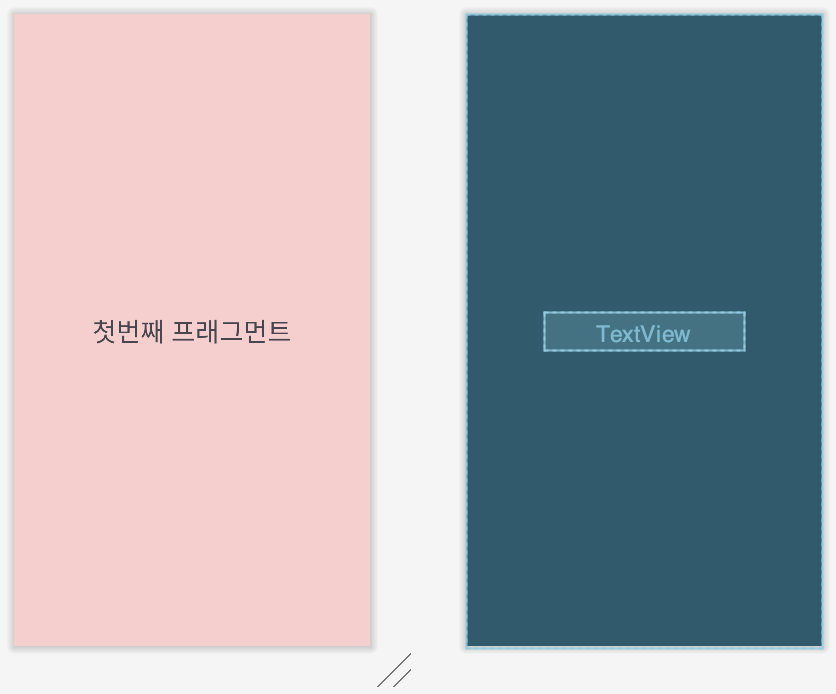
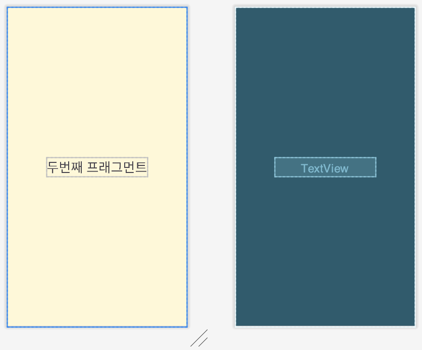
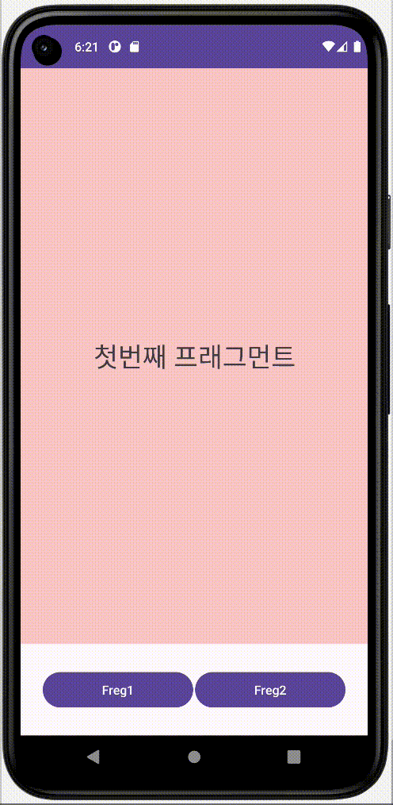

# [TIL] Fragment 알아보기

오늘은 태블릿용 및 스마트폰용 디바이스에서 프래그먼트를 재 사용할 수 있는 방법을 알아볼 것이다.


* toc
{:toc}
---

## Fragment 란?


- 액티비티 위에서 동작하는 모듈화된 사용자 인터페이스이다.
  - 액티비티와 분리되어 독립적으로 동작할 수 없다.
- 여러 개의 프래그먼트를 하나의 액티비티에 조합하여 창이 **여러 개인UI**를 구축할 수 있으며,하나의 프래그먼트를 여러 **액티비티에서 재 사용할 수** 있다.


💡**쉽게말해 한 화면에서 화면을 쪼개사용해 여러 화면으로 보이는 것 처럼 사용 할 수 있는 것이다.**


## 액티비티 vs 프래그먼트 비교


### 1) Activity

- 시스템의 액티비티 매니저에서 인텐드를 해석해 액티비티간 데이터를 전달한다.

### **2) Fragment**

- 액티비티의 프래그먼트 매니저에서 메소드로 프래그먼트간 데이터를 전달한다.


## 프래그먼트는 왜 사용할까?

* Activity로 화면을 계속 넘기는 것보다는 Fragment로 **일부만** 바꾸는 것이 **자원 이용량이 적어 속도가 빠르기 때문**이다.
* Fragment를 사용하면 **Activity를 적게 만들 수 있다**.
* Activity의 **복잡도**를 줄일 수 있다.
* Fragment를 사용하면 **재사용할 수 있는 레이아웃을 분리해서 사용**이 가능하다.
* 최소 한개의 Activity안에서 **Fragment공간에 View만 집어넣**으면 여러 **Activity를 만들지 않아도 화면을 보여줄 수 있다**.


## 🔍 프래그먼트 환경설정

```
dependencies {
    val fragment_version = "1.5.7"//업데이트에따라 다르니 참고하여 넣으면된다.

    // Java language implementation
    implementation"androidx.fragment:fragment:$fragment_version"
    // Kotlin
    implementation"androidx.fragment:fragment-ktx:$fragment_version"
}
```

* 프로젝트에 AndroidX Fragment 라이브러리를 포함하려면 앱 `build.gradle`파일에 다음 종속성을 추가해야한다.
* `$fragment_version` 안에는 현재프래그먼트의 버전을 넣으면된다.


## 프래그먼트 예제 실습


- **1) 버튼을 누르면 fragment 화면이 변경 되는 예제**
- **2) 아래와 같이 Frag1 버튼을 누르면 프래그먼트 1번 화면이 표시된다.**
- **3) Frag2 버튼을 누르면 프래그먼트 2번 화면이 표시된다.**

---

### 1) 프래그먼트 정의하기

 안드로이드스튜디오에서 **File > New > Fragment > Fragment(Blank)**를 이용하여 프래그먼트 파일을 생성해준다.

#### fragment_first.xml



```xml
<?xml version="1.0" encoding="utf-8"?>
<androidx.constraintlayout.widget.ConstraintLayout xmlns:android="http://schemas.android.com/apk/res/android"
    xmlns:app="http://schemas.android.com/apk/res-auto"
    xmlns:tools="http://schemas.android.com/tools"
    android:layout_width="match_parent"
    android:layout_height="match_parent"
    android:background="#40F44336"
    tools:context=".FirstFragment">

    <!-- TODO: Update blank fragment layout -->
    <TextView
        android:layout_width="wrap_content"
        android:layout_height="wrap_content"
        android:text="첫번째 프래그먼트"
        android:textSize="30dp"
        app:layout_constraintBottom_toBottomOf="parent"
        app:layout_constraintEnd_toEndOf="parent"
        app:layout_constraintStart_toStartOf="parent"
        app:layout_constraintTop_toTopOf="parent" />

</androidx.constraintlayout.widget.ConstraintLayout>
```

* 자동으로 생성 된 fragment_first.xml파일을 열고 위와같이 수정

---

#### fragment_second.xml



```xml
<?xml version="1.0" encoding="utf-8"?>
<androidx.constraintlayout.widget.ConstraintLayout xmlns:android="http://schemas.android.com/apk/res/android"
    xmlns:app="http://schemas.android.com/apk/res-auto"
    xmlns:tools="http://schemas.android.com/tools"
    android:layout_width="match_parent"
    android:layout_height="match_parent"
    android:background="#36FFEB3B"
    tools:context=".FirstFragment">

    <!-- TODO: Update blank fragment layout -->
    <TextView
        android:layout_width="wrap_content"
        android:layout_height="wrap_content"
        android:text="두번째 프래그먼트"
        android:textSize="30dp"
        app:layout_constraintBottom_toBottomOf="parent"
        app:layout_constraintEnd_toEndOf="parent"
        app:layout_constraintStart_toStartOf="parent"
        app:layout_constraintTop_toTopOf="parent" />

</androidx.constraintlayout.widget.ConstraintLayout>
```

* 자동으로 생성 된 fragment_second.xml파일을 열고 아래와 같이 수정

---

#### activity_main.xml

```xml
<?xml version="1.0" encoding="utf-8"?>
<androidx.constraintlayout.widget.ConstraintLayout xmlns:android="http://schemas.android.com/apk/res/android"
    xmlns:app="http://schemas.android.com/apk/res-auto"
    xmlns:tools="http://schemas.android.com/tools"
    android:layout_width="match_parent"
    android:layout_height="match_parent"
    tools:context=".MainActivity">

    <FrameLayout
        android:id="@+id/frameLayout"
        android:layout_width="409dp"
        android:layout_height="650dp"
        app:layout_constraintEnd_toEndOf="parent"
        app:layout_constraintStart_toStartOf="parent"
        app:layout_constraintTop_toTopOf="parent">

    </FrameLayout>

    <Button
        android:id="@+id/button"
        android:layout_width="170dp"
        android:layout_height="wrap_content"
        android:layout_marginStart="25dp"
        android:layout_marginTop="20dp"
        android:layout_marginBottom="20dp"
        android:text="Freg1"
        app:layout_constraintBottom_toBottomOf="parent"
        app:layout_constraintStart_toStartOf="parent"
        app:layout_constraintTop_toBottomOf="@+id/frameLayout" />

    <Button
        android:id="@+id/button2"
        android:layout_width="170dp"
        android:layout_height="wrap_content"
        android:layout_marginTop="20dp"
        android:layout_marginEnd="25dp"
        android:layout_marginBottom="20dp"
        android:text="Freg2"
        app:layout_constraintBottom_toBottomOf="parent"
        app:layout_constraintEnd_toEndOf="parent"
        app:layout_constraintTop_toBottomOf="@+id/frameLayout" />

</androidx.constraintlayout.widget.ConstraintLayout>
```

* fragment를 표시할 FrameLayout과 버튼 2개 추가

---

#### MainActivity.kt

```kotlin
package com.example.frgment

import androidx.appcompat.app.AppCompatActivity
import android.os.Bundle
import android.text.TextUtils.replace
import androidx.fragment.app.Fragment
import androidx.fragment.app.commit
import com.example.frgment.databinding.ActivityMainBinding

class MainActivity : AppCompatActivity() {
    private lateinit var binding:ActivityMainBinding

    override fun onCreate(savedInstanceState: Bundle?) {
        super.onCreate(savedInstanceState)
        val binding=ActivityMainBinding.inflate(layoutInflater)
        setContentView(binding.root)
		//버튼을 눌러 프래그먼트가 전환되도록 구현
        binding.apply {
            button.setOnClickListener{
                setFragment(FirstFragment())
            }
            button2.setOnClickListener {
                setFragment(SecondFragment())
            }
        }
      	//버튼을 누르기전에 시작화면에 첫번째프래그먼트 화면을띄워줌
        setFragment(FirstFragment())
    }
  	//inflate()함수를 통해서 fragment_first.xml 파일로부터 레이아웃을 로드
    private fun setFragment(frag : Fragment) {
        supportFragmentManager.commit {
            replace(R.id.frameLayout, frag)
            setReorderingAllowed(true)
            addToBackStack("")
        }
    }
}
```

- 프래그먼트를 생성하려면 Fragment의 서브클래스(또는 이의 기존 서브클래스)를 생성
  - **프래그먼트에 대해 레이아웃을 제공하려면 반드시 onCreateView()콜백 메서드를  구현**

---

#### 📱결과


