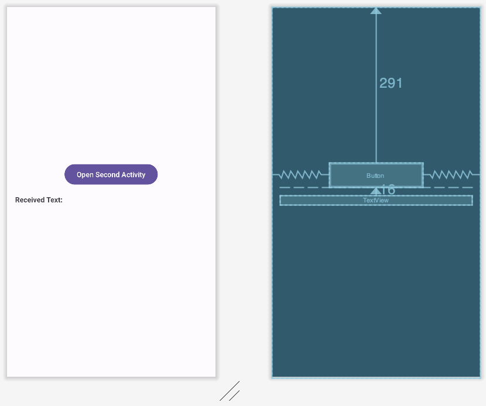
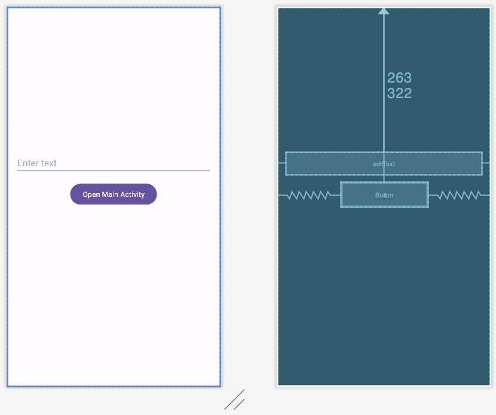
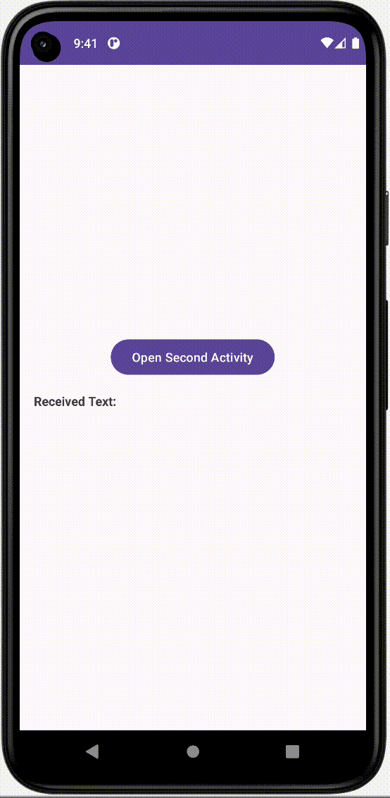

# [Kotlin] registerForActivityResult 알아보기


* toc
{:toc}


---

## **registerForActivityResult란?**

**🔍자세한 내용을 알아보자!**

* 안드로이드의 Activity 및 Fragment 결과 처리를 더 간단하게 만들어주는 Jetpack 라이브러리의 일부인 `ActivityResultLauncher`의 메서드이다. 
* 이를 통해 이전에는 `startActivityForResult` 및 `onActivityResult`를 사용하여 처리하던 작업을 더 효과적으로 다룰 수 있다.
* 액티비티나 프래그먼트에서 다른 액티비티나 프래그먼트를 실행하고 그 결과를 수신하는 과정을 **간소화할 수 있다.**
* **생명주기** 관점에서 `registerForActivityResult`는 해당하는 액티비티나 프래그먼트의 생명주기에 종속된다.
  * 즉, 액티비티나 프래그먼트가 활성화되어 있는 동안에만 `ActivityResultLauncher`와 그에 대한 콜백이 유효하다.
  * 따라서 해당 활동이나 프래그먼트가 파괴되면 이전에 등록한 `ActivityResultLauncher`와 콜백도 더 이상 유효하지 않는다.


## **registerForActivityResult의 장점**

* **권한 요청**: 사용자로부터 권한을 요청하고 결과를 처리할 때 유용하다.

* **사진 및 갤러리 선택**: 사용자가 사진을 선택하거나 갤러리에서 미디어를 선택하고 해당 결과를 처리할 때 사용할 수 있다.

* **다른 액티비티 실행**: 다른 액티비티를 실행하고 그 결과를 처리할 때 유용하다.

- 코드가 더 간결하고 **가독성이** 좋아진다.
- 결과 처리를 위한 requestCode 관리가 필요하지 않다.
- 결과 처리를 위한 `onActivityResult` 메서드를 오버라이딩할 필요가 없다.
- 람다식을 사용하여 콜백 함수를 정의할 수 있어 **코드 작성이 편리**하다.


## **onActivityResult 와 registerForActivityResult 의 차이점과 동작**

둘다 모두 안드로이드 액티비티 간의 결과 처리를 관리하기 위한 메커니즘이다.

 그러나 이 둘은 다른 방식으로 작동하며, `registerForActivityResult`가 더 최신의 API이다. 


### 1)**`onActivityResult`**

- 예전부터 안드로이드에서 사용되어 온 방식으로, 기존의 액티비티 간 결과 처리 방식이다.
- 이 방식은 **액티비티가 다른 액티비티를 실행**하고, **실행된 액티비티로부터 결과를 받는 것**을 관리하기 위해 사용된다.
- `startActivityForResult`를 사용하여 다른 액티비티를 실행하고, 그 결과를 받기 위해 `onActivityResult` 메서드를 오버라이딩하여 결과를 처리한다.
- `onActivityResult`를 통해 `requestCode`와 `resultCode` 그리고 `Intent`를 전달받아 결과를 처리한다.
- 이 방식은 `requestCode`를 관리하고 액티비티 간 결과 처리를 처리하기 위한 번거로움이 있을 수 있다.


### 2)**`registerForActivityResult`**

- AndroidX 라이브러리의 **최신 기능**으로, 액티비티 및 프래그먼트 간의 결과 처리를 더 편리하게 관리하는 방식이다.
- 이 방식은 액티비티나 프래그먼트에서 `ActivityResultLauncher`를 사용하여 결과 처리를 관리한다.
- `registerForActivityResult` 메서드를 사용하여 결과 처리에 필요한 콜백을 등록하고, 해당 콜백이 결과를 처리한다.
- `ActivityResultContract`를 사용하여 입력 및 출력 유형을 정의하고, `ActivityResultCallback`을 통해 결과를 처리한다.
- 결과 처리에 필요한 `requestCode`를 **직접 관리할 필요가 없다**.
- 또한 람다식을 사용하여 콜백을 정의할 수 있어 **코드가 더 간결**해진다.


## **registerForActivityResult 실습**

먼저 두개의 화면을 사용하기위해 새로운 SecondActivity.kt를 만들어준다.

첫화면에서 버튼을 눌러 두번째 화면으로 이동하여 값을 입력해주고 다시 첫번째 화면으로 값을 받아와보자!

### 1) xml만들어주기

#### activity_main.xml



```xml
<RelativeLayout xmlns:android="http://schemas.android.com/apk/res/android"
    xmlns:tools="http://schemas.android.com/tools"
    android:layout_width="match_parent"
    android:layout_height="match_parent"
    android:padding="16dp"
    tools:context=".MainActivity">


    <Button
        android:id="@+id/btn_second"
        android:layout_width="wrap_content"
        android:layout_height="wrap_content"
        android:layout_alignParentTop="true"
        android:layout_centerHorizontal="true"
        android:layout_marginTop="291dp"
        android:text="Open Second Activity" />

    <TextView
        android:id="@+id/tv_received"
        android:layout_width="match_parent"
        android:layout_height="wrap_content"
        android:layout_below="@id/btn_second"
        android:layout_marginTop="16dp"
        android:text="Received Text: "
        android:textStyle="bold" />

</RelativeLayout>

```

---

#### activity_second.xml



```xml
<RelativeLayout xmlns:android="http://schemas.android.com/apk/res/android"
    xmlns:tools="http://schemas.android.com/tools"
    android:layout_width="match_parent"
    android:layout_height="match_parent"
    android:padding="16dp"
    tools:context=".SecondActivity">

    <EditText
        android:id="@+id/editText"
        android:layout_width="match_parent"
        android:layout_height="wrap_content"
        android:layout_alignParentTop="true"
        android:layout_centerHorizontal="true"
        android:layout_marginTop="263dp"
        android:hint="Enter text" />

    <Button
        android:id="@+id/btn_main"
        android:layout_width="wrap_content"
        android:layout_height="wrap_content"
        android:layout_alignParentTop="true"
        android:layout_centerHorizontal="true"
        android:layout_marginTop="322dp"
        android:text="Open Main Activity" />


</RelativeLayout>

```

---

### 2) 데이터를 받을 화면에 콜백 등록

데이터를 불러오기위한 활동을 시작할 때 메모리 부족으로 프로세스와 활동이 소멸될 수 있다.

하지만, Activity Result API는 다른 활동을 실행하는 코드 위치에서 결과 콜백을 분리한다.

그렇기에 활동이 생성될 때마다 콜백을 무조건 등록해야 한다.


#### MainActivity.kt

```kotlin
private val getResult=registerForActivityResult(ActivityResultContracts.StartActivityForResult()){reslut ->
        if (reslut.resultCode == RESULT_OK) {
            val data = reslut.data
            val receivedText=data?.getStringExtra("text")
            Toast.makeText(this,"$receivedText",Toast.LENGTH_SHORT).show()

            val mainText = findViewById<TextView>(R.id.tv_received)
            mainText.text = receivedText.toString()

        }
    }
```

* 데이터를 받아올 액티비티에 콜백을위해 런쳐를 만들어준다.

---

### 3) 결과를 위한 활동 실행 하기

```kotlin
	//btnSecond을 눌러 두번째 화면으로 전환하기
    override fun onCreate(savedInstanceState: Bundle?) {
        super.onCreate(savedInstanceState)
        val binding=ActivityMainBinding.inflate(layoutInflater)
        setContentView(binding.root)

        binding.btnSecond.setOnClickListener {
            val intent=Intent(this@MainActivity,SecondActivity::class.java)
            getResult.launch(intent)

        }
    }
}
```

* 입력이 있으면 런처는 `ActivityResultContract` 유형과 일치하는 입력을 가져온다.
*  [`launch()`](https://developer.android.com/reference/androidx/activity/result/ActivityResultLauncher?hl=ko#launch(I))를 호출하면 결과를 생성하는 프로세스가 시작된다. 
* 사용자가 후속 활동을 완료하고 반환하면 `ActivityResultCallback`의 `onActivityResult()`가 다음 예와 같이 실행된다.

---

### 4) 다른 클래스에서 활동 결과 수신하기

#### SecondActivity.kt

두번째화면에서 데이터 를 전달해주자!

```kotlin
package com.example.registerforactivityresult

import android.app.Activity
import android.content.Intent
import androidx.appcompat.app.AppCompatActivity
import android.os.Bundle
import androidx.activity.result.contract.ActivityResultContracts
import com.example.registerforactivityresult.databinding.ActivitySecondBinding

class SecondActivity : AppCompatActivity() {
    private lateinit var binding: ActivitySecondBinding

    override fun onCreate(savedInstanceState: Bundle?) {
        super.onCreate(savedInstanceState)
        val binding=ActivitySecondBinding.inflate(layoutInflater)
        setContentView(binding.root)
				
      	//btnMain을 클릭하여 메인으로 화면전환,데이터 전달하기
        binding.btnMain.setOnClickListener {
            val inputText=binding.editText.text.toString()

            val resultIntent= Intent()
            resultIntent.putExtra("text",inputText)
            setResult(RESULT_OK,resultIntent)
            finish()
        }
    }
}
```

* Intent를 사용하여 값을전달해준다.

---

### 📱결과

이렇게하면 값이 잘 넘어오는 것을 확인할 수가 있다.


