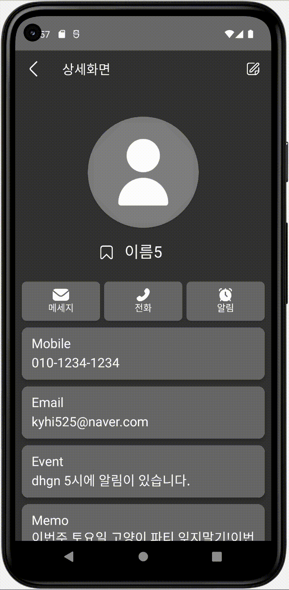
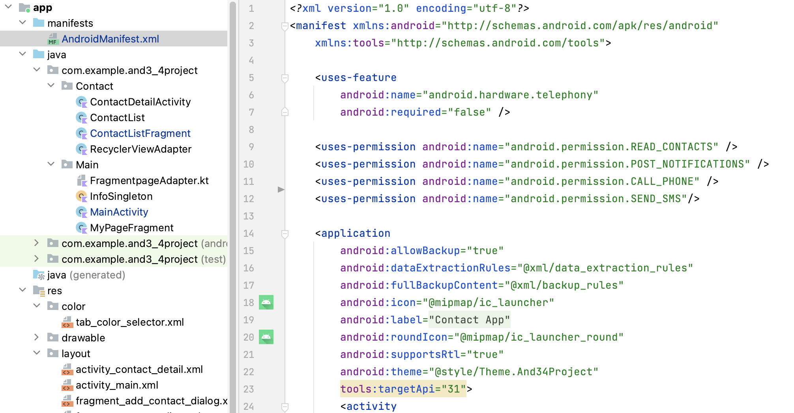
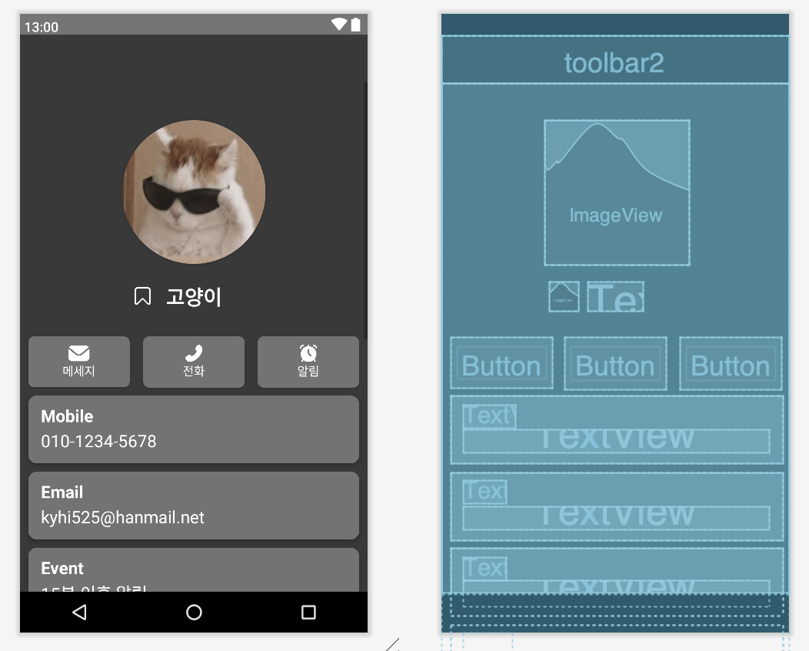

# [Kotlin] 권한(Permission) - 버튼 클릭으로 전화연결/메세지 보내기 


* toc
{:toc}


---




안드로이드의 앱 안내에서 전화번호를 연결하고 , 전화를 걸려면 Permission을 요청하고 획득해야한다.

이 작업은 실무에서도 많이 사용되고 있으므로 구현해 보도록 하자.


필요한 기능을 사용하기 위해서는 설정을 해야할 것이 있다.

오늘은 통화(CALL_PHONE), 메세지(SEND_SMS) 등의 기능 사용할 것이기 때문에 필요한 권한을 추가하고 시작할 것이다.

권한의 종류는 아주 많기 때문에 다른 것들은 [Developer](https://developer.android.com/reference/android/Manifest.permission) 를 참고하자!


## **1) 권한추가**

**AndroidManifest.xml**



```xml
<uses-permission android:name="android.permission.CALL_PHONE" />
<uses-permission android:name="android.permission.SEND_SMS"/>
```

* `AndroidManifest` 에 permission 셋팅을 해준다.


## **2) xml설정**

본인은 이미 입력된 전화번호를 가져와 넣어줄 것이기 때문에 xml을 이렇게 그려줬다.


**Activity_contact.detail.xml**



```xml
<?xml version="1.0" encoding="utf-8"?>
<androidx.constraintlayout.widget.ConstraintLayout xmlns:android="http://schemas.android.com/apk/res/android"
    xmlns:app="http://schemas.android.com/apk/res-auto"
    xmlns:tools="http://schemas.android.com/tools"
    android:layout_width="match_parent"
    android:layout_height="match_parent"
    android:background="@color/black"
    tools:context=".Main.MyPageFragment">


    <androidx.appcompat.widget.Toolbar
        android:id="@+id/toolbar2"
        android:layout_width="0dp"
        android:layout_height="wrap_content"
        android:scaleType="centerCrop"
        app:layout_constraintEnd_toEndOf="parent"
        app:layout_constraintStart_toStartOf="parent"
        app:layout_constraintTop_toTopOf="parent"
        app:theme="@style/ThemeOverlay.AppCompat.Dark.ActionBar" />

    <ScrollView
        android:layout_width="match_parent"
        android:layout_height="0dp"
        app:layout_constraintBottom_toBottomOf="parent"
        app:layout_constraintEnd_toEndOf="parent"
        app:layout_constraintStart_toStartOf="parent"
        app:layout_constraintTop_toBottomOf="@+id/toolbar2">

        <androidx.constraintlayout.widget.ConstraintLayout
            android:layout_width="match_parent"
            android:layout_height="match_parent"
            app:layout_constraintBottom_toBottomOf="parent"
            app:layout_constraintEnd_toEndOf="parent"
            app:layout_constraintStart_toStartOf="parent"
            app:layout_constraintTop_toTopOf="parent">


            <androidx.cardview.widget.CardView
                android:id="@+id/cardView"
                android:layout_width="170dp"
                android:layout_height="170dp"
                android:layout_marginTop="45dp"
                android:elevation="50dp"
                app:cardBackgroundColor="@color/light_grey"
                app:cardCornerRadius="100dp"
                app:layout_constraintEnd_toEndOf="parent"
                app:layout_constraintStart_toStartOf="parent"
                app:layout_constraintTop_toTopOf="parent">

                <ImageView
                    android:id="@+id/iv_profile"
                    android:layout_width="match_parent"
                    android:layout_height="match_parent"
                    android:scaleType="fitXY"
                    android:src="@drawable/cat"
                    app:layout_constraintEnd_toEndOf="parent"
                    app:layout_constraintStart_toStartOf="parent"
                    app:layout_constraintTop_toTopOf="parent" />

            </androidx.cardview.widget.CardView>


            <Button
                android:id="@+id/btn_massage"
                android:layout_width="120dp"
                android:layout_height="60dp"
                android:layout_marginStart="10dp"
                android:background="@drawable/buttonshape"
                android:drawableTop="@drawable/message_button"
                android:padding="10dp"
                android:text="메세지"
                android:textColor="@color/white"
                app:layout_constraintStart_toStartOf="parent"
                app:layout_constraintTop_toTopOf="@+id/btn_call"
                app:tabIconTint="@color/tab_color_selector" />

            <Button
                android:id="@+id/btn_call"
                android:layout_width="120dp"
                android:layout_height="wrap_content"
                android:layout_marginStart="5dp"
                android:layout_marginTop="30dp"
                android:layout_marginEnd="5dp"
                android:background="@drawable/buttonshape"
                android:drawableTop="@drawable/phone_button"
                android:padding="10dp"
                android:text="전화"
                android:textColor="@color/white"
                app:layout_constraintEnd_toStartOf="@+id/btn_notifycation"
                app:layout_constraintStart_toEndOf="@+id/btn_massage"
                app:layout_constraintTop_toBottomOf="@+id/tv_name" />


            <Button
                android:id="@+id/btn_notifycation"
                android:layout_width="120dp"
                android:layout_height="wrap_content"
                android:layout_marginEnd="10dp"
                android:background="@drawable/buttonshape"
                android:drawableTop="@drawable/notification_button"
                android:padding="10dp"
                android:text="알림"
                android:textColor="@color/white"
                app:layout_constraintEnd_toEndOf="parent"
                app:layout_constraintTop_toTopOf="@+id/btn_call" />

            <TextView
                android:id="@+id/tv_name"
                android:layout_width="wrap_content"
                android:layout_height="wrap_content"
                android:layout_marginTop="20dp"
                android:text="고양이"
                android:textColor="@color/white"
                android:textSize="24sp"
                app:layout_constraintEnd_toEndOf="parent"
                app:layout_constraintStart_toStartOf="parent"
                app:layout_constraintTop_toBottomOf="@+id/cardView"
                tools:textStyle="bold" />

            <androidx.cardview.widget.CardView
                android:id="@+id/cv_mobile"
                android:layout_width="match_parent"
                android:layout_height="80dp"
                android:layout_marginStart="10dp"
                android:layout_marginTop="10dp"
                android:layout_marginEnd="10dp"
                app:cardCornerRadius="10dp"
                app:cardElevation="4dp"
                app:layout_constraintEnd_toEndOf="parent"
                app:layout_constraintStart_toStartOf="parent"
                app:layout_constraintTop_toBottomOf="@+id/btn_massage">

                <androidx.constraintlayout.widget.ConstraintLayout
                    android:layout_width="match_parent"
                    android:layout_height="match_parent"
                    android:background="@color/dark_grey">

                    <TextView
                        android:id="@+id/tv_mobile"
                        android:layout_width="wrap_content"
                        android:layout_height="wrap_content"
                        android:layout_marginStart="15dp"
                        android:layout_marginTop="10dp"
                        android:text="Mobile"
                        android:textColor="@color/white"
                        android:textSize="20dp"
                        app:layout_constraintStart_toStartOf="parent"
                        app:layout_constraintTop_toTopOf="parent"
                        tools:textStyle="bold" />

                    <TextView
                        android:id="@+id/tv_number"
                        android:layout_width="match_parent"
                        android:layout_height="wrap_content"
                        android:layout_marginStart="15dp"
                        android:layout_marginTop="5dp"
                        android:layout_marginEnd="15dp"
                        android:layout_marginBottom="16dp"
                        android:text="010-1234-5678"
                        android:textColor="@color/white"
                        android:textSize="20dp"
                        app:layout_constraintBottom_toBottomOf="parent"
                        app:layout_constraintEnd_toEndOf="parent"
                        app:layout_constraintStart_toStartOf="parent"
                        app:layout_constraintTop_toBottomOf="@+id/tv_mobile" />

                </androidx.constraintlayout.widget.ConstraintLayout>


            </androidx.cardview.widget.CardView>


            <androidx.cardview.widget.CardView
                android:id="@+id/cv_event"
                android:layout_width="match_parent"
                android:layout_height="80dp"
                android:layout_marginStart="10dp"
                android:layout_marginTop="10dp"
                android:layout_marginEnd="10dp"
                app:cardCornerRadius="10dp"
                app:cardElevation="4dp"
                app:layout_constraintEnd_toEndOf="parent"
                app:layout_constraintStart_toStartOf="parent"
                app:layout_constraintTop_toBottomOf="@+id/cv_email">

                <androidx.constraintlayout.widget.ConstraintLayout
                    android:layout_width="match_parent"
                    android:layout_height="match_parent"
                    android:background="@color/dark_grey">

                    <TextView
                        android:id="@+id/tv_event"
                        android:layout_width="wrap_content"
                        android:layout_height="wrap_content"
                        android:layout_marginStart="15dp"
                        android:layout_marginTop="10dp"
                        android:text="Event"
                        android:textColor="@color/white"
                        android:textSize="20dp"
                        app:layout_constraintStart_toStartOf="parent"
                        app:layout_constraintTop_toTopOf="parent"
                        tools:textStyle="bold" />

                    <TextView
                        android:id="@+id/tv_notification"
                        android:layout_width="match_parent"
                        android:layout_height="wrap_content"
                        android:layout_marginStart="15dp"
                        android:layout_marginTop="5dp"
                        android:layout_marginEnd="15dp"
                        android:layout_marginBottom="16dp"
                        android:text="15분 이후 알림"
                        android:textColor="@color/white"
                        android:textSize="20dp"
                        app:layout_constraintBottom_toBottomOf="parent"
                        app:layout_constraintEnd_toEndOf="parent"
                        app:layout_constraintStart_toStartOf="parent"
                        app:layout_constraintTop_toBottomOf="@+id/tv_event" />

                </androidx.constraintlayout.widget.ConstraintLayout>


            </androidx.cardview.widget.CardView>

            <androidx.cardview.widget.CardView
                android:id="@+id/cv_email"
                android:layout_width="match_parent"
                android:layout_height="80dp"
                android:layout_marginStart="10dp"
                android:layout_marginTop="10dp"
                android:layout_marginEnd="10dp"
                app:cardCornerRadius="10dp"
                app:cardElevation="4dp"
                app:layout_constraintEnd_toEndOf="parent"
                app:layout_constraintStart_toStartOf="parent"
                app:layout_constraintTop_toBottomOf="@+id/cv_mobile">

                <androidx.constraintlayout.widget.ConstraintLayout
                    android:layout_width="match_parent"
                    android:layout_height="match_parent"
                    android:background="@color/dark_grey">

                    <TextView
                        android:id="@+id/tv_email"
                        android:layout_width="wrap_content"
                        android:layout_height="wrap_content"
                        android:layout_marginStart="15dp"
                        android:layout_marginTop="10dp"
                        android:text="Email"
                        android:textColor="@color/white"
                        android:textSize="20dp"
                        app:layout_constraintStart_toStartOf="parent"
                        app:layout_constraintTop_toTopOf="parent"
                        tools:textStyle="bold" />

                    <TextView
                        android:id="@+id/tv_adress"
                        android:layout_width="match_parent"
                        android:layout_height="wrap_content"
                        android:layout_marginStart="15dp"
                        android:layout_marginTop="5dp"
                        android:layout_marginEnd="15dp"
                        android:layout_marginBottom="16dp"
                        android:text="kyhi525@hanmail.net"
                        android:textColor="@color/white"
                        android:textSize="20dp"
                        app:layout_constraintBottom_toBottomOf="parent"
                        app:layout_constraintEnd_toEndOf="parent"
                        app:layout_constraintStart_toStartOf="parent"
                        app:layout_constraintTop_toBottomOf="@+id/tv_email" />

                </androidx.constraintlayout.widget.ConstraintLayout>


            </androidx.cardview.widget.CardView>

            <androidx.cardview.widget.CardView
                android:id="@+id/cv_memo"
                android:layout_width="match_parent"
                android:layout_height="wrap_content"
                android:layout_marginStart="10dp"
                android:layout_marginTop="10dp"
                android:layout_marginEnd="10dp"
                android:layout_marginBottom="10dp"
                app:cardCornerRadius="10dp"
                app:cardElevation="4dp"
                app:layout_constraintBottom_toBottomOf="parent"
                app:layout_constraintEnd_toEndOf="parent"
                app:layout_constraintStart_toStartOf="parent"
                app:layout_constraintTop_toBottomOf="@+id/cv_event">

                <androidx.constraintlayout.widget.ConstraintLayout
                    android:layout_width="match_parent"
                    android:layout_height="wrap_content"
                    android:background="@color/dark_grey">

                    <TextView
                        android:id="@+id/tv_memo"
                        android:layout_width="wrap_content"
                        android:layout_height="wrap_content"
                        android:layout_marginStart="15dp"
                        android:layout_marginTop="10dp"
                        android:text="Memo"
                        android:textColor="@color/white"
                        android:textSize="20dp"
                        app:layout_constraintStart_toStartOf="parent"
                        app:layout_constraintTop_toTopOf="parent"
                        tools:textStyle="bold" />

                    <EditText
                        android:id="@+id/tv_content"
                        android:layout_width="match_parent"
                        android:layout_height="wrap_content"
                        android:layout_marginStart="15dp"
                        android:layout_marginEnd="15dp"
                        android:layout_marginBottom="16dp"
                        android:background="@android:color/transparent"
                        android:text="이번주 토요일 고양이 파티 잊지말기!이번주 토요일 고양이 파티 잊지말기!이번주 토요일 고양이 파티 잊지말기!이번주 토요일 고양이 파티 잊지말기!이번주 토요일 고양이 파티 잊지말기!이번주 토요일 고양이 파티 잊지말기!이번주 토요일 고양이 파티 잊지말기!이번주 토요일 고양이 파티 잊지말기!이번주 토요일 고양이 파티 잊지말기!이번주 토요일 고양이 파티 잊지말기!이번주 토요일 고양이 파티 잊지말기!이번주 토요일 고양이 파티 잊지말기!이번주 토요일 고양이 파티 잊지말기!이번주 토요일 고양이 파티 잊지말기!이번주 토요일 고양이 파티 잊지말기!이번주 토요일 고양이 파티 잊지말기!이번주 토요일 고양이 파티 잊지말기!이번주 토요일 고양이 파티 잊지말기!이번주 토요일 고양이 파티 잊지말기!"
                        android:textColor="@color/white"
                        android:textSize="20dp"
                        app:layout_constraintBottom_toBottomOf="parent"
                        app:layout_constraintEnd_toEndOf="parent"
                        app:layout_constraintStart_toStartOf="parent"
                        app:layout_constraintTop_toBottomOf="@+id/tv_memo" />

                </androidx.constraintlayout.widget.ConstraintLayout>


            </androidx.cardview.widget.CardView>

            <ImageView
                android:id="@+id/iv_heart"
                android:layout_width="35dp"
                android:layout_height="35dp"
                android:layout_marginTop="0dp"
                android:layout_marginEnd="10dp"
                android:src="@drawable/icon_bookmark"
                app:layout_constraintEnd_toStartOf="@+id/tv_name"
                app:layout_constraintTop_toTopOf="@+id/tv_name" />


        </androidx.constraintlayout.widget.ConstraintLayout>
    </ScrollView>


</androidx.constraintlayout.widget.ConstraintLayout>
```

* 메세지버튼:  android:id="@+id/btn_massage"
* 통화버튼: android:id="@+id/btn_call"
* Textview : android:id="@+id/tv_number"

여기서 사용되는것은 이렇게 세개 뿐이다!


## **3)Activity설정하기**

**ContactDetailActivity.kt**

```kotlin
var number = binding.tvNumber.text.toString()
        //전화걸기 버튼
        binding.btnCall.setOnClickListener {

            val PERMISSIONS_CALL_PHONE = 1
            if (ContextCompat.checkSelfPermission(
                    this,
                    Manifest.permission.CALL_PHONE
                ) != PackageManager.PERMISSION_GRANTED
            ) {
                ActivityCompat.requestPermissions(
                    this,
                    arrayOf(Manifest.permission.CALL_PHONE),
                    PERMISSIONS_CALL_PHONE
                )
            } else {
                val callIntent = Intent(Intent.ACTION_CALL)
                callIntent.data = Uri.parse("tel:" + number)
                startActivity(callIntent)
            }

        }
        //메세지 보내기
        binding.btnMassage.setOnClickListener {
            val smsUri = Uri.parse("smsto:$number") //phonNumber에는 01012345678과 같은 구성.
            val intent = Intent(Intent.ACTION_SENDTO)
            intent.data = smsUri
            intent.putExtra("sms_body", "") //해당 값에 전달하고자 하는 문자메시지 전달
            startActivity(intent)


        }
```

* 변경되는 전화번호를 텍스트뷰에서 받아올 수 있도록 **number**변수를 선언해준다.
* 전화와 메세지의 다른 부분이 있다면 
  *  전화 :**tel:** 사용
  * 메세지: **smsto:** 사용

* 알아두면 좋은 SMS 문자보내기 소스. 전화랑은 살짝 다른 부분이 우선 **tel:** 이 아닌 **smsto:** 로 사용한다는 것과 문자는 당연 보내는 문구가 있으니 그것을 putExtra로 담고 보낸다는 차이점이 있다.

본인은 **PERMISSIONS_CALL_PHONE**에 오류가 났었는데 여러가지 권한을 사용하다보면 그에맞는 키값을 지정해야한다고 하여 1이라는 값을 지정해주었더니 오류가 사라졌다.


이렇게 실행해보면 위와같이 전화와 메세지를 연결할 수 있을 것이다!
