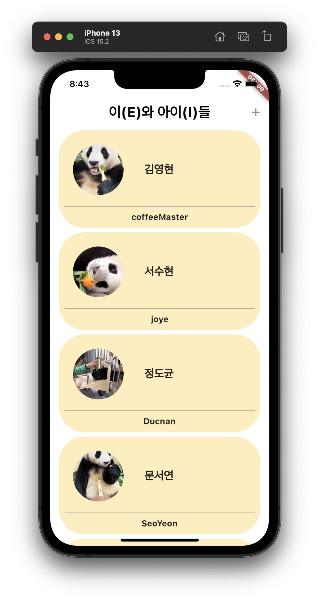
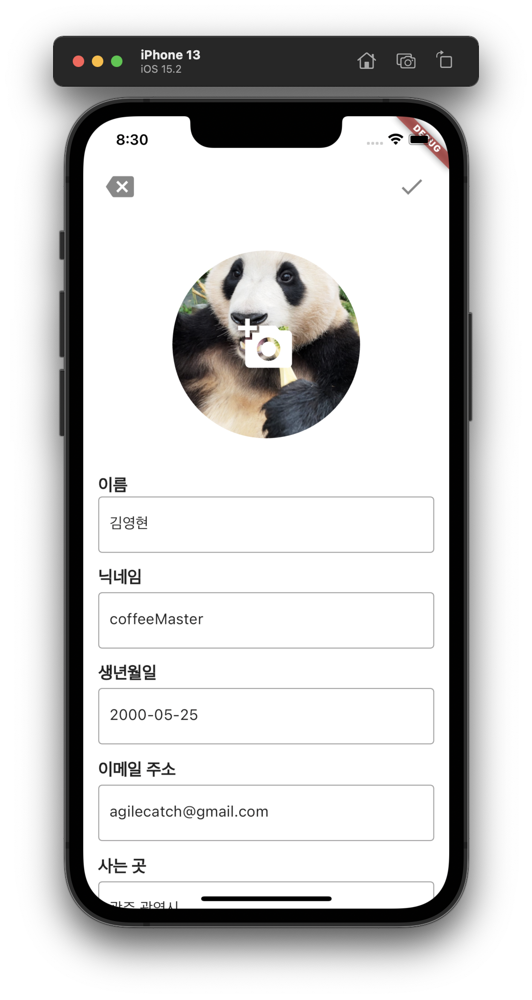

# [Flutter] 자기소개 App

* toc
{:toc}

---

`프로젝트 소개` : 내 지갑속 한장의 **명함**에 담긴 E와I들

`구현된 기능` : CRUD, Shared_preferences, Provider

## 📱**와이어프레임**

## 💡**아이디어 회의**

- Main Page

  - 정육면체 화면안에 돌아가는 팀이름과 팀원들
  - 상단에 정육면체(Text Button) → 누르면 이펙트로 떨어지는 느낌
  - 각자의이름(ListView)→ 버튼 → 서비스화면으로 전환(이펙트 스르르변하는?)

- 서비스화면1(각자페이지)

  🐤 소개글 TMI(이름,사진,MBTI, 사는곳, 하고싶은 한마디,취미,)

  - 내사진,이름,나이
  - 사는곳, 좋아하는것,취미
  - Textbox안에 표현

- 서비스화면2(팀을 소개할 수있는)

## ⚙️ **페이지별 구현기능**

### Main Page 

- 메인화면 스플래시 아이콘, 화면전환
- add button- 연결까지
- card (이름,별명) UI 만들어서 리스트뷰 추가되도록 구현
- card_Slider 기능 구현하여 삭제,수정,취소팝업 구현
- card - Create / Read / Update / Delete 기능 구현
- shared_preferences - 기기안에 데이터저장(수현님이 구현하심!!@!!!)
- Provider - 아이템 리스트 저장후 불러오기

---

### Detail Page

- back button
- modify button
- Text
- container
- RichText
- Image
- Icon back
- Icon modify

---

### Detail_Modify_Page

- back button
- save button
- Text
- TextField
- Image(프로필 이미지 추가 삭제)

---

### Image_Add_Page

- back button
- save button
- Image add
- Text
- Text Field

---

### Image_Detail_Page/Image_Modify_Page

- back button

- delete button

- modify button

- back button

- save button

  

## 📇 **구현완료 최종화면**

