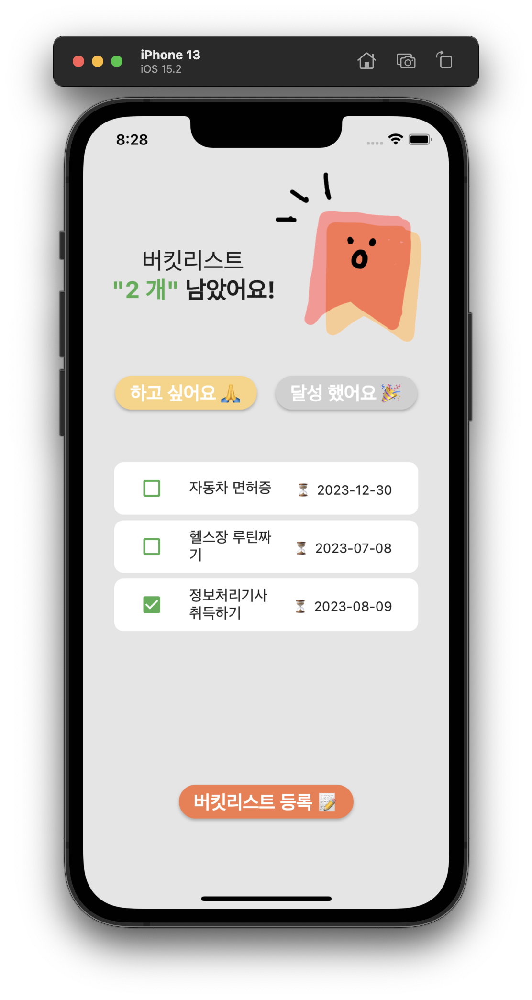
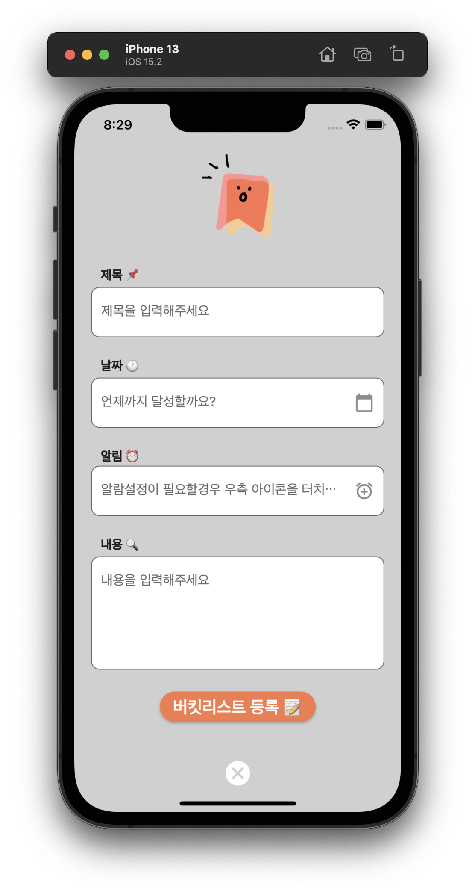
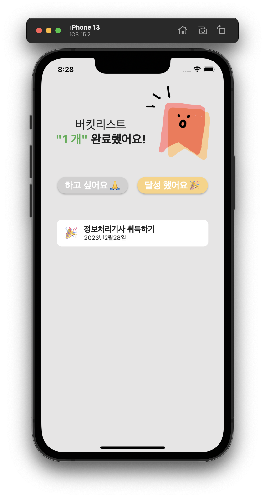
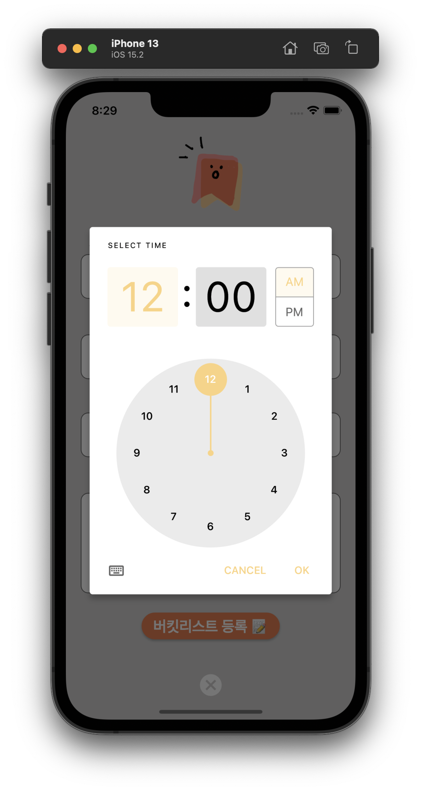
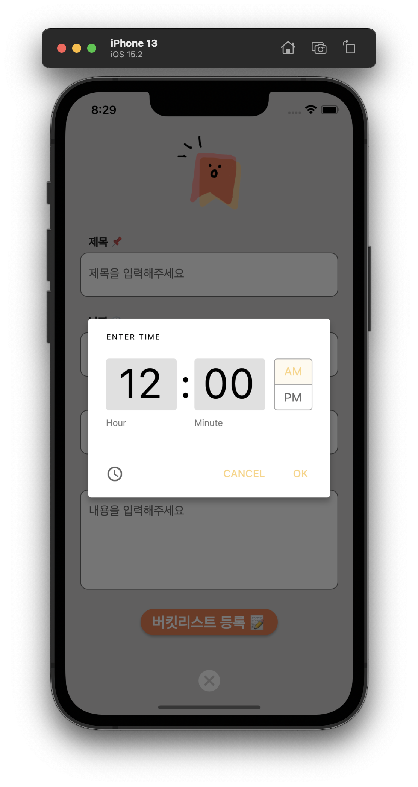

# [Flutter] 마이버킷 App

* toc
{:toc}

---

## 📱**와이어프레임**

## 💡**아이디어 회의**

#### **버킷리스트 Home**

* 남은 버킷리스트 갯수 텍스트 & 이미지
* 미완료 버킷리스트 버튼 (하고싶어요)
  * 미완료 ListView
    * 버킷리스트 남은 수 표시
    * 체크표시, 제목, 날짜(D-Day), 메모
    * 수정/삭제기능(오른쪽으로 슬라이드) 
  * 하단 버킷리스트 등록 버튼
    * 달성 버킷리스트 수 표시
    * 터치하면 버킷리스트 생성(수정)페이지로 이동 🔜 📝
* 완료 버킷리스트 버튼(달성했어요)
  - 완료목록 ListView

#### **버킷리스트 생성(수정)페이지** 📅

- 페이지 소개제목
- 이미지
- TextField
  - 제목
  - 날짜
  - 알림
  - 메모
- 버킷리스트 등록버튼
- 취소 버튼

* #### 버킷리스트 완료 페이지 🎉

  - 달성한 버킷리스트 갯수 텍스트 & 이미지
  - Icon & Text
  - ListView로 완료된 목록 실시간으로 가져오기

## 📋구현완료 최종화면 & 데모영상

1.  home.dart(메인화면)

- 하고싶어요버튼 클릭시 첫번째 화면으로 전환
- 달성했어요버튼 클릭시 세번째화면전환 전환

* 버킷리스트 등록버튼 클릭시 두번째 화면으로 전환
* 리스트왼쪽으로 슬라이드시 `삭제,수정,취소`  버튼표시

2. bucketEdit.dart(등록&수정페이지)

* 제목,날짜 알림,내용 텍스트 추가기능완료
* 날짜,시간 받아오기 팝업기능 완료

3. 데모영상
<video src="../../../../../Desktop/마이버킷_데모영상.mov" width="350" height="auto"></video>

