# [Kotlin] 18조 - 싸이월드 만들기

* toc
{:toc}
---

`팀명 ` : 환상ⓕⓞⓡⓔⓥⓔⓡ콤비

`프로젝트 소개` : "싸이월드 레트로: 추억의 소셜 플랫폼"

**[최종 구현 단계]** 

- 필수 구현사항

- [x]  **메인 페이지 ( MainPageActivity )**

- [x]  **디테일 페이지 ( DetailPageActivity )**

- [x]  **로그인, 회원 가입 페이지 ( SignInActivity, SignUpActivity )**

- [x]  **로그인, 회원 가입 예외 처리**

- [x] **마이 페이지 ( MyPageActivity )**

- [x] **Activity 전환시 animation 구현**

- [ ] **영어 버전으로 변경 적용해보기(string.xml)**


- 추가 구현사항

- [x] **동그란 ImageView 만들기**

- [x] **스크롤 기능 추가**

- [x] **회원 정보 관리 구현**

- [ ] **더보기 기능**

- [ ] **Font 크기 설정에 따라 글씨 크기 달라지도록 구현**

- [ ] **Dark theme 구현**

- [ ] **세로/가로 모드 ui 분리 구현**


## 📱**와이어프레임**

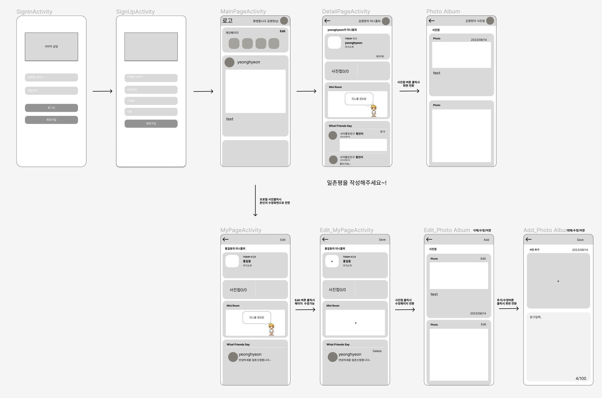


## 🎲**구현 클래스 & 상세기능**

### **1) 로그인 - SIgnInPage.kt**

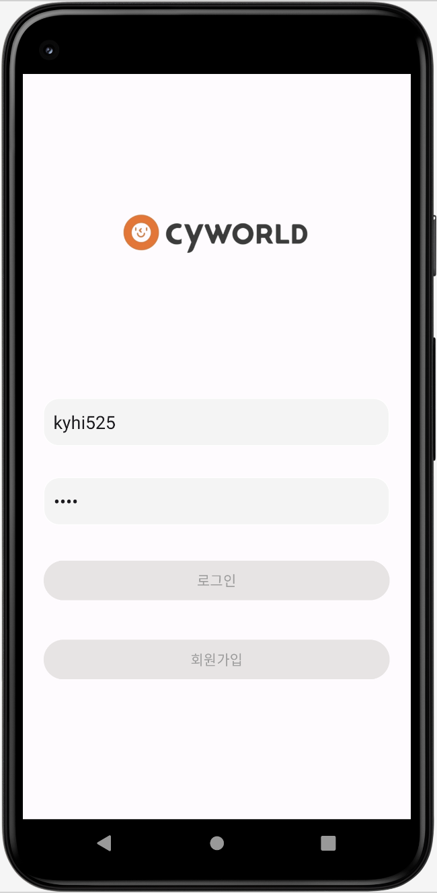

- 로그인버튼 클릭시  메인화면으로 전환.
- 회원가입 하지않은 사람이 로그인시, 빈칸이 있을시 **예외처리**기능 구현완료. (이메일,비밀번호 검증)
- 회원가입 버튼 클릭시 회원가입 화면으로 전환.

---

### **2) 회원가입 - SIgnUpPage.kt**

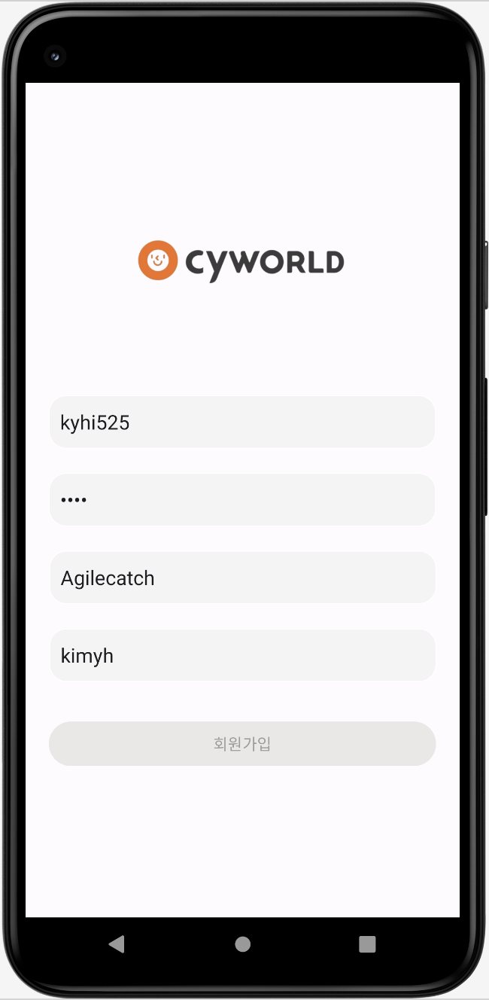

- 회원가입버튼 클릭시 입력한 정보를 새로운 사용자  정보를 생성하여 *`UserinfoSingleton` 에추가*
- 회원가입 버튼 클릭시 로그인화면으로 전환 .
- 회원가입에서 입력한 아이디 비밀번호를 `intent` 로 넘겨 로그인시 자동으로 가져옴.

---

### **3) 메인페이지 MainPage.kt**

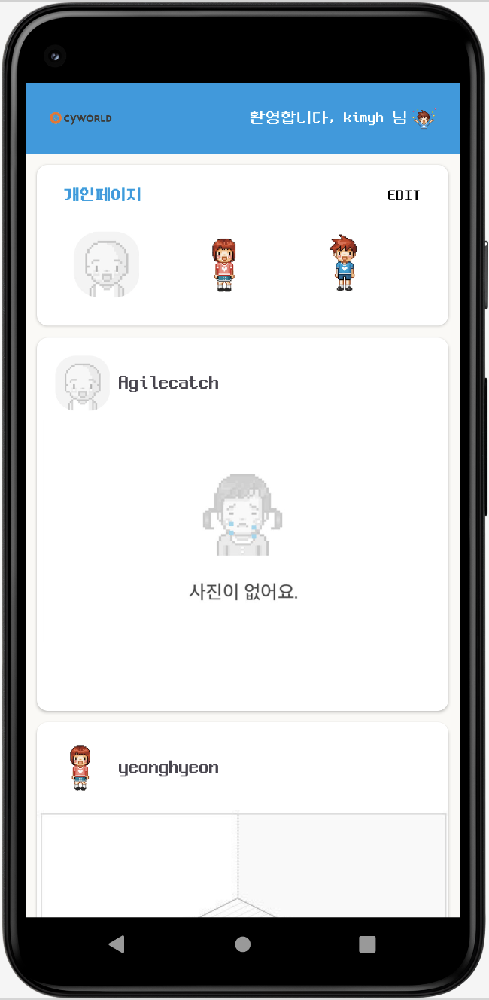

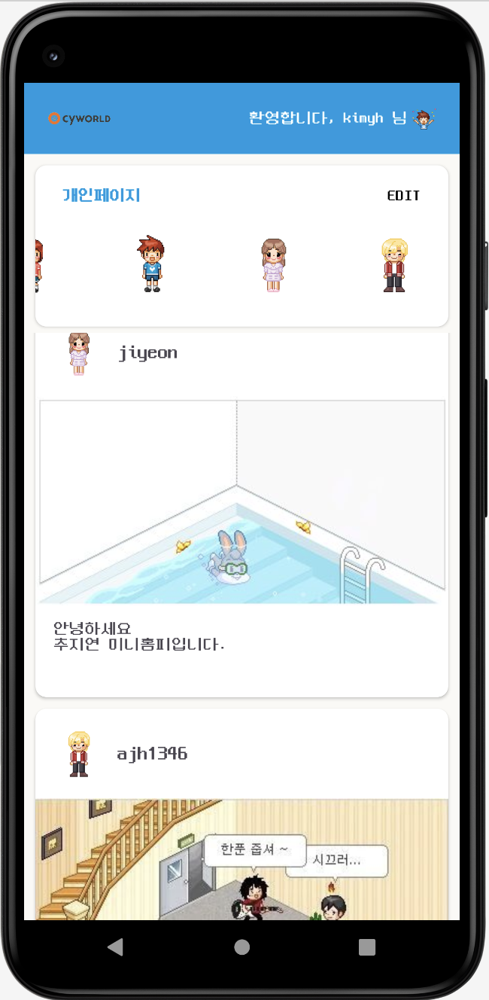


- 로그인시 상단 개인페이지에 프로필 자동으로 추가되도록 구현
  - **RecyclerView** 에 표시할 사용자정보를 `UserinfoSingleton` 으로 가져옴.
  - 프로필 클릭시 본인의 `DetailPage` 로 화면이 전환되도록 구현
  - 처음 로그인시 마이페이지에서 미니룸을추가해야 피드에 자신의 미니룸이 보임
- 앱바에 `**환영합니다. ”사용자”님!`** 으로 로그인시 입력했던 이름이 보이도록 구현
- 개인페이지 아래부분에 다른사람들의 **닉네임과** **미니홈피** **피드**가 보이도록 구현
- **피드 클릭**시 올린 사람의 `DetailPage` 로 화면이 전환되록 구현

---

### **4) 디테일 페이지 - DetailPage.kt**

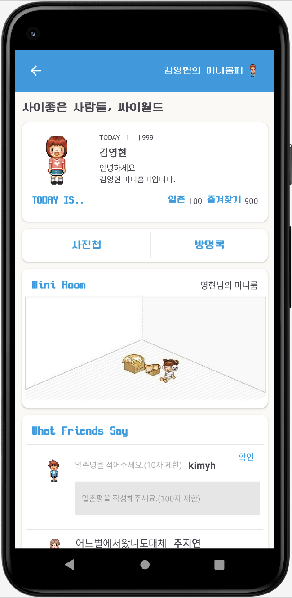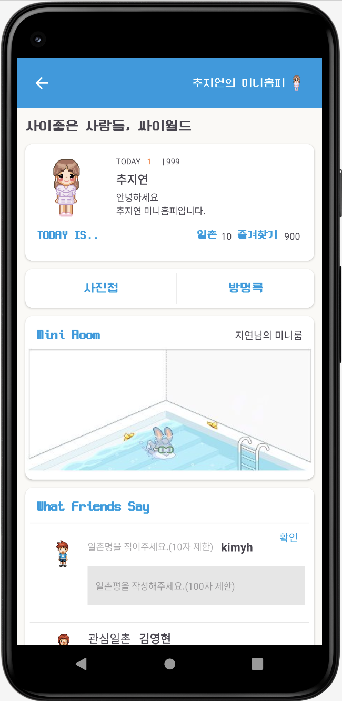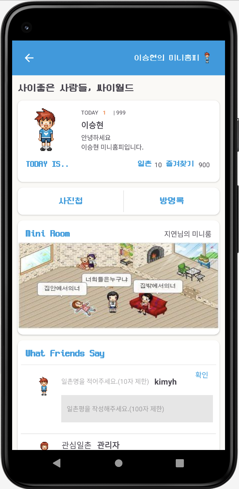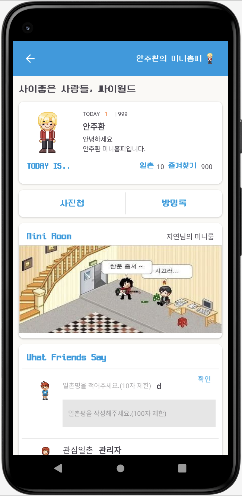

- 상단에 **“사용자”의 미니홈피, 프로필 사진** 이 표기되도록 Data 연결
- 사용자에따라 **프로필사진과 이름, 자기소개**를 넣을 수 있는 카드 구현
- **TODAY**로 오늘 하루 내미니홈피에 들어온 사람의 수를 확인 할수 있도록 구현
- 사진첩 버튼 클릭시 사용자의 **사진첩**으로 이동할 수 있도록 구현
- 나만의 **미니룸사진**을 넣을 수 있도록 구현하고 상단에 **미니룸 컨셉**을 표시하도록 구현
- 다른사람이 내 미니홈피에 일촌평을 작성할 수 있도록 일촌평추가 기능 구현
  - 일촌평 작성시 본인의 프로필과, 이름을 가져오고, 일촌명을 직접 입력할 수 있도록 구현(10자 이내.)
  - 일촌평 내용을 100자로 제한함
  - 일촌평 추가시 일촌명과 내용을 입력하지 않으면 팝업 메세지가 뜨도록 **예외처리**완료.
  - 일촌평을 작성시 **현재 날짜가** 표기되도록 구현
  - 이 페이지에서는 일촌평을 작성할 수 있도록 구현되어있음

---

### **5) 마이페이지 - MyPage.kt**

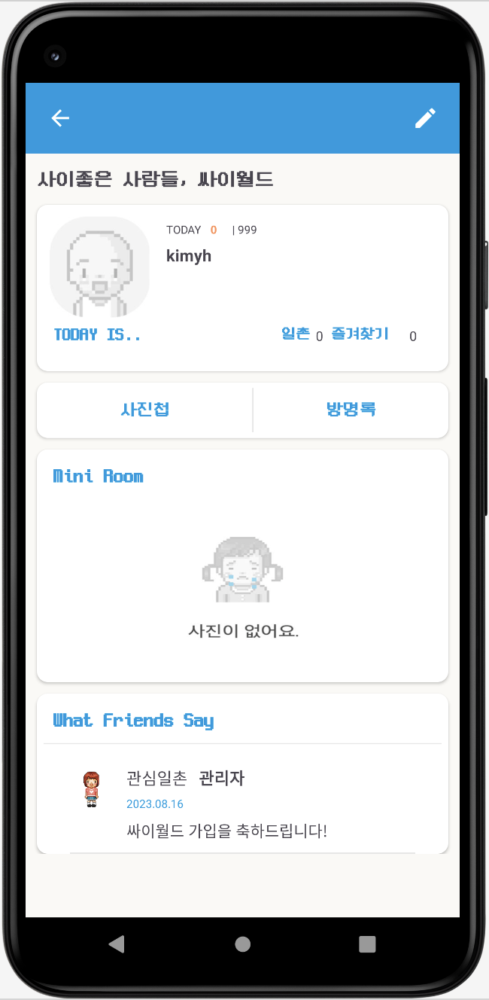

- 본인의 페이지를 볼수 있도록 `DetailPage` 를 볼 수 있도록 구현
- 디테일 페이지에서 보이는 모든 기능들에서 자신의 페이지만 볼수 있음
- 이페이지에서는 내가 직접 일촌평을 달 수 없도록 일촌평을 입력하는부분이 없음.(다른사람이 입력해준 일촌평만 확인가능)
- `DetailPage` =상대방의 페이지를 보여줌
- `MyPage`= 본인의 페이지를 보여줌

---

### **6) (수정)마이페이지 - EditMyPage.kt**

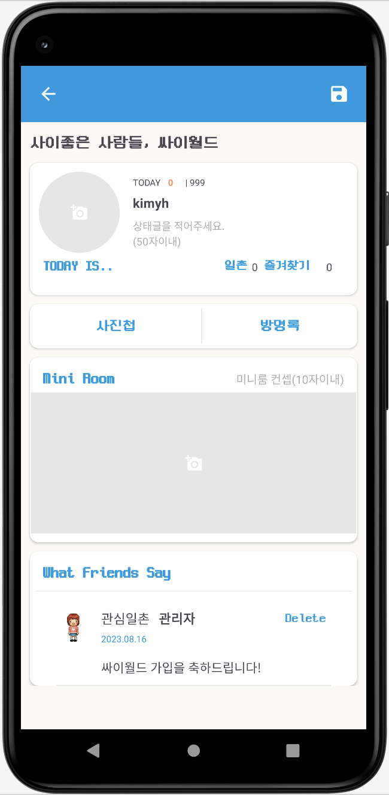

- 단의 수정버튼으로 내페이지를 수정할 수 있도록 구현
  - **목록**:  프로필이미지, 자기소개 멘트, 미니룸 사진, 일촌평 삭제하기
    - 프로필 이미지,미니룸사진 : 애뮬레이터 내 이미지 URI 가져와서 이미지를 수정하도록 구현
    - 자기소개멘트 : 마이 미니홈피와 본인을 소개할 수 있는 자기소개 멘트를 적을 수 있음
    - **일촌평**: 다른 사람이 등록한 일촌평을 **삭제**할 수 있도록 관리 할 수 있음
- **저장버튼 클릭**시 모든 변경된 데이터가 `UserinfoSingleton` 에 연동되어 저장되도록 구현

---


### **7) 사진첩 - PhotoAlbumPage.kt**

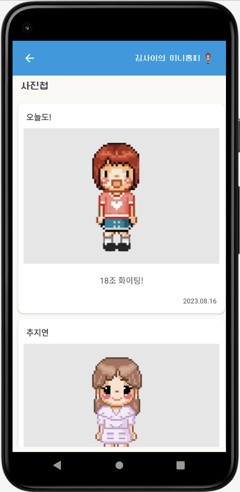

- 다른사람이 등록한 사진을 확인할 수 있음
  - 포토카드: 타이틀, 이미지, 내용, 현재시간
    - 타이틀,내용 : 사진의 제목과 내용을 정할 수있도록 구현
    - 이미지: 이미지를 가져와 넣을 수 있도록 구현
    - 사용자가 사진을 올린 시간을 확인할 수 있도록 구현
  - 다른사람의 디테일 페이지에서 앨범을 클릭했을때 보여지는화면

---

### **8) (수정)사진첩 - EditPhotoPage.kt**

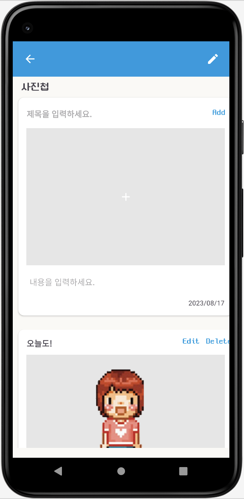

- 사용자가 사진을 올릴 수있는 화면.
- 마이페이지에서 수정버튼 클릭후 사진첩 이동시 사진게시물 작성가능
  - 타이틀과 이미지, 내용을 입력하여 **Add**버튼 클릭시 **리사이클러뷰로** 사진첩에 사진이 등록되도록 구현
  - **포토카드는** 위와같은 내용으로 구성되어있고 그동안 올렸던내용을 **삭제하고 수정**할 수있도록 구현

---

### **9) 추가기능들**

- 페이지 화면전환(slide_in_right.xml)
- 오른쪽,왼쪽으로 애니메이션을 입힐수 있도록 구현

```jsx
//오른쪽
<translate
            android:duration="700"
            android:fromXDelta="100%p"
            android:toXDelta="0" />
    </set>
//왼쪽
<translate
            android:duration="700"
            android:fromXDelta="0"
            android:toXDelta="-100%p" />
    </set>
```

- 싱글톤 object 사용 하여 UserData 관리
- RecyclerView사용

