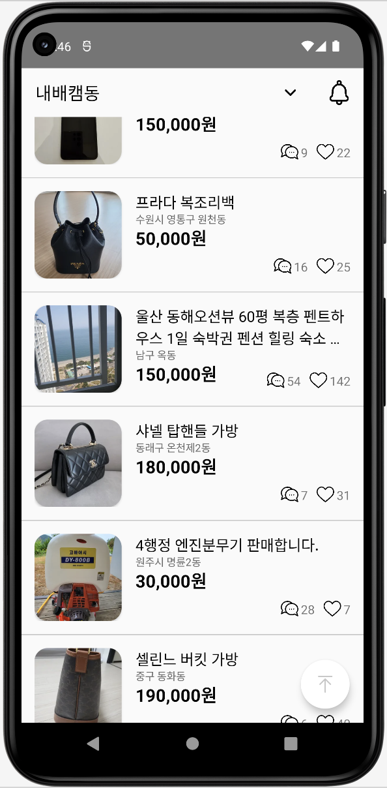
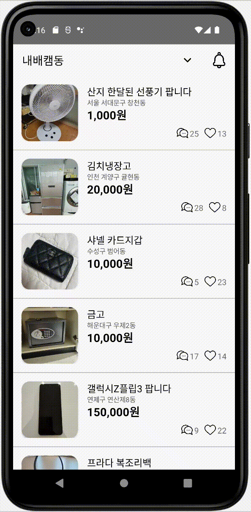
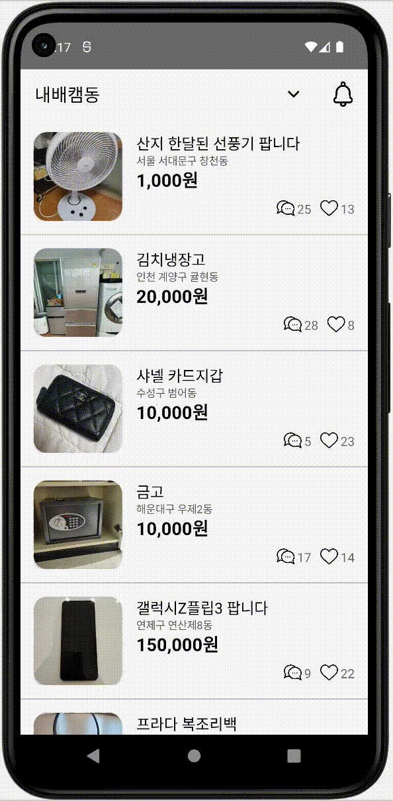
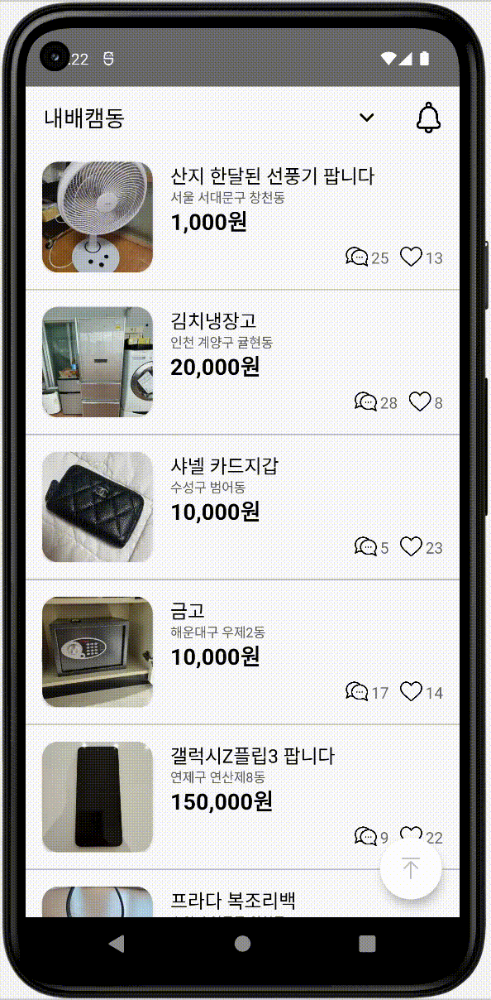

# [Kotlin/개인] 당근마켓 - 클론코딩

* toc
{:toc}
---

## 👩🏻‍💻 **[최종 구현 단계]** 

* **학습목표**

- [x]  **뷰바인딩에** 대해 이해하고 **findViewById**와의 차이점을 설명할 수 있다.
- [x]  **어댑터 뷰**의 기본 개념 및 종류를 이해하고 리스트 뷰와 그리드 뷰의 설정 방법을 이해한다.
- [x]  커스텀 항목 뷰를 정의하는 방법을 이해하고 **RecyclerView**를 사용하는 방법을 이해한다.
- [x]  **프래그먼트**의 기본개념 및 프래그먼트 생명주기를 이해한다.
- [x]  태블릿용 및 스마트폰용 디바이스에서 **프래그먼트를** 재 사용할 수 있는 방법을 실습한다.
- [x]  **다이얼로그**가 무엇인지 알고 구조에 대해 이해했다.
- [x]  **알림을 생성**하고 중요도 순서를 이해했다.

## 🥕 **구현 클래스 & 상세기능**

### **1) 메인페이지 - MainActivity.kt**

* **RecyclerViewer**를 이용해 리스트 화면을 구현하였다.

* **Singleton**을 사용해 데이터를 어디서든 참조할 수 있도록 관리해주었다.

* 상품 이름은 **최대 두 줄이고, 그래도 넘어가면 뒷 부분에 …으로 처리**하였다.

* 상품 가격은 1000단위로 **콤마**(,) 처리하였다.

  * (formatPrice) 클래스 사용

---

* 뒤로가기(BACK)버튼 클릭시 `어플을 종료하시겠습니까? [확인]/[취소]` **다이얼로그를** 띄운다.

---

* 상단 종모양 아이콘을 누르면 **Notification**을 생성한다.
  * 알림을 **클릭하면 어플로 이동**한다.

---

* 상품을 **롱클릭 했을때 삭제 여부를 묻는 다이얼로그를 띄운다.**

  * 확인을 선택시 해당 항목을 **삭제**하고 **리스트를 업데이트**한다.

  * 해당 상품이 삭제된다!

---

* 스크롤을 **최상단으로 이동**시키는 플로팅 버튼 기능 추가하였다.

  * 플로팅 버튼은 스크롤을 **아래로 내릴 때** **나타나며**, **스크롤이 최상단일**때 **사라진다**.
  * 플로팅 버튼을 누르면 **스크롤을 최상단으로 이동**시킨다.
  * 플로팅 버튼은 나타나고 사라질때 **fade 효과**가 있다.
  * 플로팅 **버튼을 클릭하면(pressed)** **아이콘 색**이 변경된다.

---

### **2) 상품 상세 페이지 - ProductDetailActivity.kt**

* **Adapter**를 이용해 메인화면과 연결해주었다.
* 상품 선택시 아래 상품 **상세 페이지로 이동**한다.
  * 상품 상세페이지 이동시 **registerForActivityResult** & **intent로 객체를 주고받는다.** 
  * 메인화면에서 **주고받은 데이터**로 판매자, 주소, 아이템, 글내용, 가격등을 **화면에** **표시**한다.
* 상단 < 버튼을 누르면 **상세 화면은 종료**되고 메인화면으로 돌아간다.

---

* **좋아요버튼이** **메인화면과 연결**되도록 구현하여 언제든 취소하거나 추가할 수 있다.

---

* 가격표시 레이아웃을 제외하고 전체화면은 **스크롤이** 된다.

---

