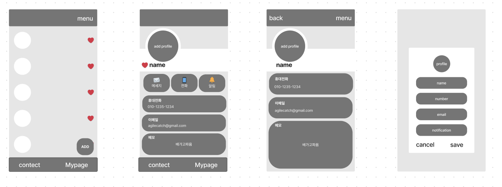
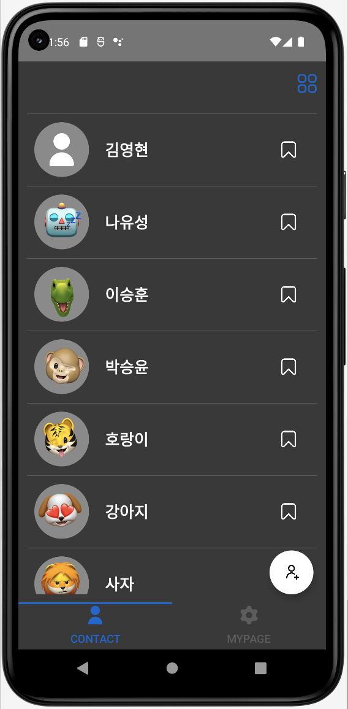
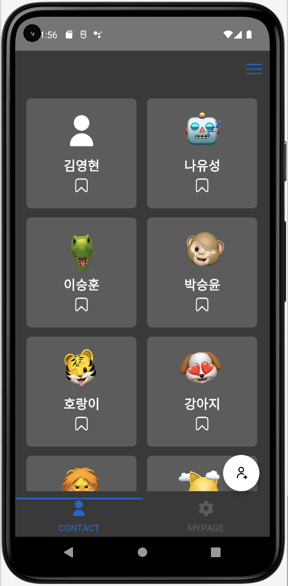
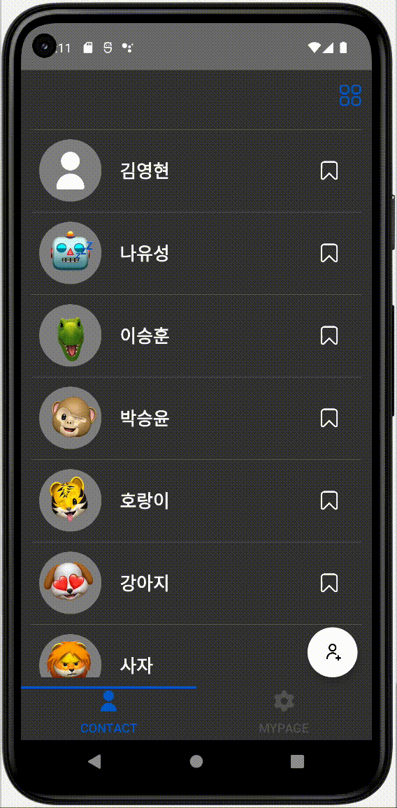
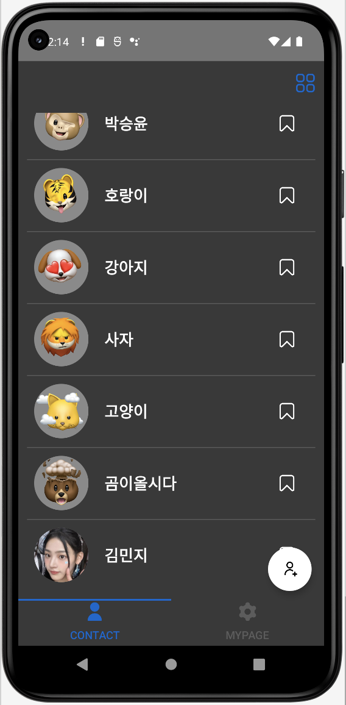
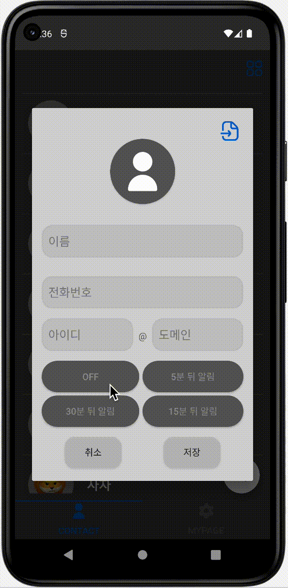
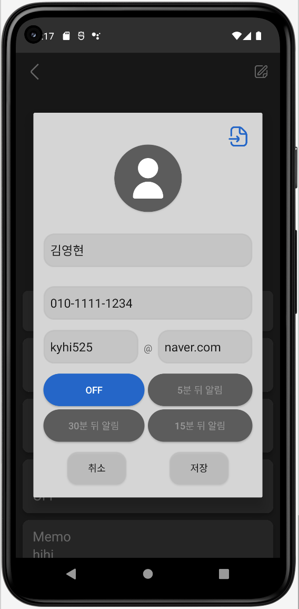
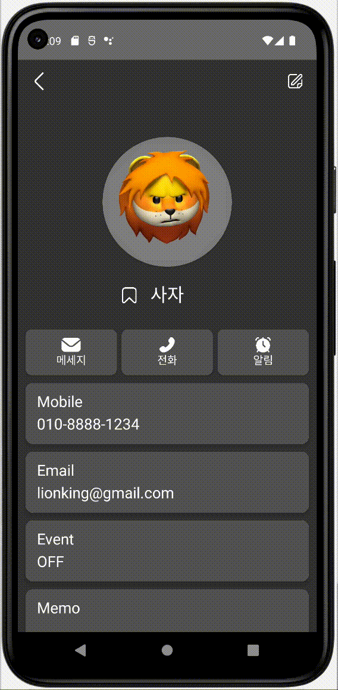
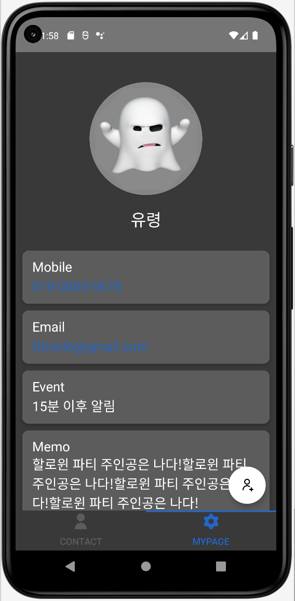

# [Kotlin/Team] 17조 - ContactManager Pro

* toc
{:toc}
---

`팀명 ` : 앱티켓 :  "앱 (Application)"과 "티켓 (Ticket)"의 합성어로, 어플리케이션과 관련된 열정적인 팀이라는 뜻을 가지고 있다.

`프로젝트 소개` : "ContactManager Pro : 연락처를 손쉽게 관리하고 실시간 알림을 받는 어플."

## 👩🏻‍💻 **[최종 구현 단계]** 

- **필수 구현사항**
- [x] **TabLayout 와 ViewPager**
- [x] **연락처 리스트 (ContactListFragment)** 
- [x] **연락처 추가 (AddContactDialog or AddContactDialogFragment)***
- [x] **상세 정보 (ContactDetailFragment)**
- [x] **마이 페이지 ( MyPageActivity )**

---

- **추가 구현사항**
- [x] **ItemViewType 변경 적용**
- [x] **Event 시간에 맞춰 Notification 표시**
- [x] **실제 폰에 있는 연락처 불러오기**
- [x] **Swipe-to-Action**

## 📱 **와이어프레임**

## 📞 **구현 클래스 & 상세기능**

### **1) 연락처 리스트 - ContactListFragment** 

* **TabLayout** 과 **ViewPager**를 사용하여 **여러** **Fragment**를 한 화면에서 쉽게 탐색할 수 있게 구현.
*  **RecyclerView**, **getItemViewType** 활용하여 상단 앱바의 **메뉴** 버튼 클릭시 **Listview&Gridview**로 전환.
  * 각 화면을 **Fragment**로 구현하고 사용자의 **click** 혹은 **drag**에 따라 다른 화면으로 이동함.
  * 각 아이템에는 **사진, 이름, 북마크** 정보가 표시됨.
  * 아이템을 클릭하여 **북마크** 설정 가능.
* **Swipe-to-Action** 을 사용하여 아이템 오른쪽으로 **슬라이드시 특정액션(전화)**을 실행.

---

### **2) 연락처 추가 - AddContactDialog or AddContactDialogFragment**

* 연락처 리스트의 **FAB** 을 눌러 연락처 추가를 위한 **Dialog**를 제공함.

* **이름, 전화번호, 사진, 이메일 주소, 이벤트 정보(**선택) 등을 입력할 수 있음.

  * 올바른 정보를 입력하지 않았을시 예외 처리 하였음.

* 상단의 가져오기 버튼으로 **연락처에 저장되어있는 이름, 전화번호**를 가져올 수 있음 .

* 다이얼로그의 프로필사진을 클릭하면 **갤러리와 연결**돼 **프로필 사진 설정 가능.**

* 저장버튼으로 **연락처리스트에** 연락처 **추가**.

  등록된 **이벤트**(없음/5분/15분/30분 뒤 알림)의 시간에 맞춰 **`Notification`**을 띄움.

  * 알림 콘텐츠에는 알림을 클릭했을 때 연락처 앱으로  **이동함.**

---

### **3) 상세 정보 - ContactDetailFragment**

- 리사이클러뷰의 아이템을 클릭하면 각 **연락처의 상세 정보**를 표시함.
- 선택된 연락처의 **상세정보** 등을 표시함.
  - **프로필**: 저장된 연락처의 프로필 이미지를 보여줌
  - **이름**: 연락처에 저장된 사람의 이름
  - **전화번호**: 상대방의 번호를 보여줌
  - **이메일주소**: 저장된 이메일 주소를 보여줌
  - **이벤트정보**: 알림의 정보를 보여줌
  
- **기능 버튼**을 표시함
  - **메세지** : 저장된 번호로 메세지를 보낼 수 있는 버튼
  - **전화 ** : 저장된 번호로 전화를 거는 버튼
  - **알림 ** : 알림을 수정할 수 있도록 다이얼로그를 띄워주는 버튼
- 알림 버튼과 툴바의 수정 버튼을 클릭하면, 수정할 수 있는 **Dialog**를 제공함.

---

### **4) 마이 페이지 - MyPageActivity**

* **Tablayout** 으로 슬라이드 하거나 버튼을 클릭하면 사용자의 **상세 정보**를 표시함.
  * **프로필**: 사용자의 프로필 이미지를 보여줌
  * **이름**: 사용자의 이름
  * **전화번호**: 사용자의 번호를 보여줌
  * **이메일주소**: 사용자의 이메일 주소를 보여줌
  * **이벤트정보**: 알림의 정보를 보여줌

* 상세정보 페이지와 다른점은 **스스로에게 문자,전화걸 수 있는 버튼이 없다**는 것임.

---

