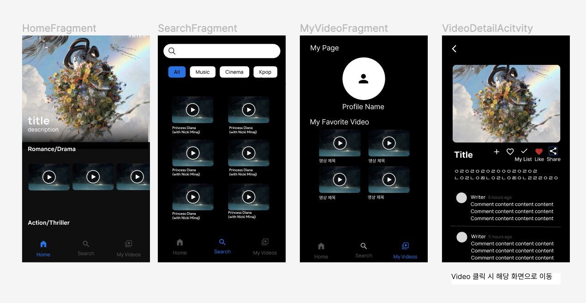

# [Kotlin/Team] 13조 - Finder

* toc
{:toc}
---

## 🥨 **프로젝트 소개**
`팀명 ` :Maniacs

`프로젝트 소개` :  Finder는 **YouTube의 원하는 영상을 검색**하고 즐길 수 있는 어플리케이션입니다.   

키워드 검색, 인기 동영상, 카테고리 별 영상을 통해  여러분의 취향에 맞는 콘텐츠를 찾을 수 있습니다. 

💡**기능**

- 키워드 검색 및 정렬 기준 선택 

- 콘텐츠 북마크 기능으로 관심 있는 영상 저장 
-  인기 동영상 / 카테고리 별 영상 추천

## 📱 **와이어프레임**

## 👩🏻‍💻 **최종 구현 단계** 

- #### **필수 구현사항**

- [x]  **효율적인 Fragment UI 관리**
- [x]  **Retrofit을 활용한 YouTube API 데이터 연동**
- [x]  **홈 화면 (HomeFragment)**
- [x]  **비디오 검색 (SearchFragment)**
- [x]  **마이 페이지 (MyVideoFragment)**

---

- #### **추가 구현사항**

- [x]  **공유 기능**

- [x]  **Infinity Scroll**

- [x]  **개성 있는 나만의 Fragment 구현**

- [x] **ViewModel 적용**

- [x]  **MotionLayout 등의 특수 효과도 활용해 보세요.**

---

* #### **GIT**

- [x] **git add / commit / push 활용**

- [x]  **git 브랜치/ PR / merge 활용**

- [x] **github pull request에서 Code review 활용**

## 📼 **구현 클래스 & 상세기능**

### **1) HomeFragment**

* **YouTube API**를 사용하여 동영상과, title 출력

- **상단 배너** 인기 비디오 리스트 와 타이틀 출력
  - 3초마다 **자동으로 스크롤** 되고 , 인디케이터를 부착하여 몇번째 영상인지 표시

- **다양한 카테고리** 추천 Video 및 타이틀 출력 (가로 슬라이드)
  - 스피너를 선택하여 **카테고리 이동** 가능

- 선택한 카데고리에 맞춰 **채널 추천** (가로 슬라이드)
- 모든 아이템은 클릭할시 **디테일 페이지로 이동**

---

### **2) SearchFragment**

- SearchView 로 **원하는 키워드 검색** 가능
- 동영상이 없을때는 "검색해주세요" 라는 **키워드 노출**
- **버튼 클릭**으로 원하는 순서대로 **정렬** 가능 (DATE, RATING, TITLE COUNT)
- 동영상 검색 결과를 아래로 스크롤 하면 페이지가 하나씩 추가되도록하여, **무한 스크롤 기능 구현**
- **Floating Button** 클릭 시 최상단 이동(아래로 슬라이드시에는 보이지 않음, 상단슬라이드시 노출)
- 모든 아이템은 클릭할시 **디테일 페이지로 이동**

---

### **3) DetailActivtiy**

* **YouTube API**를 사용
  - **영상 제목**, **설명**, **게시 일자 출력** / Channel API 활용 **채널 썸네일** 출력

- My List (+) 버튼 클릭 시 해당 영상이 **My VIDEOS 에 저장**
- Like 버튼 클릭 시 **좋아요** 기능 구현
- Share 버튼 클릭시  **Android의 공유** 인텐트를 사용하여 다른 앱으로 비디오 제목 전송
- Detail page 시작과 종료시 **Fade Effect** 추가

---

### **4) MyPageFragment**

- **My List(+) 추가**를 선택한 Video 리스트 출력 
- 상단 수정 버튼으로 **프로필 이름 및 사진 수정** 가능
  - 둘중 하나만 수정해도 반영되도록 구현
  - 닉네임은 10자이하로만 할 수 있도록 예외처리
  - 닉네임을 입력하지 않고 저장했을시, "닉네임을 입력해주세요" 라는 팝업문구가 뜨게됨
  - 다이얼로그 취소버튼 클릭시 정말 취소 하겠냐는 팝업문구 띄워짐

- My Video 및 좋아요 Shared Preference 저장 되어 있어서 어플을 종료해도 화면에 반영됨

## 👨‍👩‍👧‍👦 **팀원소개 및 역할분담**

- **김영현**

  - MainActivity ViewPager2 , Tablayout 구현
  - VideoDetailDetailActivity Layout 구현
  - MVVM 모델 적용
  - Video item 클릭 시 데이터 전달 구현
  - HomeFragment 인기 동영상 인디케이터 및 자동 스크롤 구현
  - MyPageFragment 프로필 사진 및 이름 변경(edit) 기능 구현
  - SearchFragment FAB buttoon 부착

  

- **신민지**

  - HomeFragment Layout 구현
  - VideoDetailActivty Effect 구현
  - VideoDetailActivity intent 정보 출력 구현
  - MyList 추가하기 기능 구현
  - MyList / 좋아요 SharedPreference 적용

  

- **이충환**

  - MyVideoFragment Layout 구현
  - Search 기능 API 연동
  - HomeFragment 인기 동영상 API 연동
  - HomeFragment Category 별 영상/채널 출력 API 연동
  - 무한 스크롤 기능 구현
  - VideoDetailActivity 채널 API 연동

  

* **정현식**
  * SearchFragment Layout 구현
  * 공유하기 기능 구현
  * 카테고리 리스트 기능 구현
  * NullPointerException 예외 처리
  * 쉐얼드 프리페어런스 수정사항 적용하기

