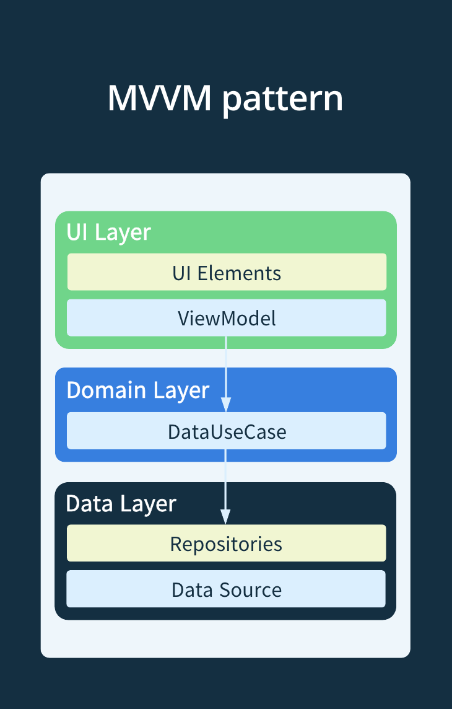
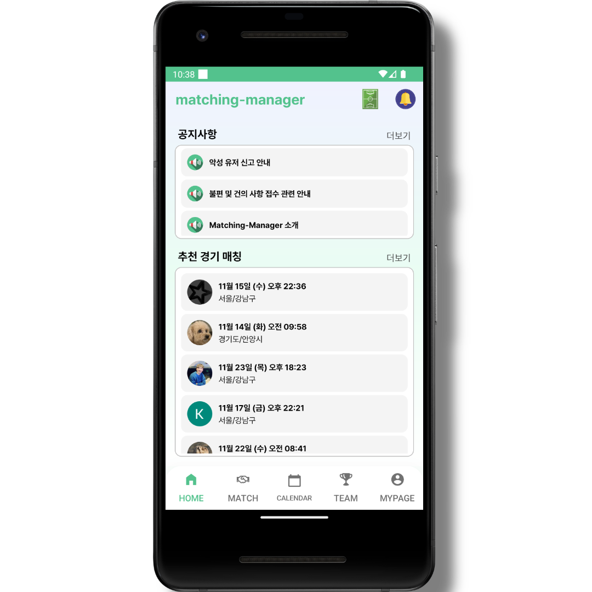
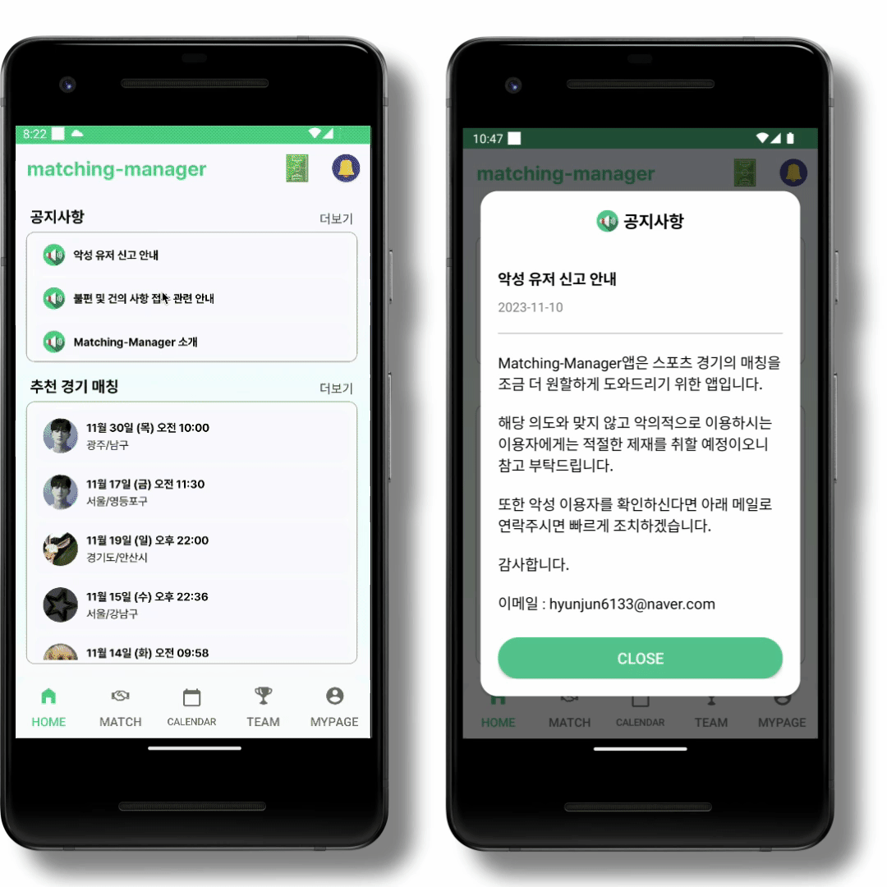
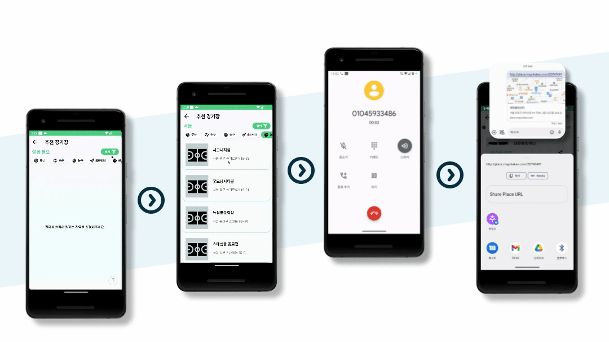
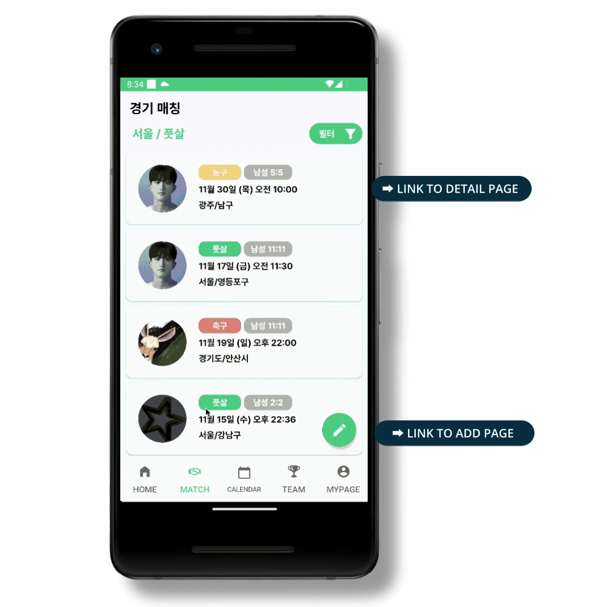
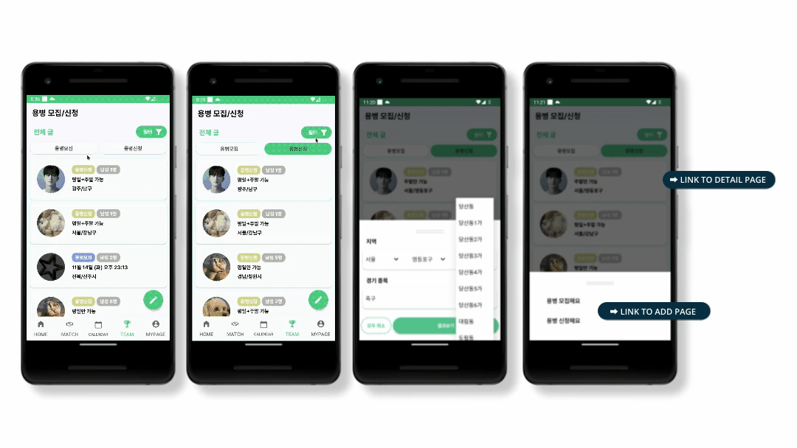
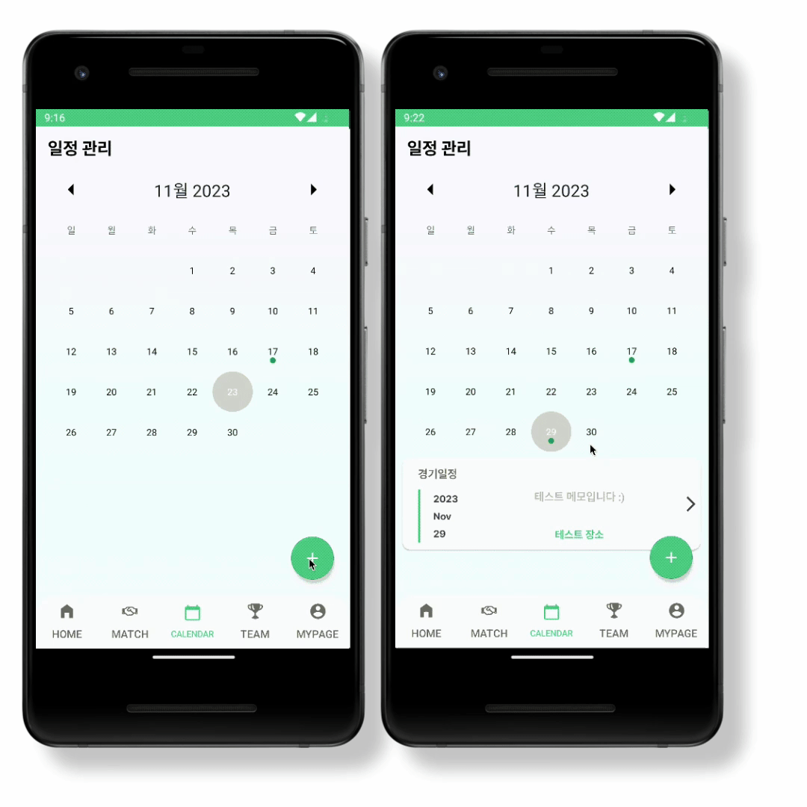

# [Kotlin/Team] 11조 - MATCHING-MANAGER

* toc
{:toc}

---

## ⚽️ **프로젝트 소개**

`팀명 ` : Link-up

`프로젝트 소개` :   "Matching-Manager"는 사용자에게스포츠 경기 매칭, 경기장 추천, 용병 모집을 도와주는 스포츠 매칭 플랫폼입니다.

`다운로드 주소` : [**구글 스토어 바로가기 Click!**](https://play.google.com/store/apps/details?id=com.link_up.matching_manager&hl=ko-KR)

💡 **이런 사람들에게 추천합니다**

**🏟️    경기장 추천- 경기장을 예약할때 근처에 있는 경기장 정보를 알고싶은 사람!**

- 지역별, 종목별 필터를 통해 경기장 정보를 제공해 줍니다.

**🫡    용병 모집- 경기는 하고싶지만 함께 할 인원이 부족한 사람들!**

- 인원이 부족한 사람들은 용병 모집/신청 이 가능해 팀에 가입하거나 인원을 보충 할수 있습니다.

**🫱🏻‍🫲🏼   경기 매칭 - 운동을 하고싶지만, 함께 경기 할 상대팀이 없을때!** 

* 지역, 운동 종목을 나눠 함께 경기를 진행할 상대와 매칭을 도와줍니다.

## 📱 ***Architecture***

**View**와 **Model** 사이의 **의존성을 낮춰주는 패턴**

온보딩, 확장성, 유지보수성, 테스트 용이성 등

다양한 이점이 있는 **MVVM** 패턴 채택 하였습니다.

책임을 한번 더 분할 하기 위해 **DomainLayer(Optional)** 까지 구현 하였습니다.

## ⚙️ ***Main Stacks***

**Architecture** - DI, MVVM

**Jetpack** - ViewModel, LiveData, Reposittory, LifeCycle, ViewBinding, DataBinding, AAC

**비동기 처리** - Coroutine

**데이터 처리** - Json Deserializer, SharedPreferences

**Firebase** - Realtime DB, Storage, Authentication, Cloud Messaging

**API 통신** - Retrofit, Kakao Search API

**이미지 로더** - Coil

**UI Frameworks** - Fragment, RecyclerViewAdapter, ListAdapter, XML, BottomsheetFragment, MaterialDesign

## 🏟️ ***Features***

### **1) Sign In + Sign Up**

* **쉽고 빠른 로그인!**
* **Google Signln + FireBase Auth**를 사용한 쉽고 간편한 로그인 기능 제공!
* 앱 내에서 사용할 User, 이름, 번호를 입력해 회원가입 진행

---

### **2) home**

- **추천매치, 공지사항 제공**
- 앱의 메인 페이지로 공지사항 및 추천 경기 매칭을 제공하며상단의 버튼 클릭 시 
  각각 Arena/Alarm 페이지로 연결

---

### **3) Announcement**

* **공지사항**
* 앱 소개 및 안내사항을 보여주는 공지사항 페이지

---

### **4) Arena**

- **경기장 검색 & 공유 & 전화 기능**
- KaKao 장소검색 API를 사용하여 종목별 경기장 정보를 지역별로 보여주고 Url공유, 전화기능을 제공합니다.

---

### **5) Match**

* **쉽고 빠른 경기 매칭**
* 함께 경기할 상태팀을 구하기 위한 경기매칭 페이지 종목별, 지역별 필터 사용 가능

---

### **6) Team**

* **용병 모집/신청**
* 인원이 부족한 사람들을 위한 용병 모집/신청 기능 제공 모집/신청, 지역별 필터 사용 가능

---

### **7) Detail/Add (MATCH/TEAM)**

* 게시글의 **상세정보**를 확인할 수 있는 디테일 페이지
* 게시글을 추가할 수 있는 Add Page 구현
* **관심 목록** 기능 & 매치/**팀 신청기능** 제공

---

### **8) Calendar**

* **간편한 일정 관리**
* **경기 날짜**, **장소**, 가벼운 **메모** 등 사용자가 손쉽게 이용할 수 있는 **일정관리** 기능 제공

---

### **9) My**

* **USER PROFILE PAGE**
* USER의 프로필 정보를 확인할 수 있는 페이지
* **작성글**/**관심목록을** 한 눈에 확인할 수 있고버튼을 눌러 수정/삭제 가능
* 추가적으로 로그아웃 기능을 제공

---

### **- SEND MSG**

* **Send Cloud Messaging** 을 사용
* 각각 디테일 페이지에서 
  용병/경기 매칭 신청을 지원하는 페이지신청 후 CloudMessage를 통해 데이터 전송

### **- ALARM**

* 빠르고 정확한 알림
* 용병 모집/신청, 경기 매칭 등 알림 서비스 제공 우측상단 Call 버튼으로 전화기능 제공

## 🛠️ ***Technical Decision***

* DI(Dependency Injection)
  - **문제상황**
    - 기존의 코드 : 하드코딩된 의존성으로 인한 객체간의 결합도 증가 
      ➡ 변경이 발생할 때 마다 수많은 코드를 수정 
      ➡ 어플리케이션의 유지보수성을 크게 저해
  - **DI 도입**
    - 문제를 해결하기 위해 DI(Dependency Injection)도입 
      ➡ DI를 사용하여 의존성을 외부에서 주입 
      ➡ 객체간의 결합도 낮아짐 
      ➡ 코드의 유지보수성, 확장성을 향상 시키는 결과를 가져옴
* ViewType
  - **문제상황**
    - 기존의 코드 : 서로 다른 타입의 두가지 데이터를 각각의 ListAdapter로 한 화면에 출력 
      ➡ 유지보수의 측면에서 복잡성 증가 
      ➡ 재사용성 및 이해도 감소
  - **ViewType 적용**
    - 문제를 해결하기 위해 ViewType을 나눠 한 ListAdapter로 관리 
      ➡ 특성에 따라 EnumClass로 타입을 분리 
      ➡ 별도의 ViewHolder로 데이터 구분 
      ➡ 재사용성, 가독성 ,유지보수성이 크게 향상
* ListAdapter
  - **기존의 상황**
    - 기존의 코드 : RecyclerView Adapter 사용 
      ➡ 추가, 삭제, 수정 등의 데이터 관리 로직 모두 구현 
      ➡ 갱신 코드의 빈번한 사용 
      ➡ 데이터의 유지보수 측면에서의 아쉬움
  - **ListAdapter 도입**
    - 문제를 해결하기 위해 ListAdapter로 변경 
      ➡ 변경된 부분만을 업데이트 해주는 DiffUtil을 활용 
      ➡ 복잡한 데이터 관리 로직을 작성할 필요가 없어짐 
      ➡ 코드 간소화, 가독성, 성능 등의 다양한 이점 
      ➡ LiveData와 함께 사용하면서 데이터의 관찰이 용이해짐
* Sealed Class
  - **기존의 상황**
    - 중복된 데이터가 많은 모집/신청두가지 모델을 함께 묶어서 구현할 때 **Enum/Sealed**중 어떤 Class를 사용할지에 대해 고민
  - **Sealed Class를 선택한 이유**
    - 제한적인 Enum과는 달리 상속, 다양성 등 다양한 이점이 있는 **Sealed Class**를 선택 이로 인해 코드안정성, 가독성등의장점 또한 가져감
* Cloud Messaging
  - **기존의 상황**
    - 짧은 시간내에 기기간 알림 서비스구현을 위해 완벽하게 구축된 서버 없이 기기간 전송을 구현해야 하는 문제가 있었음
  - **Cloud Messaging 선택 이유**
    - 크로스플랫폼 지원, 시간&비용 단축, 안정성 등 다양한 장점이 있는 **CloudMessaging** 선택
* Realtime DB, Storage
  - **기존의 상황**
    - 유저, 게시글, 이미지 정보 등을실시간으로 데이터를 저장하고상태를 동기화 하기 위한 데이터베이스가 필요한 상황
  - **도입 이유**
    - 효율적이고 지연시간이 짧은Firebase의 **Realtime DB**를 선택하였고 성능에 영향을 주지않고이미지를 저장하기 위해**FireBase Storage**를 선택
* Fragment Result Listener
  - **기존의 상황**
    - Fragment간 데이터 전달을 위해여러가지 방법을 찾아봤는데Shared VeiwModel, ResultLisner 등 여러가지 중에어떤 방법을 사용할지에 대한 고민
  - **도입 이유**
    - Fragment, DialogFragment간데이터 전달이 목적이였기 때문에가볍게 사용할 수 있는**FragmentResultListener**를 선택

## 🛠 ***Trouble Shoot***

* 최신 AGP 에서의 오류
  - **문제 상황**
    - DI(Dagger2)를 적용시키기 위하여 **의존성을 추가**해주던 중 JVM버전과 타겟이 전부 오류 메시지에서 요구하는 버전과 일치하는데 빌드되지 않고 오류 메시지를 따라가며 수정해도 **처음 상태로 돌아오는** 상황
  - **해결 방법**
    - 스택오버플로우, 블로그 등 많은 글을 찾아보며 비슷한 문제를 겪고있는 글을 찾았고 결론적으로 **최신 AGP버전에서의 오류**임을 인지하고 **AGP버전을 다운그레이드** 한 후 jvmTarget **버전을 17로 명시**해주어 해결

* RecyclerView 아이템이 중간부터 생성되는 문제
  - **문제 상황**
    - 리사이클러뷰에 아이템을 뿌려줄 때 **scrollToPosition**을 적용해주어도 처음이 아닌 **중간 부분부터 보이는 문제** 발생 ➡ 검색 이후 스크롤이 되도록 순서 변경 ➡ RecyclerView에 딜레이 넣기 등 다양한 시도를 했음에도 그대로인 상황
  - **해결 방법**
    - listAdapter가 아이템을 다 그리고 난 이후 콜백 할 수 있도록`{}`를 사용해 순서를 지정하여 해결
* Cloud Messaging 송수신
  - **문제 상황**
    - 앱의 Foreground/Background 따라 메시지 수신 여부가 달라짐 ➡ Fcm 전송 로직 구현에 대한 어려움 ➡ 알림 데이터가 갱신되지 않고 재사용 되는 오류
  - **해결 방법**
    - ➡ Foreground/Background의 처리를 동시에 처리하기 위해 수신용 **투명Activity**를 구현 ➡ 기존에 사용해봤던 **Retrofit**을 사용한 전송 로직 구현 ➡ 인텐트 재사용 문제임을 인지 → 펜딩 인텐트의 Flag를 변경하여 해결
* 두 타입의 데이터 화면에 출력
  - **문제 상황**
    - Sealed Class를 사용해 묶어놓은 두가지 타입의 데이터를 화면에 출력할 때의 어려움
  - **해결 방법**
    - 데이터를 **ViewType**으로 구분한 후 하나의 RecyclerView안에서 여러 데이터를 필터 동작에 따라 ViewType을 구분해 데이터를 출력해줄 수 있도록 함
* DB기능의 비정상적 수행
  - **문제 상황**
    - DB관련 기능 수행 후 Activity에서 finish()하면 데이터베이스 기능이 정상적으로 작동하지 않는 현상
  - **해결 방법**
    - 비동기인 DB기능이 완료되지 않았는데 Activity를 Finish 하던 문제를 인지 → **ViewModel**안의 **Live Data**를 관찰해 변동 시 Finish를 수행하도록 구현

## 🧑🏻‍💻👩🏻‍💻 ***Team members***

<table>
  <tbody>
    <tr>
      <td align="center"><a href="https://github.com/SoftyChoo"> <b>추민수</b></a> </a></td>
      <td align="center"><a href="https://github.com/AgileCatch"> <b>김영현</b></a> </a></td>
      <td align="center"><a href="https://github.com/hjdevelop"> <b>손현준</b></a> </a></td>
      <td align="center"><a href="https://github.com/mwkimm"> <b>김민우</b></a> </a></td>
     <tr/>
  </tbody>
</table>
